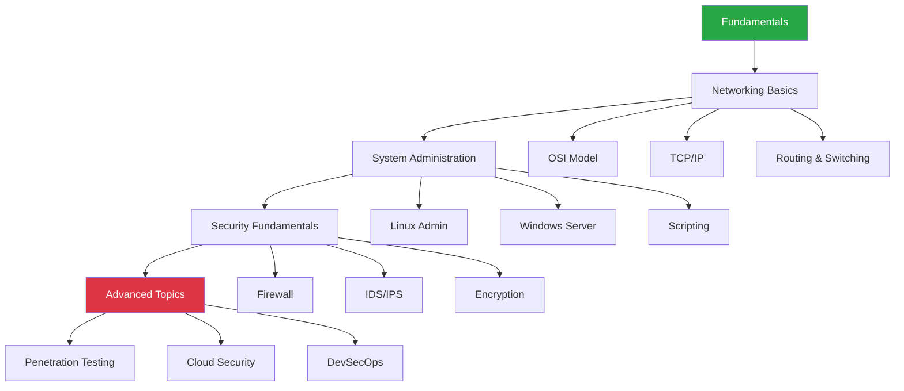

# 📚 Khu vực học tập chuyên ngành

Tổng hợp kiến thức IT, mạng máy tính, an toàn thông tin và các môn học chuyên ngành.

---

## 📊 Thống kê học tập

  

    
📖

    
12

    
Môn học

  

  

    
📝

    
156

    
Bài học

  

  

    
💡

    
89

    
Lab thực hành

  

  

    
✅

    
78%

    
Hoàn thành

  

---

-   :material-network:{ .lg .middle } __Quản trị mạng và hệ thống__

    ---
    Linux System Admin, Windows Server, Active Directory, DNS, DHCP
    
    [:octicons-arrow-right-24: Network/](Network/)

-   :material-security-network:{ .lg .middle } __An toàn mạng__

    ---
    Firewall, IDS/IPS, Security Policies, Penetration Testing
    
    [:octicons-arrow-right-24: Security Network/](Security Network/)

-   :material-router-wireless:{ .lg .middle } __Cấu hình mạng__

    ---
    Cisco Routing & Switching, VLAN, STP, OSPF, BGP
    
    [:octicons-arrow-right-24: Network/](Network/)

-   :material-layers:{ .lg .middle } __Mô hình OSI & TCP/IP__

    ---
    7 tầng OSI, Protocols, Encapsulation, Troubleshooting
    
    [:octicons-arrow-right-24: Network/osi-model.md](Network/osi-model.md)

-   :material-wifi-strength-4-lock:{ .lg .middle } __Wireless Security__

    ---
    WPA2/WPA3, Wireless Attacks, Aircrack-ng
    
    [:octicons-arrow-right-24: Security Network/](Security Network/)

-   :material-bug:{ .lg .middle } __Penetration Testing__

    ---
    Metasploit, Burp Suite, SQL Injection, XSS
    
    [:octicons-arrow-right-24: Security Network/](Security Network/)

-   :material-assembly-variant:{ .lg .middle } __Assembly x86__

    ---
    Low-level programming, Reverse Engineering
    
    [:octicons-arrow-right-24: Assembly x86/](Assembly x86/)

-   :material-flag:{ .lg .middle } __CTF Challenges__

    ---
    Capture The Flag, Security challenges
    
    [:octicons-arrow-right-24: CTF/](CTF/)

-   :material-cloud-lock:{ .lg .middle } __Cloud Security__

    ---
    AWS Security, Azure Security, IAM, Encryption
    
    [:octicons-arrow-right-24: Đang cập nhật]()

-   :material-robot-outline:{ .lg .middle } __AI & ML__

    ---
    Machine Learning, Deep Learning, Neural Networks
    
    [:octicons-arrow-right-24: Đang cập nhật]()

-   :material-database:{ .lg .middle } __Database Administration__

    ---
    MySQL, PostgreSQL, MongoDB, Redis
    
    [:octicons-arrow-right-24: Đang cập nhật]()

-   :material-docker:{ .lg .middle } __DevOps & Containerization__

    ---
    Docker, Kubernetes, CI/CD, Jenkins
    
    [:octicons-arrow-right-24: Đang cập nhật]()

---

## 🎯 Lộ trình học tập

