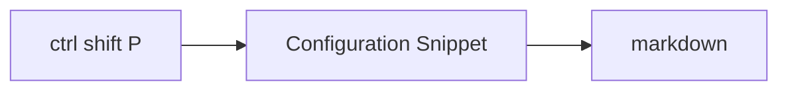
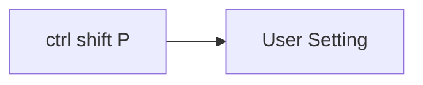

# Using snipet in vscode

## Snipet markdown


```json title="markdown.json" linenums="1"
{
  "Admonition Note": {
    "prefix": "note",
    "body": [
      "!!! note \"${1:Title}\"",
      "    ${2:Content}"
    ],
    "description": "Create a note admonition"
  },
  "Admonition Warning": {
    "prefix": "warning",
    "body": [
      "!!! warning \"${1:Title}\"",
      "    ${2:Content}"
    ],
    "description": "Create a warning admonition"
  },
  "Admonition Info": {
    "prefix": "info",
    "body": [
      "!!! info \"${1:Title}\"",
      "    ${2:Content}"
    ],
    "description": "Create an info admonition"
  },
  "Admonition Tip": {
    "prefix": "tip",
    "body": [
      "!!! tip \"${1:Title}\"",
      "    ${2:Content}"
    ],
    "description": "Create a tip admonition"
  },
  "Admonition Danger": {
    "prefix": "danger",
    "body": [
      "!!! danger \"${1:Title}\"",
      "    ${2:Content}"
    ],
    "description": "Create a danger admonition"
  },
  "Collapsible Admonition": {
    "prefix": "details",
    "body": [
      "??? ${1:note} \"${2:Title}\"",
      "    ${3:Content}"
    ],
    "description": "Create a collapsible admonition"
  },
  "Code Block with Tabs": {
    "prefix": "tabs",
    "body": [
      "=== \"${1:Python}\"",
      "",
      "    ```${2:py}",
      "    ${3:def main():",
      "        print(\"Hello world!\")}",
      "    ```",
      "",
      "=== \"${4:JavaScript}\"",
      "",
      "    ```${5:js}",
      "    ${6:function main() {",
      "        console.log(\"Hello world!\");",
      "    \\}}",
      "    ```"
    ],
    "description": "Create tabbed code blocks"
  },
  "Code Block Basic": {
    "prefix": "code",
    "body": [
      "```${1:py} title=\"${2:filename.py}\" linenums=\"1\"",
      "${3:# Your code here}",
      "```"
    ],
    "description": "Create basic code block with title"
  },
  "Code Block Highlighted": {
    "prefix": "codehl",
    "body": [
      "```${1:js} title=\"${2:filename.js}\" linenums=\"1\" hl_lines=\"${3:2-4}\"",
      "${4:// Your code here}",
      "```"
    ],
    "description": "Create code block with highlighted lines"
  },
  "Code Block Annotated": {
    "prefix": "codeanno",
    "body": [
      "```${1:python} linenums=\"1\"",
      "${2:code} # (1)",
      "```",
      "",
      "1. ${3:Annotation text}"
    ],
    "description": "Create annotated code block"
  },
  "Mermaid Flowchart": {
    "prefix": "mermaid",
    "body": [
      "```mermaid",
      "graph ${1:LR}",
      "  ${2:A}[Start] --> ${3:B}{Decision?};",
      "  ${3:B} -->|${4:Yes}| ${5:C}[Process];",
      "  ${3:B} -->|${6:No}| ${7:D}[End];",
      "```"
    ],
    "description": "Create a Mermaid flowchart"
  },
  "Mermaid Sequence": {
    "prefix": "sequence",
    "body": [
      "```mermaid",
      "sequenceDiagram",
      "  autonumber",
      "  ${1:Client}->>${2:Server}: ${3:Request}",
      "  ${2:Server}-->${1:Client}: ${4:Response}",
      "```"
    ],
    "description": "Create a Mermaid sequence diagram"
  },
  "Material Button": {
    "prefix": "button",
    "body": [
      "[${1:Button Text}](${2:link}){ .md-button .md-button--primary }"
    ],
    "description": "Create a Material button"
  },
  "Content Tabs Generic": {
    "prefix": "ctabs",
    "body": [
      "=== \"${1:Plain text}\"",
      "",
      "    ${2:This is some plain text}",
      "",
      "=== \"${3:List}\"",
      "",
      "    * ${4:First item}",
      "    * ${5:Second item}",
      "    * ${6:Third item}"
    ],
    "description": "Create generic content tabs"
  },
  "Definition List": {
    "prefix": "deflist",
    "body": [
      "${1:Term}",
      ":   ${2:Definition}"
    ],
    "description": "Create a definition list item"
  },
  "Footnote": {
    "prefix": "footnote",
    "body": [
      "${1:Text}[^${2:1}]",
      "",
      "[^${2:1}]: ${3:Footnote content}"
    ],
    "description": "Create a footnote"
  },
  "Task List": {
    "prefix": "tasklist",
    "body": [
      "- [x] ${1:Completed task}",
      "- [ ] ${2:Incomplete task}"
    ],
    "description": "Create a task list"
  },
  "Table": {
    "prefix": "table",
    "body": [
      "| ${1:Column 1} | ${2:Column 2} | ${3:Column 3} |",
      "| ----------- | ----------- | ----------- |",
      "| ${4:Row 1 Col 1} | ${5:Row 1 Col 2} | ${6:Row 1 Col 3} |",
      "| ${7:Row 2 Col 1} | ${8:Row 2 Col 2} | ${9:Row 2 Col 3} |"
    ],
    "description": "Create a table"
  },
  "Keyboard Key": {
    "prefix": "key",
    "body": [
      "++${1:ctrl+alt+del}++"
    ],
    "description": "Create keyboard key markup"
  },
  "Highlight Text": {
    "prefix": "highlight",
    "body": [
      "==${1:highlighted text}=="
    ],
    "description": "Highlight text"
  },
  "Material Icons": {
    "prefix": "icon",
    "body": [
      ":material-${1:icon-name}:"
    ],
    "description": "Insert Material icon"
  },
  "Emoji": {
    "prefix": "emoji",
    "body": [
      ":${1:emoji-name}:"
    ],
    "description": "Insert emoji"
  },
  "Image with Caption": {
    "prefix": "imgcap",
    "body": [
      "<figure markdown>",
      "  ",
      "  <figcaption>${3:Caption}</figcaption>",
      "</figure>"
    ],
    "description": "Image with caption"
  },
  "Blog Post Header": {
    "prefix": "blog",
    "body": [
      "---",
      "date:",
      "    created: ${1:2025-01-09}",
      "    updated: ${2:2025-02-09}",
      "readtime: ${3:5}",
      "categories:",
      "    - ${4:Life}",
      "tags:",
      "    - ${5:life}",
      "draft: ${6:true}",
      "---",
      "",
      "# ${7:Blog Post Title}",
      "",
      "${8:Your content here}"
    ],
    "description": "Create blog post with frontmatter"
  }
}
```

## Configure the user setting for tab



```json title="setting.json" linenums="1"
{
    "github.copilot.nextEditSuggestions.enabled": true,
    "security.workspace.trust.untrustedFiles": "open",
    "files.autoSave": "afterDelay",
    "terminal.integrated.suggest.enabled": true,
    "editor.fontFamily": "Fira Code",
    "editor.fontLigatures": true,
    "terminal.integrated.fontFamily": "MesloLGSDZ Nerd Font Mono",
    "git.autofetch": true,
    "workbench.colorCustomizations": {
        "[Vira*]": {
            "toolbar.activeBackground": "#80CBC426",
            "button.background": "#80CBC4",
            "button.hoverBackground": "#80CBC4cc",
            "extensionButton.separator": "#80CBC433",
            "extensionButton.background": "#80CBC414",
            "extensionButton.foreground": "#80CBC4",
            "extensionButton.hoverBackground": "#80CBC433",
            "extensionButton.prominentForeground": "#80CBC4",
            "extensionButton.prominentBackground": "#80CBC414",
            "extensionButton.prominentHoverBackground": "#80CBC433",
            "activityBarBadge.background": "#80CBC4",
            "activityBar.activeBorder": "#80CBC4",
            "activityBarTop.activeBorder": "#80CBC4",
            "list.inactiveSelectionIconForeground": "#80CBC4",
            "list.activeSelectionForeground": "#80CBC4",
            "list.inactiveSelectionForeground": "#80CBC4",
            "list.highlightForeground": "#80CBC4",
            "sash.hoverBorder": "#80CBC480",
            "list.activeSelectionIconForeground": "#80CBC4",
            "scrollbarSlider.activeBackground": "#80CBC480",
            "editorSuggestWidget.highlightForeground": "#80CBC4",
            "textLink.foreground": "#80CBC4",
            "progressBar.background": "#80CBC4",
            "pickerGroup.foreground": "#80CBC4",
            "tab.activeBorder": "#80CBC4",
            "tab.activeBorderTop": "#80CBC400",
            "tab.unfocusedActiveBorder": "#80CBC4",
            "tab.unfocusedActiveBorderTop": "#80CBC400",
            "tab.activeModifiedBorder": "#80CBC400",
            "notificationLink.foreground": "#80CBC4",
            "editorWidget.resizeBorder": "#80CBC4",
            "editorWidget.border": "#80CBC4",
            "settings.modifiedItemIndicator": "#80CBC4",
            "panelTitle.activeBorder": "#80CBC4",
            "breadcrumb.activeSelectionForeground": "#80CBC4",
            "menu.selectionForeground": "#80CBC4",
            "menubar.selectionForeground": "#80CBC4",
            "editor.findMatchBorder": "#80CBC4",
            "selection.background": "#80CBC440",
            "statusBarItem.remoteBackground": "#80CBC414",
            "statusBarItem.remoteHoverBackground": "#80CBC4",
            "statusBarItem.remoteForeground": "#80CBC4",
            "notebook.inactiveFocusedCellBorder": "#80CBC480",
            "commandCenter.activeBorder": "#80CBC480",
            "chat.slashCommandForeground": "#80CBC4",
            "chat.avatarForeground": "#80CBC4",
            "activityBarBadge.foreground": "#000000",
            "button.foreground": "#000000",
            "statusBarItem.remoteHoverForeground": "#000000"
        }
    },
    "editor.fontSize": 16,
    "workbench.iconTheme": "material-icon-theme",
    "Codegeex.Privacy": true,
    "explorer.fileNesting.patterns": {
        "*.ts": "${capture}.js",
        "*.js": "${capture}.js.map, ${capture}.min.js, ${capture}.d.ts",
        "*.jsx": "${capture}.js",
        "*.tsx": "${capture}.ts",
        "tsconfig.json": "tsconfig.*.json",
        "package.json": "package-lock.json, yarn.lock, pnpm-lock.yaml, bun.lockb, bun.lock",
        "*.sqlite": "${capture}.${extname}-*",
        "*.db": "${capture}.${extname}-*",
        "*.sqlite3": "${capture}.${extname}-*",
        "*.db3": "${capture}.${extname}-*",
        "*.sdb": "${capture}.${extname}-*",
        "*.s3db": "${capture}.${extname}-*"
    },
    "editor.linkedEditing": true,
    "explorer.confirmDelete": false,
    "editor.autoClosingBrackets": "always",
    "css.lint.unknownAtRules": "ignore",
    "explorer.confirmPasteNative": false,
    "terminal.integrated.profiles.windows": {
        "PowerShell": {
            "source": "PowerShell",
            "icon": "terminal-powershell"
        },
        "Command Prompt": {
            "path": [
                "${env:windir}\\Sysnative\\cmd.exe",
                "${env:windir}\\System32\\cmd.exe"
            ],
            "args": [],
            "icon": "terminal-cmd"
        },
        "Git Bash": {
            "source": "Git Bash"
        },
        "Ubuntu": {
            "path": "wsl.exe",
            "args": ["-d", "Ubuntu"],
            "icon": "terminal-ubuntu"
        }
    },
    "terminal.integrated.defaultProfile.windows": "PowerShell",
    "explorer.compactFolders": false,
    "editor.wordWrap": "on",
    "workbench.colorTheme": "Catppuccin Mocha",
    "editor.tabCompletion": "on",
    "editor.snippetSuggestions": "top",
    "editor.suggest.snippetsPreventQuickSuggestions": false,
    "editor.wordBasedSuggestions": "off",
    "[markdown]": {
        "editor.quickSuggestions": {
            "other": true,
            "comments": false,
            "strings": true
        },
        "editor.acceptSuggestionOnEnter": "on",
        "editor.suggest.showSnippets": true
    }
}
```