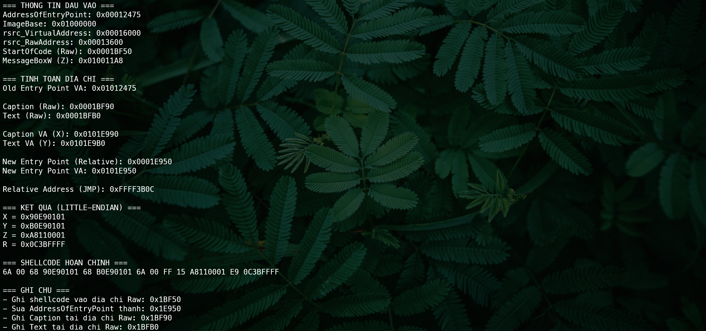

# Bài 6

[[Bai5]]
## Code

??? note "code"

    
    ``` cpp title="Bai6_Calc.cpp" linenums="1" hl_lines="0"
    #include <iostream>
    #include <iomanip>
    using namespace std;

    int RawToVirtual(int rawAddress, int rsrc_VirtualAddress, int rsrc_RawAddress) {
        return rawAddress - rsrc_RawAddress + rsrc_VirtualAddress;
    }

    void PrintHex(int value) {
        cout << " 0x" << hex << uppercase << setw(8) << setfill('0') << value << endl;
    }

    void PrintLittleEndian(int value) {
        cout << " 0x";
        for (int i = 0; i < 4; i++) {
            cout << hex << uppercase << setw(2) << setfill('0') << ((value >> (i * 8)) & 0xFF);
        }
        cout << endl;
    }

    void PrintLittleEndianNoPrefix(int value) {
        for (int i = 0; i < 4; i++) {
            cout << hex << uppercase << setw(2) << setfill('0') << ((value >> (i * 8)) & 0xFF);
        }
    }

    int main() {
        // === DU LIEU DAU VAO ===
        int AddressOfEntryPoint = 0x00012475;   // Sửa: bỏ số 0 thừa ở đầu
        int ImageBase = 0x01000000;
        int rsrc_VirtualAddress = 0x00016000;
        int rsrc_RawAddress = 0x00013600;       // Sửa: bỏ số 0 thừa (từ 0x000013600)
        int startOfCode = 0x0001BF50;
        int z = 0x010011A8;  // MessageBoxW
        
        cout << "=== THONG TIN DAU VAO ===" << endl;
        cout << "AddressOfEntryPoint:";
        PrintHex(AddressOfEntryPoint);
        cout << "ImageBase:";
        PrintHex(ImageBase);
        cout << "rsrc_VirtualAddress:";
        PrintHex(rsrc_VirtualAddress);
        cout << "rsrc_RawAddress:";
        PrintHex(rsrc_RawAddress);
        cout << "StartOfCode (Raw):";
        PrintHex(startOfCode);
        cout << "MessageBoxW (Z):";
        PrintHex(z);
        
        cout << "\n=== TINH TOAN DIA CHI ===" << endl;
        
        // Old Entry Point (Virtual Address)
        int VirtualAddressOfCode = AddressOfEntryPoint + ImageBase;
        cout << "Old Entry Point VA:";
        PrintHex(VirtualAddressOfCode);
        
        // Caption và Text (Raw Address)
        int caption = startOfCode + 0x40;  // X
        int text = startOfCode + 0x60;     // Y
        
        cout << "\nCaption (Raw):";
        PrintHex(caption);
        cout << "Text (Raw):";
        PrintHex(text);
        
        // Chuyển Caption và Text sang Virtual Address
        int x = RawToVirtual(caption, rsrc_VirtualAddress, rsrc_RawAddress) + ImageBase;
        int y = RawToVirtual(text, rsrc_VirtualAddress, rsrc_RawAddress) + ImageBase;
        
        cout << "\nCaption VA (X):";
        PrintHex(x);
        cout << "Text VA (Y):";
        PrintHex(y);
        
        // New Entry Point (Relative và Virtual Address)
        int newAddressOfEntryPoint = RawToVirtual(startOfCode, rsrc_VirtualAddress, rsrc_RawAddress);
        int newEntryPointVA = newAddressOfEntryPoint + ImageBase;
        
        cout << "\nNew Entry Point (Relative):";
        PrintHex(newAddressOfEntryPoint);
        cout << "New Entry Point VA:";
        PrintHex(newEntryPointVA);
        
        // Tính Relative Address cho lệnh JMP
        // Công thức: old_entry_VA - (new_entry_VA + shellcode_size + jmp_instruction_size)
        int shellcode_size = 0x14;
        int jmp_size = 0x5;
        int relativeAddressOfEntryPoint = VirtualAddressOfCode - (newEntryPointVA + shellcode_size + jmp_size);
        
        cout << "\nRelative Address (JMP):";
        PrintHex(relativeAddressOfEntryPoint);
        
        cout << "\n=== KET QUA (LITTLE-ENDIAN) ===" << endl;
        cout << "X =";
        PrintLittleEndian(x);
        cout << "Y =";
        PrintLittleEndian(y);
        cout << "Z =";
        PrintLittleEndian(z);
        cout << "R =";
        PrintLittleEndian(relativeAddressOfEntryPoint);
        
        cout << "\n=== SHELLCODE HOAN CHINH ===" << endl;
        cout << "6A 00 68 ";
        PrintLittleEndianNoPrefix(x);
        cout << " 68 ";
        PrintLittleEndianNoPrefix(y);
        cout << " 6A 00 FF 15 ";
        PrintLittleEndianNoPrefix(z);
        cout << " E9 ";
        PrintLittleEndianNoPrefix(relativeAddressOfEntryPoint);
        cout << endl;
        
        cout << "\n=== GHI CHU ===" << endl;
        cout << "- Ghi shellcode vao dia chi Raw: 0x" << hex << uppercase << startOfCode << endl;
        cout << "- Sua AddressOfEntryPoint thanh: 0x" << hex << uppercase << newAddressOfEntryPoint << endl;
        cout << "- Ghi Caption tai dia chi Raw: 0x" << hex << uppercase << caption << endl;
        cout << "- Ghi Text tai dia chi Raw: 0x" << hex << uppercase << text << endl;
        
        return 0;
    }
    ```

    


## Kết quả

