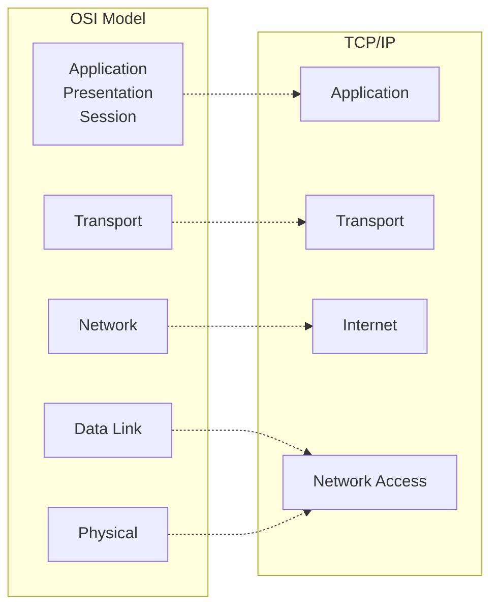
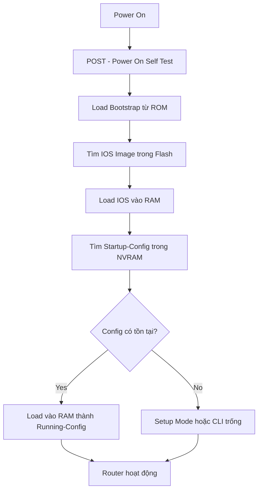
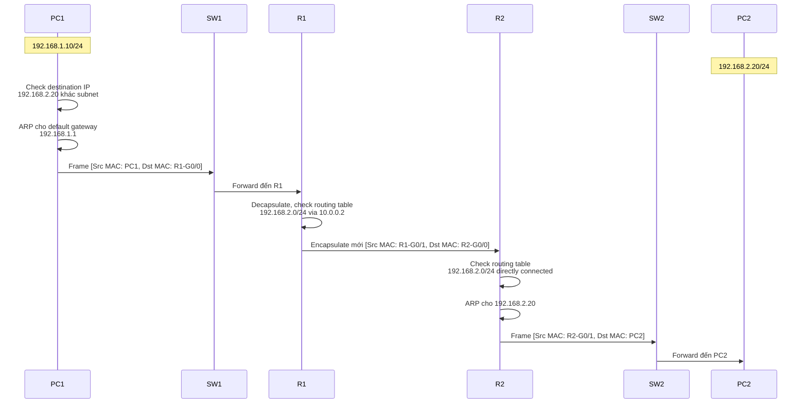
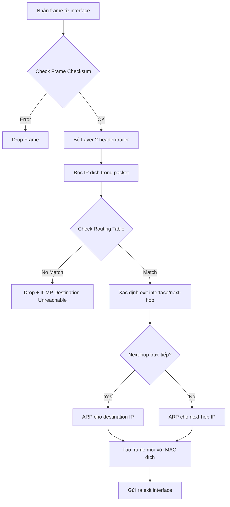

# Tuần 1: Network Devices and Network Infrastructure

## TL1.1 Network Devices and Network Infrastructure

### Các thiết bị mạng cơ bản

#### Router
**Định nghĩa**: Thiết bị lớp 3 (Network Layer) trong mô hình OSI, có nhiệm vụ định tuyến gói tin giữa các mạng khác nhau.

**Chức năng chính**:
- Kết nối nhiều mạng với nhau (LAN-LAN, LAN-WAN)
- Định tuyến dựa trên địa chỉ IP đích
- Phân đoạn broadcast domain
- Cung cấp các dịch vụ: NAT, DHCP, ACL, QoS

#### Switch
**Định nghĩa**: Thiết bị lớp 2 (Data Link Layer), chuyển tiếp frame dựa trên địa chỉ MAC.

**Phân loại**:
- **Layer 2 Switch**: Chỉ hoạt động ở lớp 2
- **Layer 3 Switch**: Có khả năng routing (multilayer switch)

**Chức năng**:
- Kết nối nhiều thiết bị trong cùng mạng LAN
- Học và lưu MAC address vào bảng CAM
- Forward/Filter frame dựa trên MAC đích

#### Hub (Legacy)
- Thiết bị lớp 1, chỉ khuếch đại tín hiệu
- Gửi broadcast tới tất cả cổng → hiệu suất thấp
- **Không còn sử dụng trong mạng hiện đại**

> [!warning] Lưu ý bảo mật
> Hub tạo ra collision domain duy nhất, dễ bị nghe lén (sniffing). Luôn sử dụng switch thay vì hub.

---

## VD1.1 Introduction - Mô hình mạng cơ bản

### Mô hình OSI vs TCP/IP



### IP Address Classes và Subnetting

| Class | Range | Default Mask | Mục đích |
|-------|-------|-------------|----------|
| A | 1.0.0.0 - 126.255.255.255 | /8 | Large networks |
| B | 128.0.0.0 - 191.255.255.255 | /16 | Medium networks |
| C | 192.0.0.0 - 223.255.255.255 | /24 | Small networks |
| D | 224.0.0.0 - 239.255.255.255 | N/A | Multicast |
| E | 240.0.0.0 - 255.255.255.255 | N/A | Reserved |

**Private IP Ranges** (RFC 1918):
- `10.0.0.0/8` → 10.0.0.0 - 10.255.255.255
- `172.16.0.0/12` → 172.16.0.0 - 172.31.255.255
- `192.168.0.0/16` → 192.168.0.0 - 192.168.255.255

---

## VD1.2 Router - Kiến trúc và hoạt động

### Thành phần phần cứng Router

```
┌─────────────────────────────────────────────┐
│              CPU                            │
├─────────────────────────────────────────────┤
│  ROM (Bootstrap, POST, Mini IOS)            │
├─────────────────────────────────────────────┤
│  Flash Memory (IOS Image, Config Backup)    │
├─────────────────────────────────────────────┤
│  RAM (Running Config, Routing Table,        │
│       ARP Cache, Packet Buffers)            │
├─────────────────────────────────────────────┤
│  NVRAM (Startup Config)                     │
└─────────────────────────────────────────────┘
```

### Quá trình Boot của Router



### Router Modes

```
Router> ──────────────────────────────────────────────── User EXEC Mode
  │                                                      (Xem thông tin cơ bản)
  │ enable
  ↓
Router# ──────────────────────────────────────────────── Privileged EXEC Mode
  │                                                      (Xem toàn bộ, debug)
  │ configure terminal
  ↓
Router(config)# ──────────────────────────────────────── Global Config Mode
  │                                                      (Cấu hình toàn router)
  │ interface g0/0
  ↓
Router(config-if)# ───────────────────────────────────── Interface Config Mode
```

### Các lệnh cơ bản

```cisco
! Đặt hostname
Router(config)# hostname R1

! Đặt password cho console
R1(config)# line console 0
R1(config-line)# password cisco123
R1(config-line)# login

! Đặt password cho enable mode
R1(config)# enable secret Str0ngP@ss

! Mã hóa tất cả password dạng plaintext
R1(config)# service password-encryption

! Cấu hình banner cảnh báo
R1(config)# banner motd #
***********************************************
UNAUTHORIZED ACCESS IS PROHIBITED
***********************************************
#

! Lưu cấu hình
R1# copy running-config startup-config
! Hoặc
R1# write memory
```

---

## VD1.3 Routing - Nguyên lý định tuyến

### Routing Table

Router sử dụng **routing table** để quyết định đường đi của gói tin.

**Thành phần của routing entry**:
- **Destination Network**: Mạng đích
- **Next-hop IP/Exit Interface**: IP hop tiếp theo hoặc interface đi ra
- **Metric**: Độ ưu tiên của route
- **Administrative Distance**: Độ tin cậy của nguồn routing

### Các loại Routing

#### 1. Static Routing

**Ưu điểm**:
- Bảo mật cao (admin kiểm soát toàn bộ)
- Không tốn băng thông (không trao đổi routing update)
- Không tốn CPU

**Nhược điểm**:
- Không tự động cập nhật khi topology thay đổi
- Khó quản lý với mạng lớn

**Cú pháp cấu hình**:
```cisco
Router(config)# ip route <destination-network> <subnet-mask> <next-hop-IP | exit-interface> [administrative-distance]

! Ví dụ
R1(config)# ip route 192.168.2.0 255.255.255.0 10.0.0.2
R1(config)# ip route 0.0.0.0 0.0.0.0 203.0.113.1  ! Default route
```

#### 2. Dynamic Routing

Router tự động học và cập nhật routing table thông qua giao thức định tuyến.

**Phân loại**:
- **Distance Vector**: RIP, EIGRP (học từ hàng xóm)
- **Link State**: OSPF, IS-IS (biết toàn bộ topology)
- **Path Vector**: BGP (dùng cho Internet)

### Administrative Distance (AD)

| Nguồn | AD Value |
|-------|----------|
| Directly Connected | 0 |
| Static Route | 1 |
| EIGRP (Internal) | 90 |
| OSPF | 110 |
| RIP | 120 |
| EIGRP (External) | 170 |
| Unknown | 255 (không tin cậy) |

> [!info] Nguyên tắc chọn route
> Router chọn route theo thứ tự:
> 1. **Longest prefix match** (mạng cụ thể nhất)
> 2. **Administrative Distance** (nguồn tin cậy nhất)
> 3. **Metric** (đường đi tốt nhất)

---

## VD1.4 Data Flow - Luồng dữ liệu trong mạng

### Mô hình truyền thông end-to-end



### Encapsulation Process

```
┌────────────────────────────────────────────────┐
│         Application Data                       │  Layer 7-5
├────────────────────────────────────────────────┤
│  TCP/UDP Header | Application Data             │  Layer 4 (Segment)
├────────────────────────────────────────────────┤
│  IP Header | TCP Header | Data                 │  Layer 3 (Packet)
├────────────────────────────────────────────────┤
│  Frame Header | IP Packet | Frame Trailer      │  Layer 2 (Frame)
├────────────────────────────────────────────────┤
│         Bits on Wire                           │  Layer 1 (Bits)
└────────────────────────────────────────────────┘
```

### Quy trình xử lý gói tin trên Router



### Lab cơ bản: Kết nối 2 mạng qua Router

**Topology**:
```
PC1 (192.168.1.10/24) ---- [G0/0] R1 [G0/1] ---- PC2 (192.168.2.10/24)
                        192.168.1.1    192.168.2.1
```

**Cấu hình R1**:
```cisco
R1(config)# interface g0/0
R1(config-if)# ip address 192.168.1.1 255.255.255.0
R1(config-if)# no shutdown
R1(config-if)# exit

R1(config)# interface g0/1
R1(config-if)# ip address 192.168.2.1 255.255.255.0
R1(config-if)# no shutdown
```

**Cấu hình PC1**:
- IP: 192.168.1.10
- Mask: 255.255.255.0
- Gateway: 192.168.1.1

**Cấu hình PC2**:
- IP: 192.168.2.10
- Mask: 255.255.255.0
- Gateway: 192.168.2.1

**Kiểm tra**:
```bash
# Từ PC1
ping 192.168.2.10
traceroute 192.168.2.10

# Trên R1
show ip interface brief
show ip route
show arp
```

> [!tip] Troubleshooting cơ bản
> 1. Kiểm tra interface: `show ip interface brief` (status up/up)
> 2. Kiểm tra routing table: `show ip route`
> 3. Kiểm tra ARP: `show arp`
> 4. Test connectivity: `ping` từng hop
> 5. Kiểm tra cáp vật lý nếu interface down

---

## Bài tập thực hành

### Lab 1: Basic Router Configuration

**Yêu cầu**:
1. Đặt hostname là `Branch-R1`
2. Cấu hình password console: `cisco123`
3. Cấu hình enable secret: `class456`
4. Tạo banner MOTD cảnh báo truy cập
5. Mã hóa tất cả password
6. Lưu cấu hình

### Lab 2: Static Routing

**Topology**:
```
PC1 ---- R1 ---- R2 ---- R3 ---- PC2
     .1      .2 .1    .2 .1    .2
192.168.1.0/24  10.0.12.0/30  10.0.23.0/30  192.168.3.0/24
```

**Yêu cầu**:
1. Cấu hình IP cho tất cả interface
2. Cấu hình static route để PC1 ping được PC2
3. Kiểm tra bảng routing trên từng router
4. Sử dụng `traceroute` để xem đường đi

### Lab 3: Default Route

**Yêu cầu**:
1. Cấu hình default route trên R1 trỏ về R2
2. Test kết nối tới mạng không tồn tại, kiểm tra hành vi của router
3. So sánh với khi không có default route

---

## Câu hỏi ôn tập

??? note "1. Sự khác biệt chính giữa Router và Switch là gì?"

    - **Router**: Lớp 3, định tuyến dựa trên IP, kết nối các mạng khác nhau
    - **Switch**: Lớp 2, chuyển mạch dựa trên MAC, kết nối thiết bị trong cùng mạng
    Router phân đoạn broadcast domain, Switch không


??? note "2. Administrative Distance là gì? Tại sao quan trọng?"


    - Đại lượng đo độ tin cậy của nguồn routing (0-255)
    - Giá trị càng thấp càng đáng tin
    - Dùng để chọn route khi có nhiều nguồn cung cấp cùng mạng đích


??? note "Khi nào nên dùng Static Routing?"

    - Mạng nhỏ, topology đơn giản
    - Yêu cầu bảo mật cao (không muốn routing protocol)
    - Stub network (chỉ có 1 đường ra)
    - Default route tới ISP

---

## Tài liệu tham khảo

- RFC 791: Internet Protocol
- RFC 1918: Address Allocation for Private Internets
- Cisco IOS Configuration Fundamentals Command Reference
- CCNA Official Cert Guide