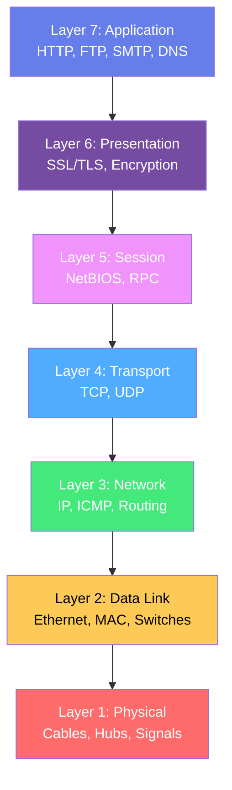
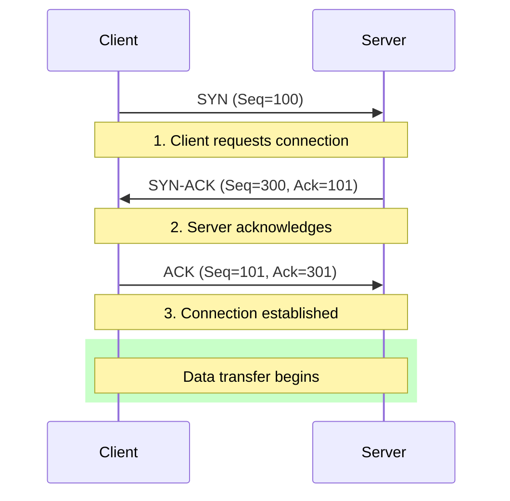
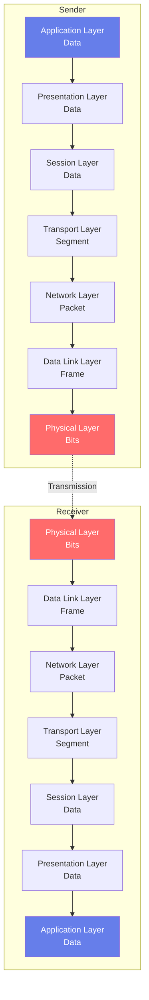
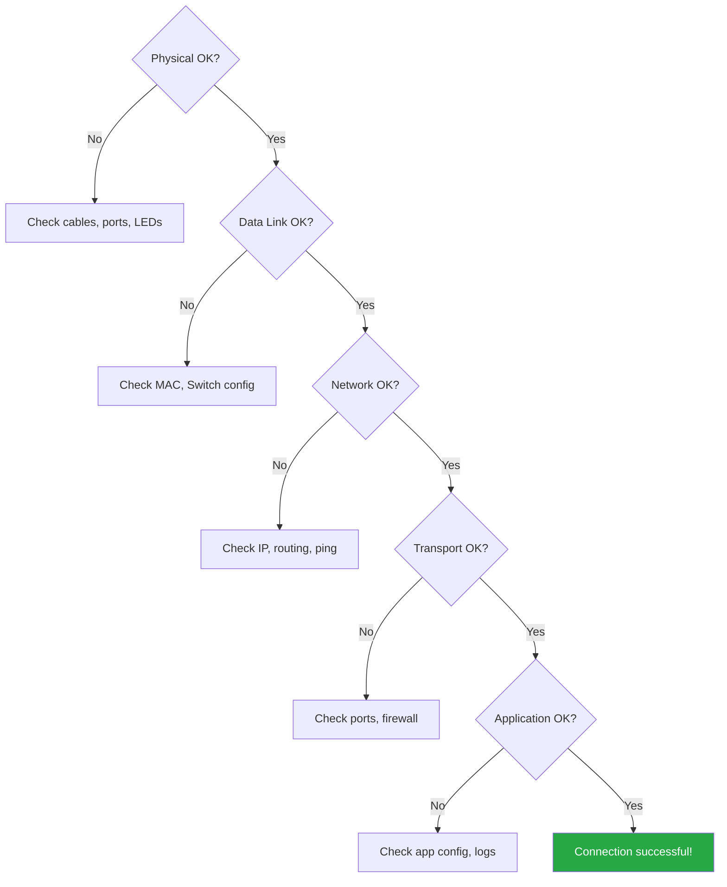

# 🌐 OSI Model - 7 Tầng mạng

Mô hình OSI (Open Systems Interconnection) là mô hình tham chiếu chuẩn cho việc truyền thông mạng.

---

## 📊 Tổng quan 7 tầng OSI



---

## 1️⃣ Layer 1 - Physical Layer (Tầng Vật lý)

### Chức năng
- Truyền bit stream qua môi trường vật lý
- Định nghĩa đặc tính điện, cơ học của thiết bị
- Không quan tâm đến ý nghĩa dữ liệu

### Thiết bị & Công nghệ
- **Cables**: Twisted pair, Coaxial, Fiber optic
- **Devices**: Hub, Repeater, Network adapters
- **Standards**: RS-232, V.35, Ethernet physical standards

### Ví dụ
```
Tín hiệu điện: 0V = bit 0, 5V = bit 1
Manchester encoding cho Ethernet
```

!!! example "Real-world Example"
    Khi bạn cắm dây mạng RJ-45 vào máy tính, đó là Layer 1 đang hoạt động.

---

## 2️⃣ Layer 2 - Data Link Layer (Tầng Liên kết dữ liệu)

### Chức năng
- Đóng gói dữ liệu thành **frames**
- Địa chỉ **MAC addressing**
- Kiểm soát lỗi và luồng dữ liệu
- Phát hiện collision (CSMA/CD)

### Sub-layers
- **LLC** (Logical Link Control) - Giao tiếp với Network layer
- **MAC** (Media Access Control) - Giao tiếp với Physical layer

### Thiết bị & Protocols
- **Devices**: Switch, Bridge, NIC
- **Protocols**: Ethernet, PPP, HDLC, Frame Relay

### MAC Address Format
```
XX:XX:XX:XX:XX:XX
48 bits (6 bytes)

Example: 00:1A:2B:3C:4D:5E
         └─────┬─────┘└──┬──┘
           OUI (Vendor)  Device ID
```

### Ethernet Frame Structure

```
┌──────────┬──────────┬──────┬────────┬─────┬─────┐
│ Preamble │   Dest   │ Src  │  Type  │Data │ FCS │
│  7 bytes │ MAC (6B) │MAC(6)│ (2B)   │ ... │ 4B  │
└──────────┴──────────┴──────┴────────┴─────┴─────┘
```

!!! warning "Important"
    Switches học MAC address và forward frames dựa trên MAC table.

---

## 3️⃣ Layer 3 - Network Layer (Tầng Mạng)

### Chức năng
- **Routing** - Tìm đường tối ưu
- **Logical addressing** - IP addressing
- Phân mảnh và tái hợp gói tin
- Quản lý congestion

### Thiết bị & Protocols
- **Devices**: Router, Layer 3 Switch
- **Protocols**: IP, ICMP, IGMP, IPsec
- **Routing Protocols**: OSPF, BGP, EIGRP, RIP

### IPv4 Packet Header

```
 0                   1                   2                   3
 0 1 2 3 4 5 6 7 8 9 0 1 2 3 4 5 6 7 8 9 0 1 2 3 4 5 6 7 8 9 0 1
+-+-+-+-+-+-+-+-+-+-+-+-+-+-+-+-+-+-+-+-+-+-+-+-+-+-+-+-+-+-+-+-+
|Version|  IHL  |Type of Service|          Total Length         |
+-+-+-+-+-+-+-+-+-+-+-+-+-+-+-+-+-+-+-+-+-+-+-+-+-+-+-+-+-+-+-+-+
|         Identification        |Flags|      Fragment Offset    |
+-+-+-+-+-+-+-+-+-+-+-+-+-+-+-+-+-+-+-+-+-+-+-+-+-+-+-+-+-+-+-+-+
|  Time to Live |    Protocol   |         Header Checksum       |
+-+-+-+-+-+-+-+-+-+-+-+-+-+-+-+-+-+-+-+-+-+-+-+-+-+-+-+-+-+-+-+-+
|                       Source Address                          |
+-+-+-+-+-+-+-+-+-+-+-+-+-+-+-+-+-+-+-+-+-+-+-+-+-+-+-+-+-+-+-+-+
|                    Destination Address                        |
+-+-+-+-+-+-+-+-+-+-+-+-+-+-+-+-+-+-+-+-+-+-+-+-+-+-+-+-+-+-+-+-+
```

### Routing Example


---

## 4️⃣ Layer 4 - Transport Layer (Tầng Giao vận)

### Chức năng
- **Segmentation** và reassembly
- **Port addressing** - Phân biệt ứng dụng
- **Connection control** - TCP vs UDP
- **Flow control** - Window size
- **Error control** - Checksum, ACK

### TCP vs UDP

| Feature | TCP | UDP |
|---------|-----|-----|
| **Connection** | Connection-oriented | Connectionless |
| **Reliability** | Reliable (ACK) | Unreliable |
| **Speed** | Slower | Faster |
| **Header Size** | 20 bytes | 8 bytes |
| **Use Cases** | HTTP, FTP, Email | DNS, Video streaming, Gaming |

### TCP 3-Way Handshake



### Common Port Numbers

| Port | Protocol | Service |
|------|----------|---------|
| 20/21 | TCP | FTP |
| 22 | TCP | SSH |
| 23 | TCP | Telnet |
| 25 | TCP | SMTP |
| 53 | TCP/UDP | DNS |
| 80 | TCP | HTTP |
| 443 | TCP | HTTPS |
| 3389 | TCP | RDP |

---

## 5️⃣ Layer 5 - Session Layer (Tầng Phiên)

### Chức năng
- Thiết lập, quản lý, kết thúc sessions
- Dialog control (half-duplex, full-duplex)
- Synchronization với checkpoints

### Protocols
- **NetBIOS** - Network Basic Input/Output System
- **RPC** - Remote Procedure Call
- **PPTP** - Point-to-Point Tunneling Protocol
- **SAP** - Session Announcement Protocol

!!! info "Session Example"
    Khi bạn login vào một website, session được tạo để duy trì trạng thái đăng nhập.

---

## 6️⃣ Layer 6 - Presentation Layer (Tầng Trình bày)

### Chức năng
- **Translation** - Chuyển đổi format dữ liệu
- **Encryption/Decryption** - Bảo mật dữ liệu
- **Compression** - Nén dữ liệu
- **Data formatting** - ASCII, EBCDIC, JPEG, MPEG

### Protocols & Standards
- **SSL/TLS** - Encryption
- **MIME** - Email encoding
- **JPEG, GIF, PNG** - Image formats
- **MPEG, QuickTime** - Video formats

### Encryption Example

```
Plain text:  "Hello World"
             ↓ (SSL/TLS encryption)
Cipher text: "8F3A9D2E..."
             ↓ (Network transmission)
Cipher text: "8F3A9D2E..."
             ↓ (SSL/TLS decryption)
Plain text:  "Hello World"
```

---

## 7️⃣ Layer 7 - Application Layer (Tầng Ứng dụng)

### Chức năng
- Giao diện giữa ứng dụng và mạng
- Cung cấp network services cho user applications
- Không phải là chính ứng dụng (vd: browser)

### Protocols

=== "Web"
    - **HTTP/HTTPS** - Web browsing
    - **WebSocket** - Real-time communication

=== "File Transfer"
    - **FTP** - File Transfer Protocol
    - **TFTP** - Trivial FTP
    - **SFTP** - SSH FTP

=== "Email"
    - **SMTP** - Sending email
    - **POP3** - Receiving email
    - **IMAP** - Email management

=== "DNS & Network"
    - **DNS** - Domain Name System
    - **DHCP** - Dynamic IP assignment
    - **SNMP** - Network management
    - **Telnet/SSH** - Remote access

### HTTP Request Example

```http
GET /index.html HTTP/1.1
Host: www.example.com
User-Agent: Mozilla/5.0
Accept: text/html
Accept-Language: en-US
Connection: keep-alive
```

---

## 🔄 Data Encapsulation Process



### PDU (Protocol Data Unit) Names

| Layer | PDU Name |
|-------|----------|
| Application, Presentation, Session | **Data** |
| Transport | **Segment** (TCP) / **Datagram** (UDP) |
| Network | **Packet** |
| Data Link | **Frame** |
| Physical | **Bits** |

---

## 🎯 Troubleshooting theo OSI Model

### Bottom-Up Approach



### Common Commands by Layer

| Layer | Linux Command | Windows Command |
|-------|--------------|-----------------|
| **Layer 1** | `ethtool eth0` | Check Device Manager |
| **Layer 2** | `ip link show`<br/>`arp -a` | `ipconfig /all`<br/>`arp -a` |
| **Layer 3** | `ip route`<br/>`ping`<br/>`traceroute` | `route print`<br/>`ping`<br/>`tracert` |
| **Layer 4** | `ss -tulpn`<br/>`netstat -an` | `netstat -an` |
| **Layer 7** | `curl`<br/>`nslookup`<br/>`telnet` | `curl`<br/>`nslookup`<br/>`telnet` |

---

## 📝 Practice Scenarios

### Scenario 1: No Internet Access

**Symptoms**: User cannot browse websites

**Troubleshooting**:

1. **Layer 1**: Check cable, port LEDs → ✅ OK
2. **Layer 2**: `arp -a` shows gateway → ✅ OK
3. **Layer 3**: `ping 8.8.8.8` → ❌ FAILED
4. **Solution**: Check default gateway, routing

### Scenario 2: Slow Connection

**Symptoms**: High latency, packet loss

**Investigation**:

```bash
# Check interface errors (Layer 2)
$ ip -s link show eth0

# Check route path (Layer 3)
$ traceroute google.com

# Check TCP connections (Layer 4)
$ ss -s  # Summary statistics
```

---

## 🎓 Key Takeaways

!!! success "Remember"
    - **Please Do Not Throw Sausage Pizza Away**
      - **P**hysical
      - **D**ata Link
      - **N**etwork
      - **T**ransport
      - **S**ession
      - **P**resentation
      - **A**pplication

!!! tip "Practical Tips"
    - Troubleshoot from Layer 1 up (bottom-up)
    - Each layer adds its own header (encapsulation)
    - Routers work at Layer 3, Switches at Layer 2
    - Firewalls can operate at Layers 3, 4, or 7

---

## 📚 References

- [Cisco Networking Academy](https://www.netacad.com/)
- [RFC 1122 - Internet Protocol Suite](https://www.rfc-editor.org/rfc/rfc1122)
- [Wireshark User Guide](https://www.wireshark.org/docs/wsug_html_chunked/)

---

**Học xong OSI Model**: ✅ | **Tiếp theo**: [TCP/IP Model](tcp-ip-model.md)
