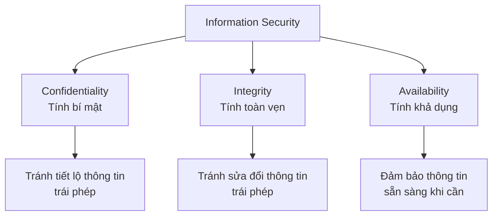
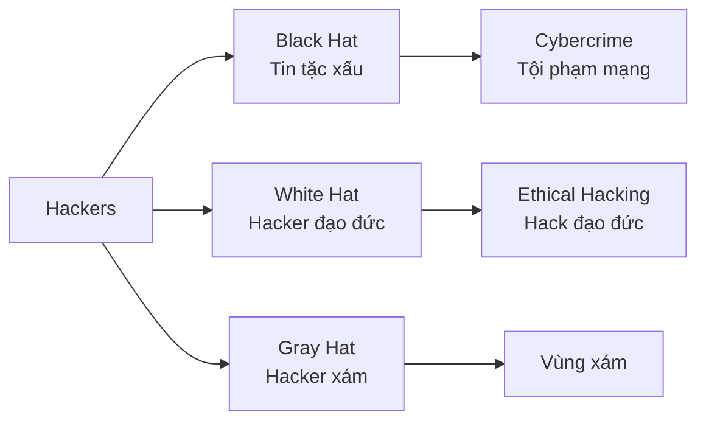
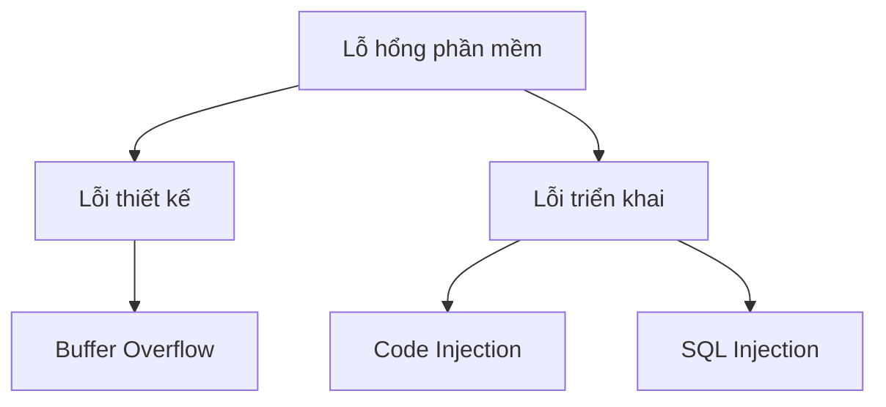
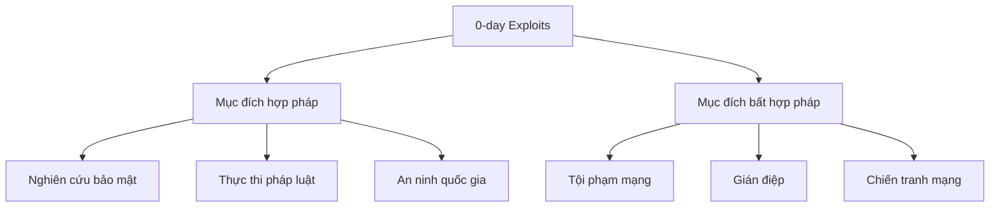

# Bài 1: Giới thiệu về Cybersecurity

---

## 1. Thông tin môn học

### 1.1 Mục tiêu khóa học
- Cung cấp nền tảng về bảo mật mạng máy tính
- Tập trung vào các nguyên lý cơ bản và bảo mật cho mạng máy tính
- Không tập trung vào "yếu tố con người trong bảo mật"

### 1.2 Yêu cầu tiên quyết
- **IT005** - Nhập môn mạng máy tính
- Hiểu cách máy tính hoạt động (CPU, bộ nhớ ảo)
- Kinh nghiệm lập trình (IT001 - IT004)
- Kiến thức cơ bản về mật mã học (NT219) - đối với sinh viên chuyên ngành ATTT

### 1.3 Đánh giá
| Thành phần | Tỷ trọng |
|------------|----------|
| Bài tập, hoạt động lớp | 10% |
| Đồ án cuối kỳ | 20% |
| Thực hành lab | 20% |
| Thi cuối kỳ | 50% |

### 1.4 Tài liệu tham khảo
- **[SEED book]** Wenliang Du (2019). Computer & Internet Security: A hands-on approach, 2nd edition
- **[CS book]** William Stallings and Lawrie Brown (2018). Computer Security: Principles and Practice, 4th Edition

---

## 2. Tình trạng An ninh mạng hiện tại

### 2.1 Các khái niệm cơ bản

#### Information Security (Bảo mật thông tin)
> "Bảo vệ thông tin và hệ thống thông tin khỏi truy cập, sử dụng, tiết lộ, gián đoạn, sửa đổi hoặc phá hủy trái phép nhằm đảm bảo tính bí mật, toàn vẹn và khả dụng."
> 
> — NIST

#### CIA Triad - Ba mục tiêu chính



### 2.2 Phân biệt các khái niệm

| Khái niệm | Định nghĩa | Phạm vi |
|-----------|-----------|---------|
| **Information Security** | Bảo vệ thông tin và hệ thống thông tin | Rộng nhất |
| **Cybersecurity** | Bảo vệ mạng, máy tính, dữ liệu khỏi truy cập số trái phép | Tập con của Information Security |
| **Network Security** | Bảo vệ dữ liệu được truyền qua mạng | Tập con của Cybersecurity |

### 2.3 Thực trạng

#### Số liệu từ ISACA (2020)
- **Thiếu hụt nhân lực**: Tình hình tuyển dụng và giữ chân nhân tài trong lĩnh vực cybersecurity có ít tiến bộ
- **92%** chuyên gia IT audit và bảo mật cho rằng tội phạm mạng đang gia tăng (trong bối cảnh COVID-19)

#### Đặc điểm hiện tại
- ✗ Nhiều phần mềm có lỗi
- ✗ Tội phạm mạng liên tục gia tăng và ngày càng tốn kém
- ✗ Kỹ thuật xã hội (social engineering) rất hiệu quả
- ✗ Có thể kiếm được nhiều tiền từ việc tìm và khai thác lỗ hổng

---

## 3. Các mối đe dọa bảo mật

### 3.1 Hacker là ai?

#### Định nghĩa
> **Hacker** (danh từ): Người có kỹ năng sử dụng hệ thống máy tính, thường là người truy cập bất hợp pháp vào hệ thống máy tính riêng tư

#### Phân loại Hacker



### 3.2 Động cơ của Hacker

#### 1. Trẻ em nghịch ngợm
- **Ví dụ**: Kristoffer von Hassel (2009) - Hacker trẻ tuổi nhất thế giới

#### 2. Nation-state actors (Tác nhân quốc gia)
- Tấn công có tài trợ từ nhà nước
- Mục tiêu chính trị hoặc kinh tế

#### 3. Động cơ tài chính
- **Phổ biến nhất**
- Tống tiền, mua bán thông tin chợ đen
- Ransomware, banking trojans

### 3.3 Các cuộc tấn công nổi tiếng

| Năm | Tấn công | Mô tả |
|-----|----------|-------|
| 1988 | Morris Worm | Sâu Internet đầu tiên |
| 2014 | Heartbleed | Lỗ hổng OpenSSL nghiêm trọng |
| 2016 | Mirai Botnet | Botnet IoT quy mô lớn |
| 2017 | WannaCry | Ransomware toàn cầu |

---

## 4. Lỗ hổng bảo mật

### 4.1 Các khái niệm quan trọng

#### Vulnerability (Lỗ hổng)
Điểm yếu đã biết của tài sản hệ thống có thể bị khai thác

#### Threat (Mối đe dọa)
Sự cố mới hoặc mới phát hiện có khả năng gây hại cho hệ thống

#### Risk (Rủi ro)
Khả năng bị mất mát hoặc thiệt hại khi mối đe dọa khai thác lỗ hổng

#### Attack (Tấn công)
Mối đe dọa được thực hiện, nếu thành công sẽ dẫn đến vi phạm bảo mật

### 4.2 Nguồn gốc Lỗ hổng

#### 1. Lỗi phần mềm


**Buffer Overflow** - Vẫn là một trong những vấn đề lớn nhất:
- Được sử dụng trong Morris Worm (1988)
- Vẫn nằm trong Top 25 CWE (Common Weakness Enumeration)

#### 2. Cấu hình sai (Misconfiguration)
- Đây là vấn đề **CUC KỲ LỚN**
- Ví dụ: Cơ sở dữ liệu mở công khai, quyền truy cập không hợp lý

#### 3. Con người kém đào tạo
- Social engineering
- Phishing attacks
- Weak passwords

### 4.3 Các ứng dụng dễ bị khai thác

Theo Kaspersky Security Bulletin 2019:
- Trình duyệt web
- Ứng dụng văn phòng (Office)
- Flash Player
- Java
- PDF readers

---

## 5. Thị trường Zero-day

### 5.1 Khái niệm 0-day
**Zero-day exploit**: Lỗ hổng chưa được công bố, nhà sản xuất chưa có bản vá

### 5.2 Các kênh bán 0-day

#### Option 1: Bug Bounty Programs (Hợp pháp)
| Chương trình | Phần thưởng tối đa |
|--------------|-------------------|
| Google VRP | $31,337 |
| Microsoft Bounty | $100,000 |
| Apple Bug Bounty | $200,000 |
| Pwn2Own | $15,000 |

#### Option 2: Thị trường Chợ đen
| Công ty | Giá mua |
|---------|---------|
| Zerodium | Lên đến $2.5M (Android) |
| Zerodium | Lên đến $2M (iOS) |

### 5.3 Mục đích mua 0-day



---

## 6. Trusted Computing Base (TCB)

### 6.1 Vấn đề "Trusting Trust"

**Bài toán của Ken Thompson (1984)**:

```
Làm thế nào để tin tưởng code khi:
1. Compiler có thể bị backdoor
2. Compiler tự biên dịch chính nó
3. Source code có thể được phục hồi sau khi nhiễm mã độc
```

### 6.2 Giải pháp: TCB

> **Trusted Computing Base**: Giả định một phần tối thiểu của hệ thống không bị xâm phạm, sau đó xây dựng môi trường bảo mật dựa trên đó.

**Kết luận**: Không có gì hoàn toàn đáng tin cậy, nhưng chúng ta cần một điểm xuất phát để tiến về phía trước.

---

## Bài tập

### Homework 1
Chọn một sự cố hack gây ấn tượng nhất từ [danh sách sự cố bảo mật](https://en.wikipedia.org/wiki/List_of_security_hacking_incidents), tìm hiểu và tóm tắt trong báo cáo 1 trang:

**Nội dung cần có:**
- Khi nào (When)
- Ai (Who)
- Ở đâu (Where)
- Tại sao (Why)
- Như thế nào (How)
- Tài liệu tham khảo (References)

---

## Tài liệu tham khảo

1. [ISACA State of Cybersecurity 2020](http://www.isaca.org/state-of-cybersecurity-2020)
2. [Kaspersky Blog - Five Most Notorious Cyberattacks](https://www.kaspersky.com/blog/five-most-notorious-cyberattacks/24506/)
3. [Wikipedia - List of Security Hacking Incidents](https://en.wikipedia.org/wiki/List_of_security_hacking_incidents)
4. [CWE Top 25](https://cwe.mitre.org/top25/)
5. [Zerodium](https://zerodium.com/)