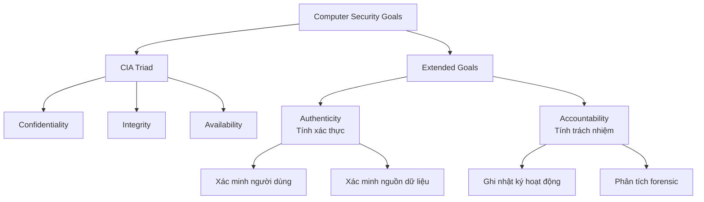
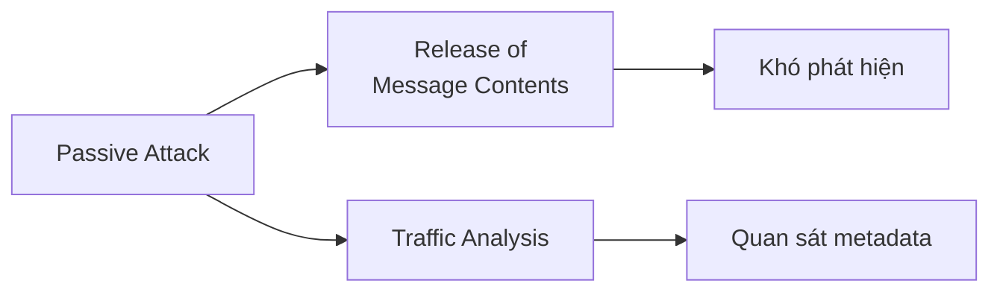
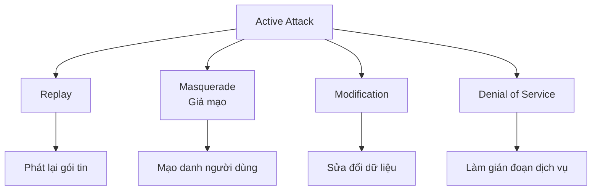
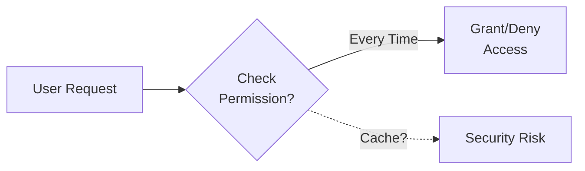
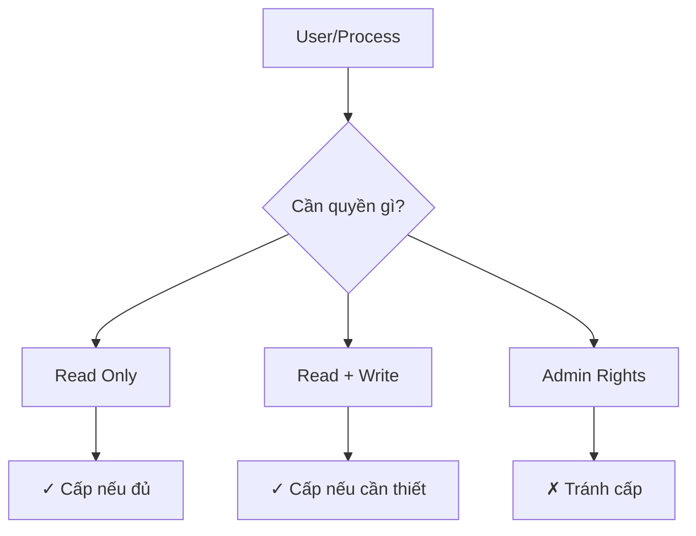
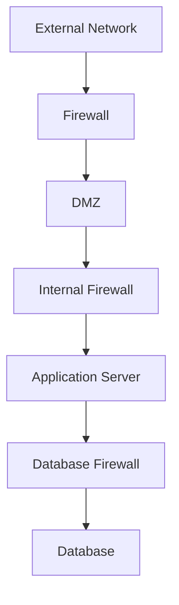
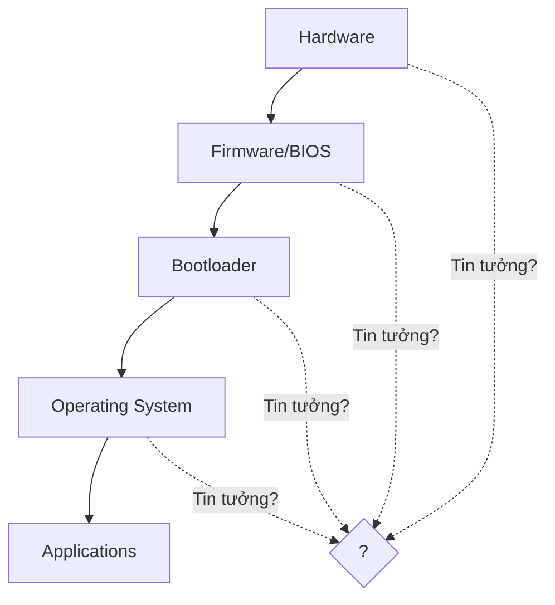
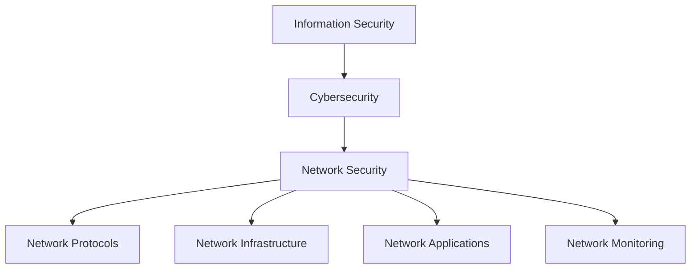

# Bài 2: Các khái niệm và Nguyên lý Bảo mật

---

## 1. Khái niệm bảo mật máy tính

### 1.1 Định nghĩa (NIST)

> **Computer Security**: "Các biện pháp và kiểm soát đảm bảo tính bí mật, toàn vẹn và khả dụng của tài sản hệ thống thông tin bao gồm phần cứng, phần mềm, firmware và thông tin đang được xử lý, lưu trữ và truyền thông"

### 1.2 Mục tiêu bảo mật mở rộng

Ngoài **CIA Triad**, có 2 mục tiêu bổ sung quan trọng:



---

## 2. Mối đe dọa và Tấn công

### 2.1 Thuật ngữ cơ bản

| Thuật ngữ | Định nghĩa | Ví dụ |
|-----------|-----------|-------|
| **Vulnerability** | Điểm yếu đã biết của tài sản hệ thống | Buffer overflow, SQL injection |
| **Threat** | Sự cố có khả năng gây hại cho hệ thống | Malware mới, zero-day exploit |
| **Risk** | Khả năng mất mát khi threat khai thác vulnerability | Mất dữ liệu khách hàng |
| **Attack** | Threat được thực hiện | DDoS attack, phishing campaign |
| **Countermeasure** | Biện pháp đối phó với attack | Firewall, IDS, encryption |

### 2.2 Phân loại Tấn công

#### 2.2.1 Passive Attack (Tấn công thụ động)



**Đặc điểm:**
- Không thay đổi dữ liệu hoặc hệ thống
- **Rất khó phát hiện**
- Mục tiêu: Thu thập thông tin

**Ví dụ:**
- Nghe lén (eavesdropping)
- Phân tích lưu lượng mạng
- Sniffing passwords

#### 2.2.2 Active Attack (Tấn công chủ động)



**Đặc điểm:**
- Cố gắng thay đổi tài sản hệ thống
- Có thể phát hiện được (nhưng khó ngăn chặn)
- Gây thiệt hại trực tiếp

### 2.3 Hệ thống phân loại Threat (RFC 4949)

#### Threat Consequences và Threat Actions

| Consequence | Actions | Mô tả |
|-------------|---------|-------|
| **Unauthorized Disclosure** | • Exposure<br/>• Interception<br/>• Inference<br/>• Intrusion | Dữ liệu nhạy cảm bị tiết lộ trực tiếp hoặc gián tiếp |
| **Deception** | • Masquerade<br/>• Falsification<br/>• Repudiation | Người dùng tin vào dữ liệu giả mạo |
| **Disruption** | • Incapacitation<br/>• Corruption<br/>• Obstruction | Gián đoạn hoạt động bình thường |
| **Usurpation** | • Misappropriation<br/>• Misuse | Chiếm quyền kiểm soát trái phép |

### 2.4 Threats và Assets

#### Bảng phân tích Threats theo Asset

| Asset | Availability | Confidentiality | Integrity |
|-------|--------------|-----------------|-----------|
| **Hardware** | Thiết bị bị đánh cắp/vô hiệu hóa | USB không mã hóa bị mất | - |
| **Software** | Chương trình bị xóa | Sao chép phần mềm trái phép | Code bị sửa đổi có chủ ý |
| **Data** | File bị xóa | Đọc dữ liệu trái phép | File bị sửa đổi/giả mạo |
| **Communication** | Tin nhắn bị phá hủy | Tin nhắn bị đọc lén | Tin nhắn bị sửa đổi/giả mạo |

---

## 3. Nguyên lý thiết kế bảo mật

### 3.1 Các nguyên lý cơ bản

#### 1. Economy of Mechanism (Tiết kiệm cơ chế)

**Nguyên tắc**: Cơ chế bảo mật nên đơn giản nhất có thể

```
✓ Simple = Dễ hiểu = Dễ kiểm tra = Ít lỗi
✗ Complex = Khó hiểu = Khó kiểm tra = Nhiều lỗi
```

**Ví dụ**:
- Sử dụng whitelist thay vì blacklist
- Giao thức đơn giản thay vì phức tạp

#### 2. Fail-Safe Defaults (Mặc định an toàn)

**Nguyên tắc**: Từ chối truy cập trừ khi được cấp phép rõ ràng

```python
# ✗ SAI - Cho phép trừ khi bị từ chối
if (dwRet == ERROR_ACCESS_DENIED):
    deny_access()
else:
    allow_access()  # Nguy hiểm nếu có lỗi!

# ✓ ĐÚNG - Từ chối trừ khi được cho phép
if (dwRet == NO_ERROR):
    allow_access()
else:
    deny_access()  # An toàn
```

**Ví dụ thực tế**:
- Firewall: Deny all, allow specific
- File permissions: No access by default

#### 3. Complete Mediation (Kiểm tra toàn diện)

**Nguyên tắc**: Mọi truy cập đến object đều phải được kiểm tra



**Lỗi thường gặp**: Cache quyền truy cập và không kiểm tra lại

#### 4. Open Design (Thiết kế mở)

**Nguyên tắc**: Bảo mật không nên dựa vào tính bí mật của thiết kế

**Kerckhoffs' Principle (1883)**:
> "Hệ thống mật mã phải an toàn ngay cả khi kẻ tấn công biết toàn bộ thuật toán, chỉ khóa là bí mật"

```
Security through Obscurity = ✗ Không tốt
Security through Strong Algorithm + Secret Key = ✓ Tốt
```

#### 5. Separation of Privilege (Tách biệt đặc quyền)

**Nguyên tắc**: Cần nhiều điều kiện để cấp quyền

**Ví dụ**:
```
✗ Chỉ cần password
✓ Password + OTP (Two-Factor Authentication)
✓ Password + Biometric + Smart Card (Multi-Factor)
```

#### 6. Least Privilege (Đặc quyền tối thiểu)

**Nguyên tắc**: Chỉ cấp quyền tối thiểu cần thiết để hoàn thành công việc



**Ví dụ**:
- Web server chạy với user thường, không phải root
- Database user chỉ có quyền SELECT, không có DELETE

#### 7. Least Common Mechanism (Cơ chế chung tối thiểu)

**Nguyên tắc**: Giảm thiểu chia sẻ tài nguyên giữa các user

**Lý do**: Chia sẻ tài nguyên tạo ra kênh thông tin không mong muốn

#### 8. Psychological Acceptability (Chấp nhận về mặt tâm lý)

**Nguyên tắc**: Cơ chế bảo mật không được làm tài nguyên khó truy cập hơn

```
Bảo mật quá phức tạp → User bypass → Kém an toàn hơn
```

**Ví dụ**:
- Password policy quá phức tạp → User viết ra giấy
- MFA quá rườm rà → User tìm cách vô hiệu hóa

### 3.2 Các nguyên lý bổ sung

#### 9. Isolation (Cô lập)

**Ba loại isolation**:
1. Cô lập hệ thống công cộng khỏi tài nguyên quan trọng
2. Cô lập processes và files của các user
3. Cô lập cơ chế bảo mật

#### 10. Encapsulation (Đóng gói)

Bảo vệ bằng cách đóng gói procedures và data objects trong một domain

#### 11. Modularity (Mô-đun hóa)

Phát triển các chức năng bảo mật như các module riêng biệt, được bảo vệ

#### 12. Layering (Phân lớp)

**Defense in Depth**: Nhiều lớp bảo vệ



#### 13. Least Astonishment (Ít ngạc nhiên nhất)

Chương trình nên phản hồi theo cách ít gây ngạc nhiên nhất cho user

---

## 4. Trusted Computing Base

### 4.1 Vấn đề "Reflections on Trusting Trust"

**Ken Thompson's Attack (1984)**:

#### Bước 1: Nhiễm Compiler

```c
compile(s) {
    if (match(s, "login-program")) {
        compile("login-backdoor");
        return;
    }
    if (match(s, "compiler-program")) {
        compile("compiler-backdoor");
        return;
    }
    /* regular compilation */
}
```

#### Bước 2: Che dấu

1. Compile compiler bị nhiễm → Compiler binary có backdoor
2. Khôi phục compiler source về trạng thái gốc
3. Kết quả:
   - Source code trông sạch sẽ
   - Nhưng mỗi lần compile lại tạo ra compiler bị nhiễm

### 4.2 Chuỗi Trust



**Câu hỏi**: Khi mua laptop mới, ta có thể tin tưởng gì?
- ✗ Applications - có thể bị backdoor
- ✗ OS - có thể bị backdoor
- ✗ BIOS/UEFI - có thể bị backdoor (VD: ShadowHammer 2018)
- ✗ Motherboard - có thể bị backdoor
- ✗ Hardware - có thể bị backdoor

### 4.3 Giải pháp: TCB

> **Trusted Computing Base (TCB)**: Giả định một phần tối thiểu của hệ thống không bị xâm phạm, sau đó xây dựng môi trường bảo mật trên đó.

**Nguyên tắc**:
1. Xác định TCB càng nhỏ càng tốt
2. Kiểm tra và xác minh TCB kỹ lưỡng
3. Xây dựng security policies dựa trên TCB
4. Giám sát liên tục

**Kết luận**:
> "Sadly, nothing … anything can be compromised. But then we can't make progress."
> 
> Chúng ta phải chấp nhận một mức độ tin tưởng nhất định để có thể tiến về phía trước.

---

## Bài tập

### In-class Exercise

#### Bài tập 1: Phân tích Vulnerabilities
Liệt kê tất cả các thiết bị điện tử có thể kết nối Internet trong nhà bạn. Với mỗi thiết bị, xác định:
- Potential vulnerabilities (lỗ hổng tiềm ẩn)
- Potential threats (mối đe dọa tiềm ẩn)
- Potential risks (rủi ro tiềm ẩn)

#### Bài tập 2: Phân tích Website
Phân tích website **daa.uit.edu.vn**, liệt kê:
- Vulnerabilities
- Threats
- Risks

### Homework 2

#### Phần 1: Security Design Principles
Tóm tắt tất cả các Nguyên lý Thiết kế Bảo mật và đưa ra ví dụ cho mỗi nguyên lý:

1. Economy of mechanism
2. Fail-safe defaults
3. Complete mediation
4. Open design
5. Separation of privilege
6. Least privilege
7. Least common mechanism
8. Psychological acceptability
9. Isolation
10. Encapsulation
11. Modularity
12. Layering
13. Least astonishment

**Tham khảo**: CS Book, Section 1.4, Chapter 1

#### Phần 2: Code Analysis

Phân tích đoạn code sau:

```c
DWORD dwRet = IsAccessAllowed(...);
if (dwRet == ERROR_ACCESS_DENIED) {
    // Security check failed
    // Inform user that access is denied
} else {
    // Security check OK.
    // Do something
}
```

**Câu hỏi**:
a. Giải thích lỗi bảo mật trong chương trình này
b. Viết lại code để tránh lỗi này

**Gợi ý**: Xem xét nguyên lý "fail-safe defaults"

---

## Tóm tắt

### Key Takeaways

1. **Security Goals**: CIA + Authenticity + Accountability
2. **Threats vs Attacks**: Threat là khả năng, Attack là thực thi
3. **Design Principles**: 13 nguyên lý cơ bản cần áp dụng khi thiết kế hệ thống bảo mật
4. **TCB**: Cần một điểm tin cậy tối thiểu để xây dựng bảo mật

### Scope of Network Security



**Môn học này tập trung vào**: Network Security

---

## Tài liệu tham khảo

1. NIST Internal Report NISTIR 7298
2. RFC 4949 - Internet Security Glossary
3. Ken Thompson (1984). "Reflections on Trusting Trust", CACM
4. CS Book - Chapter 1: Computer Security Concepts
5. Saltzer & Schroeder (1975). "The Protection of Information in Computer Systems"