# Bài 3: Tổng quan về Mật mã học


---

## 1. Vai trò của Mật mã học

### 1.1 Mật mã và CIA Triad

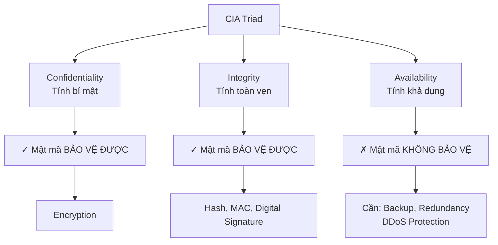

**Kết luận quan trọng:**
- Mật mã học bảo vệ **Information-focused goals** (C & I)
- Mật mã học KHÔNG bảo vệ **System-focused goal** (A)

### 1.2 Mục tiêu bảo mật tin nhắn

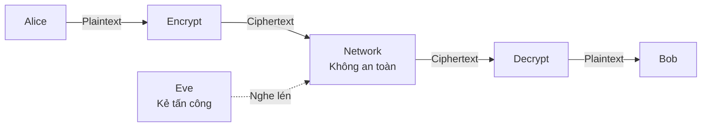

**Hai mục tiêu chính:**

1. **Semantic Security (Bảo mật ngữ nghĩa)**:
   - Ciphertext không tiết lộ thông tin gì về plaintext
   - Kẻ tấn công không biết key không thể đọc được

2. **Non-malleable Security (Không thể sửa đổi)**:
   - Ciphertext không thể bị can thiệp có ý nghĩa
   - Ngăn chặn tấn công thay đổi nội dung

---

## 2. Threat Model trong Mật mã

### 2.1 Kerckhoff's Principle (1883)

> **Nguyên tắc Kerckhoff**: "Phương pháp mã hóa không cần phải bí mật và có thể rơi vào tay kẻ thù mà không gây bất tiện"

**Phiên bản hiện đại:**
```
Bảo mật = Thuật toán mạnh (Công khai) + Khóa bí mật
       ≠ Thuật toán bí mật (Security through Obscurity)
```

**Lý do:**
- Giữ thuật toán bí mật hầu như luôn thất bại
- Tốt hơn là dùng thuật toán đã được chuyên gia kiểm tra
- Open Design Principle

### 2.2 Kẻ tấn công biết gì?

#### Adversary Knowledge

**Về thuật toán:**
- ✓ Biết tất cả các thuật toán mã hóa
- ✓ Biết cipher mode được dùng

**Về hành vi:**
- ✓ Biết ngôn ngữ message (VD: tiếng Anh)
- ✓ Biết các pattern thông dụng (email headers)
- ✓ Có thể đoán được các khóa/mật khẩu phổ biến

**Về khả năng:**
- ✓ Có thể chặn/sửa đổi mọi communication
- ✓ Có sức mạnh tính toán hợp lý (Polynomial-Time)

### 2.3 Điều gì phải bí mật?

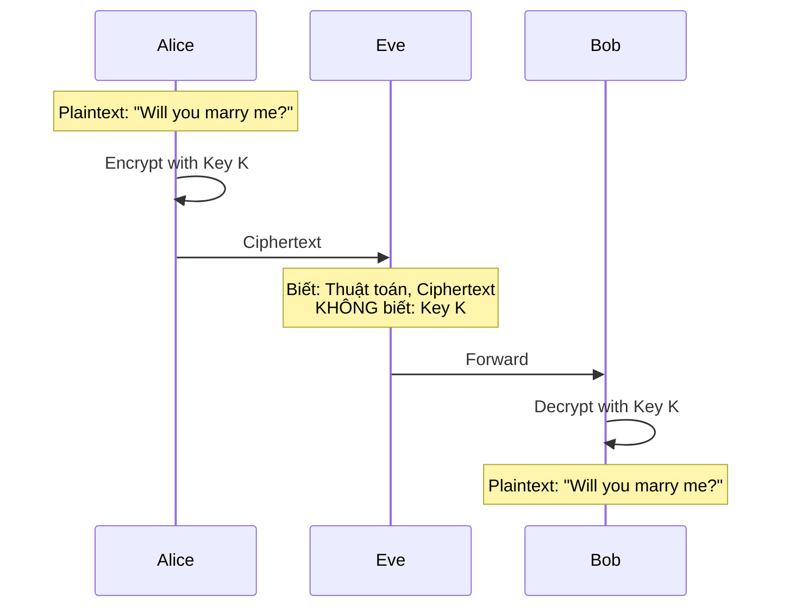

**Câu hỏi then chốt:**
- Decryption Key có cần bí mật? → **CÓ** (bắt buộc)
- Encryption Key có cần bí mật? → **KHÔNG nhất thiết!**

**Breakthrough:** Mã hóa bất đối xứng (Public-Key Cryptography)

---

## 3. Mã hóa đối xứng

### 3.1 Khái niệm Symmetric Ciphers

```
Đặc điểm: Encryption Key = Decryption Key (hoặc dễ tính từ nhau)
```

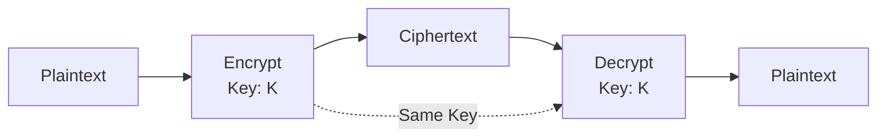

#### Ưu nhược điểm

| Ưu điểm ✓ | Nhược điểm ✗ |
|-----------|--------------|
| Rất nhanh (5-10 Gbps với AES-NI) | Khó quản lý khóa |
| Hiệu quả với dữ liệu lớn | Phải chia sẻ bí mật trước |
| Đơn giản để implement | Không thể giao tiếp với người lạ |
| Yêu cầu brute force để phá | N người cần N(N-1)/2 khóa |

#### Các thuật toán phổ biến

| Thuật toán | Block Size | Key Size | Trạng thái |
|------------|------------|----------|------------|
| **AES** | 128 bits | 128/192/256 bits | ✓ **Khuyến nghị** |
| 3DES | 64 bits | 168 bits | ⚠ Đang lỗi thời |
| DES | 64 bits | 56 bits | ✗ Không an toàn |
| RC4 | Stream | 40-2048 bits | ✗ Tránh dùng |
| Blowfish | 64 bits | 32-448 bits | OK |

### 3.2 Block Cipher - Mã hóa khối

#### Cơ bản

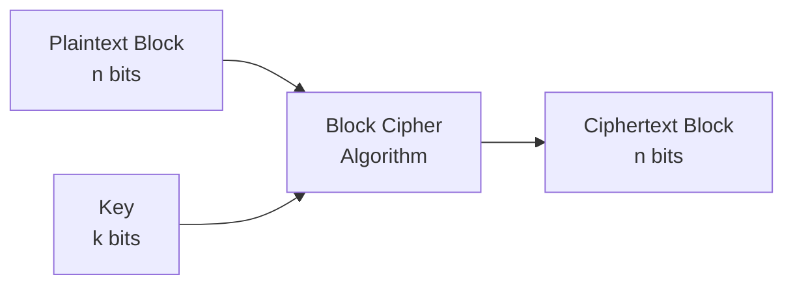

**Tham số thiết kế:**
- **Block size**: Số bits được mã hóa mỗi lần (thường 128 bits)
- **Key size**: Độ dài khóa |K| = 2^k possibilities

**Vấn đề:** Plaintext thường dài hơn 1 block → Cần **Cipher Mode**

### 3.3 AES - Advanced Encryption Standard

#### Thông số kỹ thuật

```
Algorithm: Rijndael
Block Size: 128 bits (cố định)
Key Sizes: 128, 192, 256 bits
Rounds: 10, 12, 14 (tùy key size)
Approved: FIPS 197 (2001)
```

#### Bảo mật

**Thành tích:**
- Không có tấn công cryptanalytic thực tế nào trong 20+ năm
- Được dùng cho thông tin mật:
  - **128-bit**: SECRET level
  - **192/256-bit**: TOP SECRET level

**Hiệu năng:**
```
CPU with AES-NI:
  Single core: >10 Gbps
  
Hardware accelerator:
  >30 Gbps
```

### 3.4 Block Cipher Modes

#### Tổng quan

| Mode | Tên đầy đủ | Bảo mật | Song song | Sử dụng |
|------|------------|---------|-----------|---------|
| ECB | Electronic Codebook | ✗ Yếu | ✓ | **Không dùng** |
| CBC | Cipher Block Chaining | ✓ | ✗ Encrypt<br/>✓ Decrypt | **Phổ biến** |
| CTR | Counter | ✓ | ✓ | **Tốt** |
| CFB | Cipher Feedback | ✓ | ✗ | Ít dùng |
| OFB | Output Feedback | ✓ | ✗ | Ít dùng |

---

#### Mode 1: ECB - Electronic Codebook

```
Encryption: C_j = E(K, P_j)
Decryption: P_j = D(K, C_j)
```

**Cách hoạt động:**
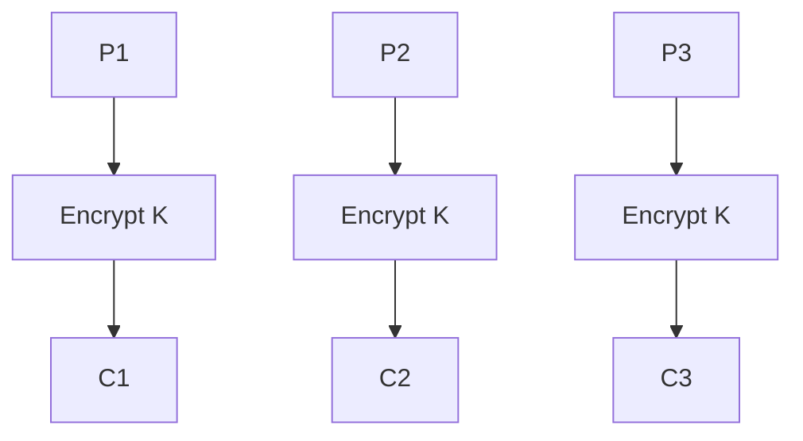

**Vấn đề nghiêm trọng:**
```
Same plaintext block → Same ciphertext block
→ Lộ pattern trong dữ liệu!
```

**Ví dụ thực tế:**
```
Plaintext:  AAAA BBBB AAAA CCCC
Ciphertext: XY12 PQ34 XY12 MN56
                ↑         ↑
            Same! Attacker nhìn thấy pattern!
```

**Kết luận:** ✗ **CHỈ dùng cho messages < 1 block (128 bits)**

---

#### Mode 2: CBC - Cipher Block Chaining

```
Encryption:
  C_1 = E(K, P_1 ⊕ IV)
  C_j = E(K, P_j ⊕ C_{j-1})  for j ≥ 2

Decryption:
  P_1 = D(K, C_1) ⊕ IV
  P_j = D(K, C_j) ⊕ C_{j-1}  for j ≥ 2
```

**Cách hoạt động:**
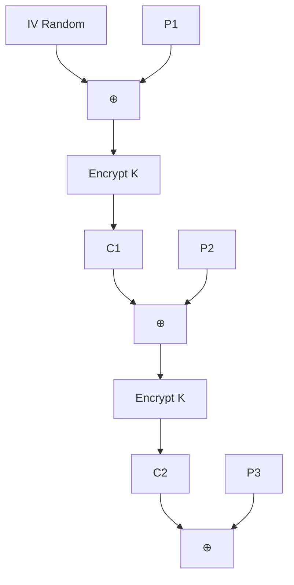

**Đặc điểm:**
- ✓ IV phải random và được truyền kèm ciphertext
- ✓ Mỗi block phụ thuộc vào block trước → Phá vỡ pattern
- ✓ Lỗi trong 1 block chỉ ảnh hưởng 2 blocks
- ✗ Encryption không song song được (phải tuần tự)
- ✓ Decryption song song được

**Lưu ý bảo mật:**
- IV phải **random** cho mỗi message
- **Không** dùng lại IV với cùng key
- Dễ bị tấn công nếu IV predictable (BEAST attack 2011)

---

#### Mode 3: CTR - Counter Mode

```
Encryption/Decryption:
  C_j = P_j ⊕ E(K, Counter + j)
  P_j = C_j ⊕ E(K, Counter + j)
```

**Cách hoạt động:**
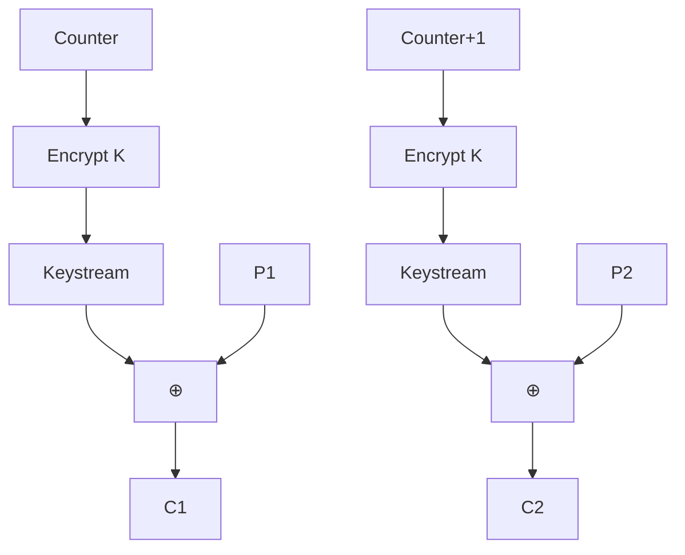

**Đặc điểm:**
- ✓ **Hoàn toàn song song hóa** (encrypt và decrypt)
- ✓ Random access (có thể decrypt block bất kỳ)
- ✓ Không cần padding
- ✓ Giống "One-Time Pad" với pseudo-random pad
- ⚠ **Malleable**: Attacker có thể flip bits tùy ý

**Lưu ý bảo mật:**
- Counter phải unique cho mỗi message với cùng key
- Không bao giờ reuse Counter với cùng key
- Cần thêm integrity protection (MAC hoặc AEAD)

---

### 3.5 Padding - Xử lý dữ liệu không đủ block

**Vấn đề:** Dữ liệu không phải bội số của block size?

#### Kỹ thuật 1: Bit Padding

```
Luôn thêm bit 1, sau đó thêm đủ bit 0 để đủ block

Example (8-bit blocks):
  Plaintext:  10111010 110
  Padded:     10111010 11010000
              ↑ original  ↑ padding
```

**Ưu điểm:** Hoạt động với bất kỳ số bits nào

#### Kỹ thuật 2: PKCS#7 (Byte Count Padding)

```
Đếm số bytes cần padding (c), thêm c bytes mỗi byte có giá trị c

Example (16-byte blocks, hex):
  Need 3 bytes → Add: 03 03 03
  Need 5 bytes → Add: 05 05 05 05 05
  Full block   → Add: 10 10 10 10 10 10 10 10 10 10 10 10 10 10 10 10
```

**Unpadding:**
```
Read cuối cùng byte → Giá trị là c
Remove c bytes cuối
Verify tất cả c bytes đều có giá trị c
```

**Lưu ý:** Luôn thêm padding, ngay cả khi plaintext đã đủ block!

---

## 4. Mã hóa bất đối xứng

### 4.1 Vấn đề với Symmetric Encryption

**Kịch bản:** Alice muốn mua hàng online lần đầu

```
Alice → muốn gửi số thẻ tín dụng → Online Store

Vấn đề:
  - Chưa từng giao dịch trước
  - Không có shared secret
  - Làm sao thiết lập kết nối bảo mật?

Giải pháp cũ:
  - Key Distribution Center (KDC)
  - Phức tạp, đòi hỏi tin tưởng bên thứ 3
  - Người dùng thường khó quản lý
```

### 4.2 Public-Key Cryptography

#### Ý tưởng cách mạng

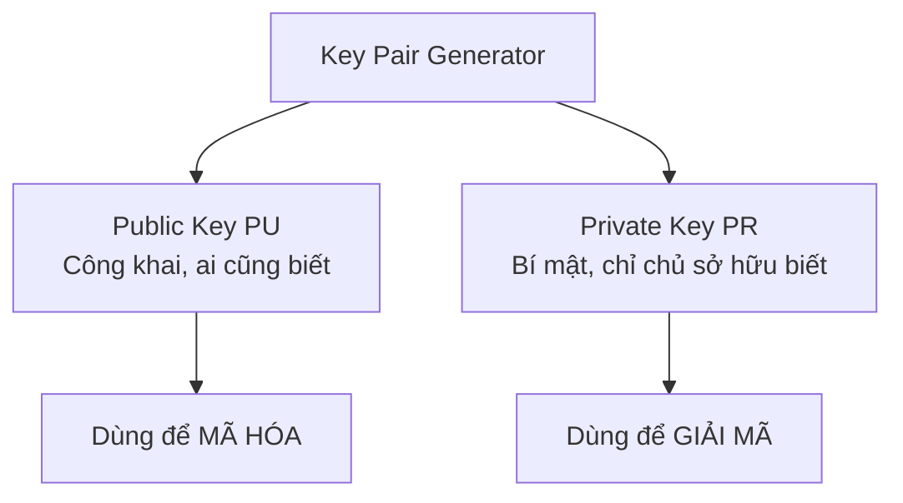

**Đặc điểm:**
- Encryption key ≠ Decryption key
- Không thể tính PR từ PU (computationally infeasible)
- Dựa trên "trapdoor functions"

#### So sánh Symmetric vs Public-Key

| Đặc điểm | Symmetric | Public-Key |
|----------|-----------|------------|
| **Key** | Shared secret | Key pair |
| **Tốc độ** | ✓✓✓ Rất nhanh (Gbps) | ✗ Chậm (Mbps) |
| **Key management** | ✗ Khó (cần share trước) | ✓ Đơn giản (public) |
| **Bảo mật** | Brute force | Math problems |
| **Key size** | Nhỏ (256 bits) | Lớn (2048+ bits) |
| **Use case** | Bulk encryption | Key exchange, Signatures |

### 4.3 Toán học nền tảng

#### Trapdoor Functions

```
f(x) → y: DỄ tính toán (polynomial time)
f^(-1)(y) → x: KHÓ tính toán (exponential time)

Nhưng với "trapdoor secret" t:
f^(-1)(y, t) → x: trở nên DỄ
```

**Ví dụ:**
- RSA: f(x) = x^e mod N (dễ), f^(-1) cần factoring N (khó)
- DH/ElGamal: f(x) = g^x mod p (dễ), f^(-1) là discrete log (khó)

#### Discrete Logarithm Problem

**Cho:**
- p: số nguyên tố lớn
- g: generator (primitive root) của p

**Forward (DỄ):**
```
f(i) = g^i mod p
```

**Backward (KHÓ):**
```
f^(-1)(x) = log_g(x) mod p  ← Discrete Logarithm Problem
```

**Ví dụ cụ thể:** p=17, g=3

```
i    | 1  | 2  | 3  | 4  | 5  | 6  | ... | 16
-----|----|----|----|----|----|----|-----|----
3^i  | 3  | 9  | 10 | 13 | 5  | 15 | ... | 1
mod17|    |    |    |    |    |    |     |
```

Tính g^i dễ, nhưng tìm i từ kết quả rất khó!

### 4.4 Diffie-Hellman Key Exchange

#### Protocol

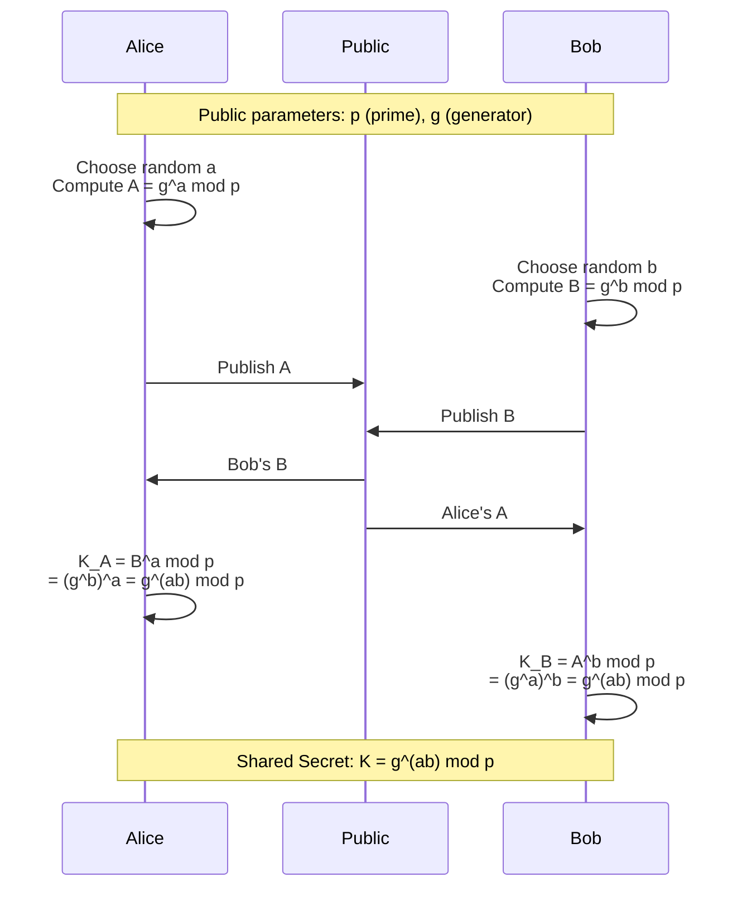

#### Bảo mật

**Eve (eavesdropper) thấy:**
- p, g (public parameters)
- A = g^a mod p
- B = g^b mod p

**Eve muốn tính:**
- K = g^(ab) mod p

**Để tính K, Eve phải:**
1. Tìm a từ A = g^a mod p, HOẶC
2. Tìm b từ B = g^b mod p

→ **Phải giải Discrete Logarithm Problem!** (believed hard)

### 4.5 Các thuật toán Public-Key

#### Encryption và Key Exchange

| Algorithm | Math Basis | Độ khó | Key Size | Dùng cho |
|-----------|------------|--------|----------|----------|
| **RSA** | Factoring | Semi-hard | 2048 bits | Encryption, Signature |
| **ElGamal** | Discrete Log (mod p) | Semi-hard | 2048 bits | Encryption |
| **EC-ElGamal** | Discrete Log (EC) | Hard | 224 bits | Encryption |
| **DH** | Discrete Log (mod p) | Semi-hard | 2048 bits | Key Exchange |
| **EC-DHE** | Discrete Log (EC) | Hard | 224 bits | Key Exchange |

**Ghi chú:**
- **Semi-hard**: Thuật toán phá tốt hơn brute force nhưng vẫn khó
- **Hard**: Chỉ biết thuật toán exponential time

#### So sánh Key Size (NIST SP 800-57)

| Security Level | Symmetric | RSA/DH (FFC) | ECC |
|----------------|-----------|--------------|-----|
| 80 bits | 80 | 1024 | 160 |
| 112 bits | 112 | 2048 | 224 |
| 128 bits | 128 | 3072 | 256 |
| 192 bits | 192 | 7680 | 384 |
| 256 bits | 256 | 15360 | 512 |

**Kết luận:** ECC cho phép key nhỏ hơn nhiều với cùng độ bảo mật!

### 4.6 Hybrid Encryption

**Vấn đề:** Public-key rất chậm cho dữ liệu lớn

**Giải pháp:** Kết hợp ưu điểm của cả hai!

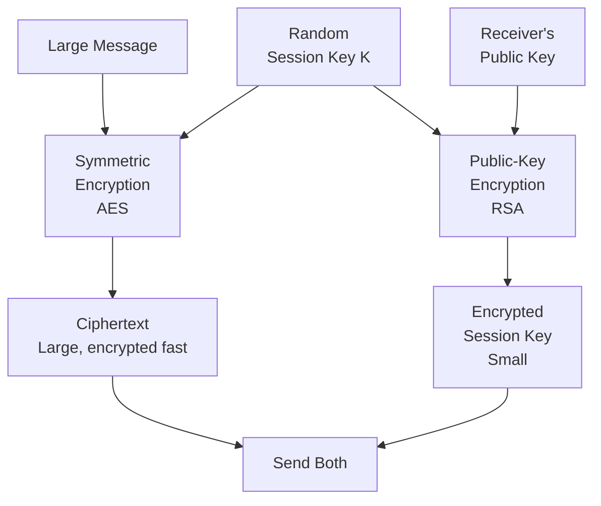

**Quy trình:**
1. Generate random session key K
2. Encrypt message với K (symmetric - nhanh)
3. Encrypt K với receiver's public key (public-key)
4. Gửi cả encrypted message và encrypted key

**Đặc điểm:**
- ✓ Nhanh (symmetric cho message)
- ✓ An toàn (public-key cho key exchange)
- ✓ Không cần shared secret trước
- ⚠ Phức tạp hơn (2 thuật toán)

**Ứng dụng:** TLS/SSL, PGP, S/MIME

---

## 5. Hàm băm mật mã

### 5.1 Cryptographic Hash Functions

#### Định nghĩa

```
H: {0,1}* → {0,1}^n

Input:  Bất kỳ độ dài nào (file 4GB, video,...)
Output: Cố định n bits (VD: SHA-256 → 256 bits)
```

**Ví dụ:**
```
Message: "Will you marry me?" (18 bytes)
SHA-256: be6224d4762c36ad36485de4f90a54c0892c60f4ca6e... (32 bytes)

File: movie.avi (4 GB)
SHA-256: 3a7bd3e2360a3d29eea436fcfb7e44c735d117c4... (32 bytes)
```

### 5.2 Tính chất bảo mật

#### 1. One-Way Property (Preimage Resistance)

```
Cho: h (hash value)
Khó: Tìm x sao cho H(x) = h
```

**Ví dụ:**
```
h = be6224d4762c36ad...
→ Rất khó tìm message x có hash này
```

#### 2. Weak Collision Resistance (Second Preimage Resistance)

```
Cho: x
Khó: Tìm y ≠ x sao cho H(x) = H(y)
```

**Ứng dụng:** Bảo vệ integrity

#### 3. Strong Collision Resistance

```
Khó: Tìm BẤT KỲ x, y với x ≠ y và H(x) = H(y)
```

**Ghi chú:** Strong collision → Weak collision, nhưng ngược lại không đúng

### 5.3 Các thuật toán Hash

#### SHA Family

| Algorithm | Output Size | Status | Ghi chú |
|-----------|-------------|--------|---------|
| MD5 | 128 bits | ✗ **Broken** | Đừng dùng |
| SHA-1 | 160 bits | ✗ **Broken** | Đừng dùng |
| SHA-224 | 224 bits | ✓ OK | |
| **SHA-256** | 256 bits | ✓ **Recommended** | Phổ biến nhất |
| SHA-384 | 384 bits | ✓ OK | |
| SHA-512 | 512 bits | ✓ OK | |
| SHA-3 | 224-512 bits | ✓ OK | Thiết kế khác SHA-2 |

#### Tấn công qua Cryptanalysis

```
Algorithm | Collision Attack | Status
----------|------------------|--------
MD5       | 2^18 (practical) | Broken 2004
SHA-1     | 2^63 (practical) | Broken 2017
SHA-256   | No attack        | Secure
SHA-512   | No attack        | Secure
SHA-3     | No attack        | Secure
```

**"No attack"** = Không có tấn công nào tốt hơn brute force đáng kể

---

## 6. Bảo vệ tính toàn vẹn

### 6.1 Vấn đề với Hash đơn thuần

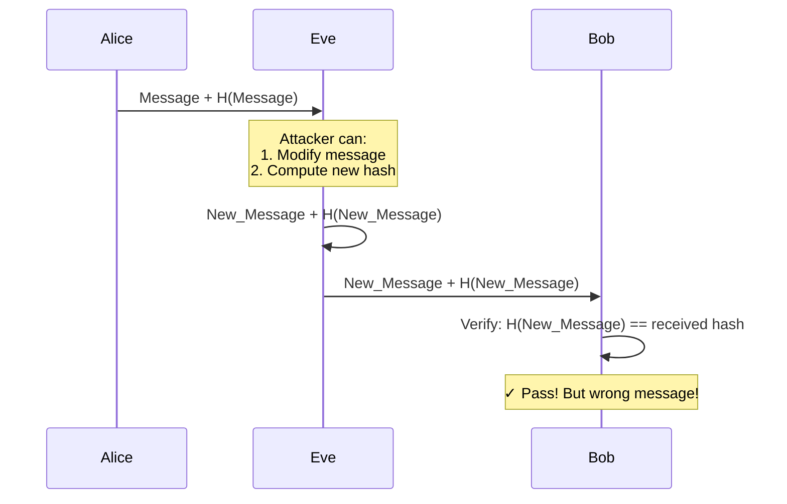

**Vấn đề:** Hash function là công khai, ai cũng tính được!

### 6.2 Message Authentication Code (MAC)

#### Khái niệm

```
MAC(K, M) → tag

K: Secret key (shared between Alice & Bob)
M: Message
tag: Authentication tag (fixed size)
```

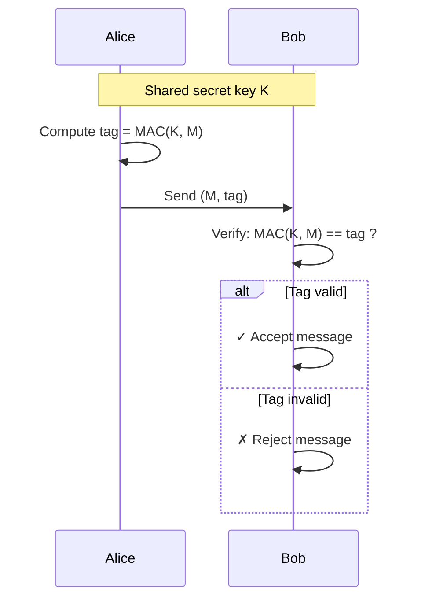

**Đặc điểm:**
- ✓ Chỉ người có key K mới tạo được valid tag
- ✓ Attacker không có K không thể forge
- ✗ Cả hai bên đều có thể tạo tag (không có non-repudiation)

### 6.3 HMAC - Hash-based MAC

#### Construction

```
HMAC(K, M) = H((K ⊕ opad) || H((K ⊕ ipad) || M))

Trong đó:
  opad = 0x5C lặp lại
  ipad = 0x36 lặp lại
  || = concatenation
  H = hash function (SHA-256, SHA-512,...)
```

**Simplified view:**
```
HMAC = Hash(Key + Hash(Key + Message))
       ↑ Two-layer hashing với key
```

#### ⚠️ CẢNH BÁO QUAN TRỌNG

**ĐỪNG dùng:**
```
✗ MAC = H(K || M)  ← Dễ bị length extension attack!
✗ MAC = H(M || K)  ← Không an toàn!
```

**PHẢI dùng:**
```
✓ HMAC-SHA256
✓ HMAC-SHA512
✓ CMAC (Cipher-based MAC)
✓ Authenticated Encryption (AES-GCM)
```

#### Ví dụ sử dụng

```python
# Python example with hashlib
import hmac
import hashlib

key = b"secret_key_123"
message = b"Important message"

# Compute HMAC-SHA256
tag = hmac.new(key, message, hashlib.sha256).hexdigest()
print(f"HMAC: {tag}")

# Verify
is_valid = hmac.compare_digest(tag, received_tag)
```

---

## 7. Chữ ký số

### 7.1 Digital Signatures vs MAC

#### So sánh

| Đặc điểm | MAC | Digital Signature |
|----------|-----|-------------------|
| **Key Type** | Symmetric (shared) | Asymmetric (keypair) |
| **Who can sign** | Cả hai bên | Chỉ người có private key |
| **Who can verify** | Chỉ người có key | Bất kỳ ai (public key) |
| **Non-repudiation** | ✗ Không có | ✓ Có |
| **Speed** | ✓✓✓ Rất nhanh | ✗ Chậm |
| **Key size** | Nhỏ (256 bits) | Lớn (2048+ bits) |
| **Use case** | Internal, trusted parties | Public verification |

#### Model cho Integrity Protection

**MAC:**
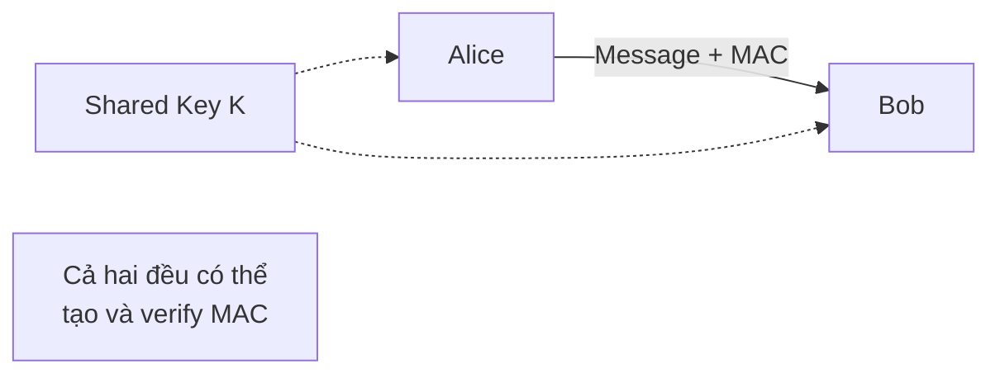

**Digital Signature:**
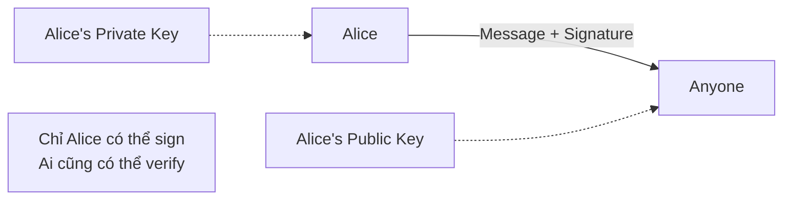

### 7.2 Digital Signature Scheme

#### Các thuật toán

```
Sign(M, Private_Key) → Signature
Verify(M, Signature, Public_Key) → True/False
```

**Algorithms:**

| Algorithm | Math Basis | Key Size | Signature Size | Status |
|-----------|------------|----------|----------------|--------|
| **RSA** | Factoring | 2048 bits | 2048 bits | ✓ Recommended |
| **DSA** | Discrete Log (mod p) | 2048 bits | 448 bits | ✓ OK |
| **EC-DSA** | Discrete Log (EC) | 224 bits | 448 bits | ✓ Recommended |
| **EdDSA** | Twisted Edwards curves | 256 bits | 512 bits | ✓ Modern |

### 7.3 Hash-then-Sign

#### Vấn đề

```
Message có thể rất lớn (video 4GB)
→ Sign trực tiếp rất chậm
```

#### Giải pháp

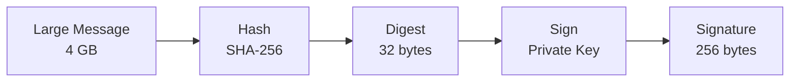

**Quy trình:**
1. **Hash**: h = H(M)
2. **Sign**: s = Sign(h, Private_Key)
3. **Send**: (M, s)
4. **Verify**: 
   - Compute h' = H(M)
   - Check Verify(h', s, Public_Key)

**Bảo mật:**
- Collision resistance của H đảm bảo không thể forge
- Nếu attacker tìm được (M', s') với H(M') = H(M):
  - Tìm được collision trong H (không thể!)
  - Hoặc tìm được cách forge signature (không thể!)

### 7.4 Certificates - Chứng chỉ số

#### Vấn đề Trust

```
Signature verification nói:
"Người có private key tương ứng đã ký message này"

Nhưng: Làm sao biết public key thực sự thuộc về Alice?
```

**Ví dụ tấn công:**
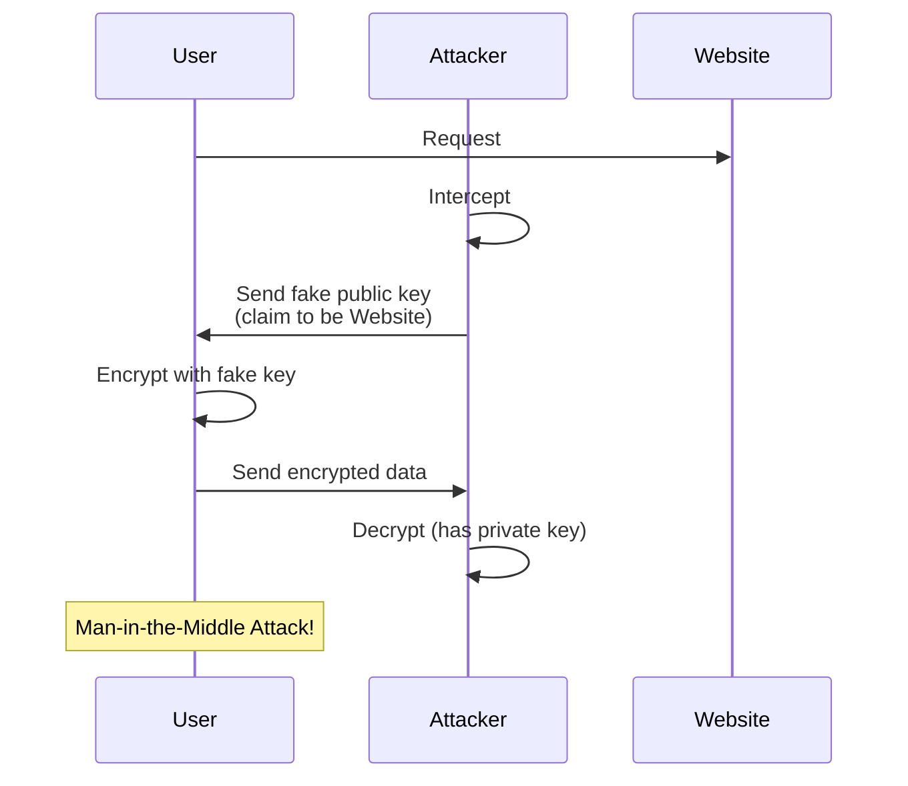

#### Giải pháp: Certificate Authority (CA)

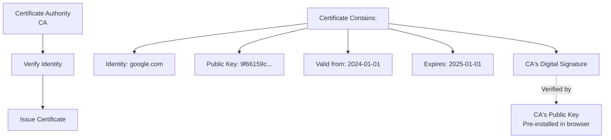

#### X.509 Certificate Structure

```
Certificate:
    Version: 3
    Serial Number: 03:e7:d2:...
    Signature Algorithm: sha256WithRSAEncryption
    Issuer: CN=DigiCert SHA2 Secure Server CA
    Validity
        Not Before: Jan  1 00:00:00 2024 GMT
        Not After : Jan  1 23:59:59 2025 GMT
    Subject: CN=www.google.com
    Subject Public Key Info:
        Public Key Algorithm: rsaEncryption
        RSA Public Key: (2048 bit)
            Modulus: 00:c6:d9:...
            Exponent: 65537 (0x10001)
    X509v3 extensions:
        X509v3 Subject Alternative Name:
            DNS:www.google.com, DNS:*.google.com
    Signature Algorithm: sha256WithRSAEncryption
        73:a2:c5:...
```

#### Certificate Chain of Trust

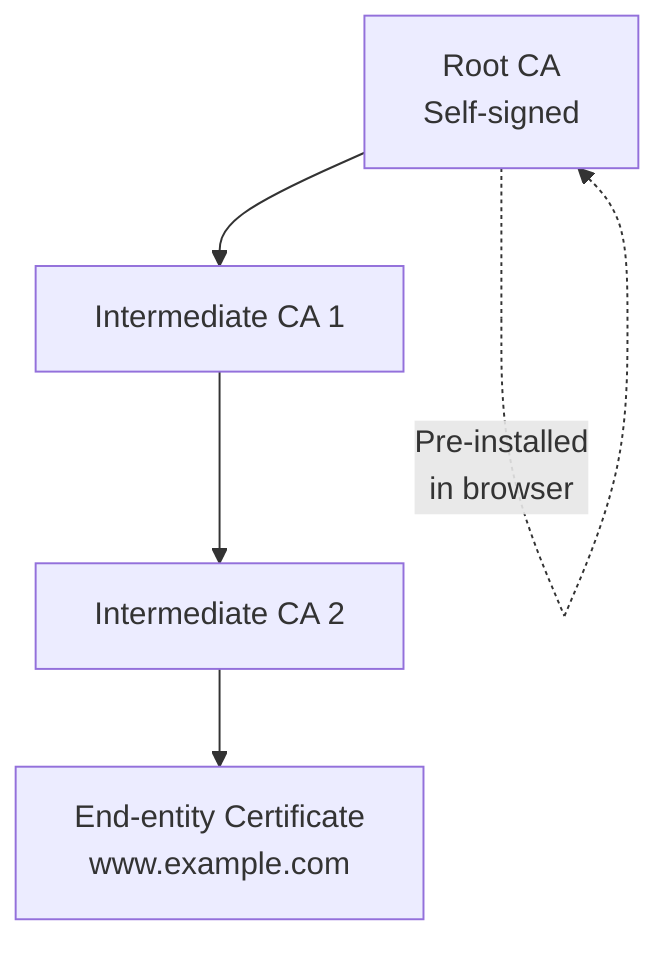

**Verification process:**
1. Browser nhận certificate của website
2. Kiểm tra signature bởi Intermediate CA
3. Kiểm tra Intermediate CA's cert bởi Root CA
4. Root CA cert có trong browser (trusted)
5. Kiểm tra expiration dates
6. Kiểm tra certificate không bị revoke (CRL/OCSP)

---

## Tóm tắt

### Bảng tổng hợp các công cụ mật mã

| Tool | Purpose | Key Type | Speed | Example | Best for |
|------|---------|----------|-------|---------|----------|
| **Symmetric Encryption** | Confidentiality | Shared secret | ✓✓✓ | AES-256-CBC | Bulk data |
| **Public-Key Encryption** | Confidentiality | Keypair | ✗ | RSA-2048 | Key exchange |
| **Hybrid Encryption** | Confidentiality | Both | ✓✓ | TLS | Web security |
| **Hash Function** | Integrity (no auth) | None | ✓✓✓ | SHA-256 | Checksums |
| **MAC** | Integrity + Auth | Shared secret | ✓✓✓ | HMAC-SHA256 | Trusted parties |
| **Digital Signature** | Integrity + Auth + Non-repudiation | Keypair | ✗ | RSA, EC-DSA | Public verification |
| **Certificate** | Public key trust | CA's keypair | - | X.509 | PKI |

### Design Patterns

#### Pattern 1: Secure Communication (Confidentiality + Integrity)

```
Best Practice: Authenticated Encryption (AEAD)

Examples:
  - AES-GCM (Galois/Counter Mode)
  - ChaCha20-Poly1305

Provides:
  ✓ Confidentiality (encryption)
  ✓ Integrity (authentication)
  ✓ In one operation (efficient)
```

#### Pattern 2: Public Communication (Signatures)

```
Use Case: Software updates, documents

Process:
  1. Hash document: h = SHA-256(document)
  2. Sign hash: s = Sign(h, private_key)
  3. Distribute: (document, s)
  4. Anyone can verify with public key
```

#### Pattern 3: Secure Channel Setup (TLS/SSL)

```
1. Handshake:
   - Exchange certificates
   - Verify signatures
   - DH key exchange → shared secret

2. Data Transfer:
   - Use shared secret for symmetric encryption
   - AEAD for each message
```

---

## Best Practices

### Encryption

**DO:**
- ✓ Dùng AES-256 với CBC hoặc CTR mode
- ✓ Hoặc dùng AEAD modes (GCM, CCM)
- ✓ Generate random IV cho mỗi message
- ✓ Dùng keys đủ dài (AES-256, RSA-2048, ECC-256)
- ✓ Kết hợp với integrity protection

**DON'T:**
- ✗ ECB mode
- ✗ DES, 3DES, RC4
- ✗ Reuse IV/nonce
- ✗ Keys nhỏ hơn khuyến nghị
- ✗ Encrypt without integrity check

### Hashing

**DO:**
- ✓ SHA-256 trở lên
- ✓ SHA-3 cho applications mới
- ✓ Verify checksums từ nguồn tin cậy

**DON'T:**
- ✗ MD5
- ✗ SHA-1
- ✗ Custom/homemade hash functions

### MACs and Signatures

**DO:**
- ✓ HMAC-SHA256 cho MAC
- ✓ RSA-2048 hoặc EC-DSA-256 cho signatures
- ✓ Verify trước khi process data
- ✓ Use constant-time comparison

**DON'T:**
- ✗ H(K || M) hoặc H(M || K)
- ✗ RSA < 2048 bits
- ✗ DSA < 2048 bits
- ✗ Implement crypto yourself

### Key Management

**DO:**
- ✓ Generate keys từ CSPRNG
- ✓ Rotate keys định kỳ
- ✓ Store keys securely (HSM, key vault)
- ✓ Use key derivation functions (PBKDF2, scrypt)
- ✓ Separate keys cho encryption và signing

**DON'T:**
- ✗ Hardcode keys trong source code
- ✗ Reuse keys cho nhiều purposes
- ✗ Share private keys
- ✗ Dùng weak passwords làm keys trực tiếp

---

## Bài tập

### Bài tập 1: Thiết kế hệ thống bảo mật

**Tình huống:** Bob và Alice muốn trò chuyện an toàn qua Internet.

**Yêu cầu:**

1. **Confidentiality**:
   - Nội dung có thể rất dài (text, hình, video)
   - Mã hóa an toàn
   - Không quá chậm
   - Giữ kín khóa

2. **Integrity & Authenticity**:
   - Đảm bảo tin nhắn từ đúng người gửi
   - Không bị sửa đổi
   - Không bị mất mát

**Câu hỏi:**
- Thiết kế quy trình sử dụng các thuật toán mật mã
- Chọn thuật toán và tham số cụ thể
- Vẽ sơ đồ quy trình
- Giải thích tại sao lựa chọn đó

### Bài tập 2: Phân tích bảo mật

Cho các schemes sau, phân tích điểm mạnh/yếu:

1. `MAC = MD5(secret || message)`
2. `Encrypt-then-MAC vs MAC-then-Encrypt`
3. Reuse IV trong CBC mode
4. `Sign(message)` vs `Sign(Hash(message))`

### Bài tập 3: Thực hành

Implement (hoặc sử dụng library):
1. AES-256-CBC encryption/decryption
2. HMAC-SHA256 generation/verification
3. RSA key generation và digital signature

---

## Tài liệu tham khảo

### Textbooks
1. CS Book - Chapters 2, 3: Cryptographic Tools
2. "Cryptography Engineering" - Ferguson, Schneier, Kohno
3. "Introduction to Modern Cryptography" - Katz, Lindell

### Standards
1. NIST SP 800-57 - Key Management Recommendations
2. NIST FIPS 197 - Advanced Encryption Standard (AES)
3. NIST FIPS 180-4 - Secure Hash Standard (SHS)
4. NIST SP 800-38 Series - Block Cipher Modes
5. RFC 2104 - HMAC
6. RFC 5280 - X.509 Certificates

### Online Resources
1. [Cryptography I - Coursera (Dan Boneh)](https://www.coursera.org/learn/crypto)
2. [Crypto 101](https://www.crypto101.io/)
3. [CryptoHack](https://cryptohack.org/)
4. [OWASP Cryptographic Storage Cheat Sheet](https://cheatsheetseries.owasp.org/cheatsheets/Cryptographic_Storage_Cheat_Sheet.html)

### Tools
1. OpenSSL - Cryptographic toolkit
2. CyberChef - Web app for encryption/encoding
3. Hashcat - Password cracking (educational)
4. Wireshark - Analyze TLS traffic

---

## Ghi chú quan trọng

### Nguyên tắc vàng

1. **Don't Roll Your Own Crypto**
   - Sử dụng thư viện đã được kiểm chứng
   - Không tự implement thuật toán trừ khi bạn là chuyên gia

2. **Defense in Depth**
   - Mật mã chỉ là một layer
   - Cần kết hợp với các biện pháp khác

3. **Keep It Simple**
   - Hệ thống phức tạp dễ có lỗi
   - Sử dụng standard protocols (TLS, SSH)

4. **Stay Updated**
   - Crypto nhanh chóng lỗi thời
   - Theo dõi security advisories
   - Update thường xuyên

### Common Mistakes

1. Using weak/deprecated algorithms
2. Improper key management
3. Missing integrity protection
4. IV/nonce reuse
5. Trusting user input
6. Not using constant-time operations
7. Insufficient random number generation
8. Mixing encryption and encoding

---

**Next:** Bài 4 - Malware Threats

... Chưa có