# Bài 4: Các mối đe dọa từ Malware

---

## 1. Malware là gì?

### 1.1 Định nghĩa

> **Malware** (Malicious Software): Chương trình được chèn vào hệ thống, thường là bí mật, với mục đích xâm phạm tính bí mật, toàn vẹn hoặc khả dụng của dữ liệu, ứng dụng hoặc hệ điều hành của nạn nhân, hoặc gây phiền nhiễu hoặc gián đoạn.
> 
> — NIST SP 800-83

### 1.2 Cách Malware xâm nhập hệ thống

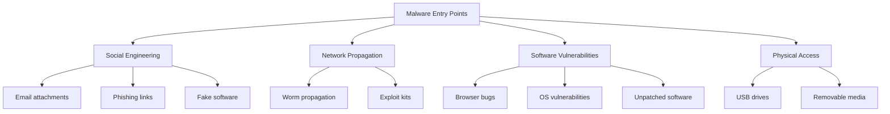

**Các vector tấn công phổ biến:**
- Email attachments
- Download files từ Internet
- Untrusted websites và freeware
- Instant messenger applications
- Removable devices (USB, external drives)
- Browser và email software bugs
- Network propagation (exploit vulnerabilities)
- File sharing services (FTP, SMB)
- Insecure patch management

### 1.3 Thống kê Malware

#### Số liệu toàn cầu (2020)
```
Tổng số malware: ~1.101.270.000
Malware mới mỗi ngày: >350.000
Tấn công malware (2019): >7 tỷ
Tốc độ tấn công ransomware: 4 công ty/phút
Tăng trưởng IoT malware: 33% (2018-2019)
Loại phổ biến nhất: Trojans (11%)
```

---

## 2. Phân loại Malware

### 2.1 Taxonomy - Phân loại theo cơ chế

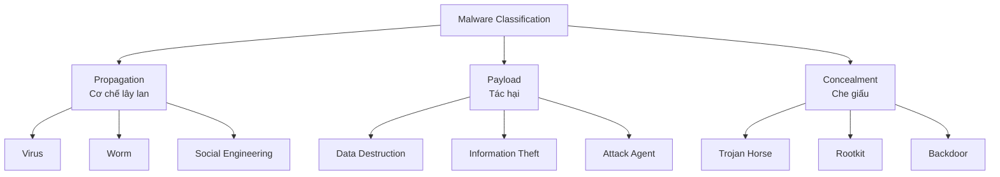

### 2.2 Các loại Malware phổ biến

| Loại | Mô tả ngắn gọn |
|------|----------------|
| **Virus** | Lây nhiễm programs/files, cần hành động người dùng |
| **Worm** | Tự lan truyền qua mạng, thường tự động |
| **Trojan Horse** | Giả làm phần mềm hữu ích |
| **Ransomware** | Mã hóa dữ liệu, đòi tiền chuộc |
| **Spyware** | Thu thập thông tin người dùng |
| **Adware** | Hiển thị quảng cáo không mong muốn |
| **Rootkit** | Che giấu sự tồn tại của malware |
| **Backdoor** | Cho phép truy cập trái phép |
| **Keylogger** | Ghi lại các phím người dùng nhấn |
| **Bot/Botnet** | Máy bị kiểm soát từ xa, thành mạng lưới |

### 2.3 Advanced Persistent Threat (APT)

#### Định nghĩa
> **APT**: Tội phạm mạng có tổ chức (thường do nhà nước tài trợ), nhắm vào mục tiêu kinh doanh và chính trị, sử dụng nhiều kỹ thuật xâm nhập và malware, được áp dụng liên tục và hiệu quả trong thời gian dài.

#### Đặc điểm

```
Advanced: Kỹ thuật tinh vi, đa dạng
  ↓
Persistent: Áp dụng liên tục, lén lút
  ↓
Threat: Capability + Intent
```

**Kỹ thuật thường dùng:**
- Social engineering
- Spear-phishing emails
- Drive-by-downloads
- Zero-day exploits

**Ví dụ nổi tiếng:**
- Aurora (2010)
- RSA breach (2011)
- APT1 (China, 2013)
- Stuxnet (2010)

---

## 3. Cơ chế lây lan

### 3.1 Virus

#### Khái niệm
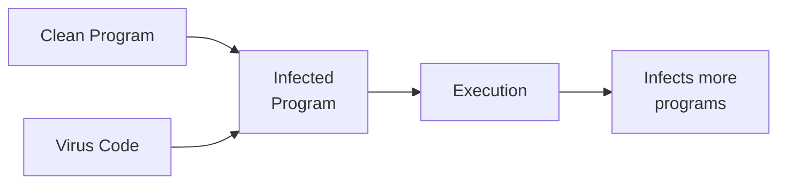

**Đặc điểm:**
- Gắn vào nội dung hoạt động (programs, scripts, boot sector)
- Cần hành động của người dùng để kích hoạt
- Được Fred Cohen đặt tên năm 1983

#### Các cách virus gắn vào program

```
1. Prepend (thêm vào đầu):
   VStart: [Virus Code]
           jmp Start
   Start:  [Good Program]

2. Append (thêm vào cuối):
   Start:  jmp VStart
           [Good Program]
   VStart: [Virus Code]
           jmp Start+1

3. Fragmented (chia nhỏ - stealth):
   [Virus Part 1]
   [Good Program Part 1]
   [Virus Part 2]
   [Good Program Part 2]
```

#### Boot Sector Virus (Bootkit)

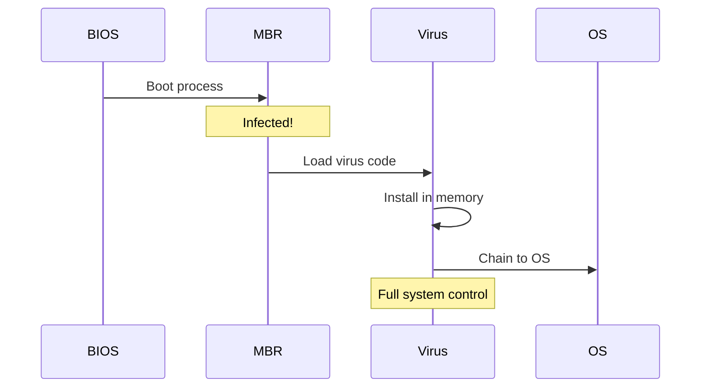

**Ví dụ lịch sử**: Brain virus (1986)
- Virus PC đầu tiên "in the wild"
- Nguồn gốc: Pakistan
- Cơ chế:
  - Nằm trong high memory
  - Copy vào boot sector
  - Đánh dấu sector bị nhiễm là "bad sectors"
  - Intercept disk I/O để giả mạo đọc boot sector
  - Lan sang tất cả disks chưa nhiễm

**Phòng ngừa hiện đại**: UEFI Secure Boot

#### Macro Virus

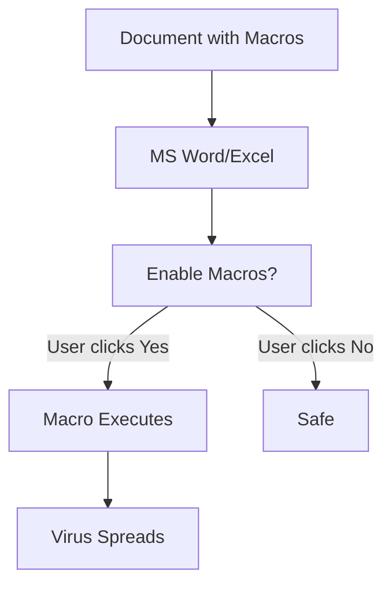

**Ví dụ**: Melissa (1999)
- Sử dụng VBA macros trong MS Word
- Truy cập Outlook address book
- Tự gửi đến 50 người đầu tiên
- Ảnh hưởng: ~100,000 máy tính trong cuối tuần đầu

**Hiện tại**: MS Office yêu cầu xác nhận trước khi enable macros

#### Virus Hoaxes (Tin đồn virus giả)

**Ví dụ nổi tiếng:**
- "Virus Flambé": Đồn virus có thể làm cháy màn hình
- Blue Mountain greeting card virus
- "Goodtimes" hoax (1994) - hoax lan truyền đầu tiên

**Cách kiểm tra**: Luôn xác minh với các công ty bảo mật uy tín (Kaspersky, Symantec, McAfee)

### 3.2 Worms

#### Khái niệm

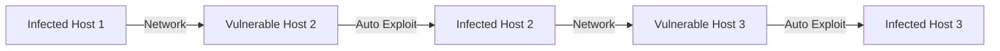

**Đặc điểm:**
- Lan truyền qua mạng
- Thường không cần tương tác người dùng (tự động)
- Khai thác lỗ hổng bảo mật
- Có thể là chương trình độc lập (không gắn vào file khác)

#### Các worm lịch sử

##### 1. Morris Worm (1988)

```
Ngày: 2/11/1988
Tác giả: Robert Morris (Cornell grad student)
Ảnh hưởng: ~6,000 máy (10% Internet lúc đó)
```

**Kỹ thuật khai thác:**
1. Guessed passwords
2. Fingerd buffer overflow
3. Sendmail "debug mode"

**Hậu quả:**
- Người đầu tiên bị kết tội theo Computer Fraud and Abuse Act 1986
- Phạt $10,000, 3 năm án treo, 400 giờ phục vụ cộng đồng
- Tác động tích cực: Thành lập CERT (Computer Emergency Response Team)

##### 2. Code Red (2001)

```
Lỗ hổng: MS IIS buffer overflow
Ảnh hưởng: ~750,000 servers
Động cơ: Có thể chính trị
```

**Hành vi:**
- Để lại message "Hacked by Chinese"
- Hai phase: scan/infect và attack
- DDoS attack vào www.whitehouse.gov vào ngày nhất định

##### 3. Slammer/Sapphire (2003)

```
Lỗ hổng: MS SQL Server buffer overflow
Tốc độ: Cực nhanh!
  - Số máy nhiễm tăng gấp đôi mỗi 8.5 giây
  - Nhiễm 90% máy dễ bị tấn công trong 10 phút
```

**Đặc điểm:**
- Sử dụng UDP (không phải TCP)
- Làm tê liệt mạng, vô hiệu hóa nhiều dịch vụ
- Ví dụ: ATM của Bank of America ngừng hoạt động

##### 4. Stuxnet (2010)

```
Đánh giá: Worm tinh vi nhất từng được phát hiện
Mục tiêu: Hệ thống điều khiển công nghiệp
```

**Đặc điểm:**
- Khai thác ít nhất 4 zero-day exploits
- Lan truyền qua USB và mạng
- Có rootkit để ẩn mình
- Logic bomb: Chỉ kích hoạt trong điều kiện cụ thể

**Target đặc biệt:**
- Tìm kiếm Siemens "Step 7" controller software
- Cấu hình khớp với centrifuge hạt nhân Iran
- Lập trình lại controller làm centrifuge quay mất kiểm soát
- Ước tính phá hủy 1/5 centrifuge hạt nhân Iran

### 3.3 Trojan Horses

#### Khái niệm

> "Beware of geeks bearing gifts" - Virgil, 29 B.C. (adapted)

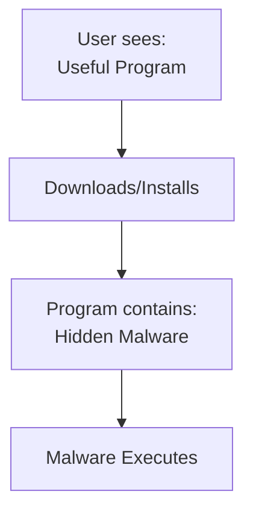

**Đặc điểm:**
- Giấu sau chức năng hấp dẫn
- Người dùng tự cài đặt
- Không tự lan truyền (khác virus/worm)

#### Các loại Trojan

| Loại | Chức năng |
|------|----------|
| **RAT** (Remote Access Trojan) | Điều khiển từ xa: MoSucker, ProRAT, Theef |
| **Backdoor Trojans** | Tạo cửa hậu: Kovter, Nitol, Quadars, Snake |
| **Rootkit Trojan** | Ẩn malware: Wingbird, GrayFish, Whistler |
| **Proxy Server Trojan** | Sử dụng máy làm proxy: Linux.Proxy.10, Qbot |
| **Mobile Trojan** | Nhắm vào điện thoại |
| **IoT Trojan** | Nhắm vào thiết bị IoT |

#### Kỹ thuật lây nhiễm

**Wrappers** - Đóng gói:
```
Genuine-looking Application (Game, Office, Antivirus)
    + Trojan Code
    = Wrapped Package
```

**Ví dụ thực tế:**
- Fake antivirus software
- Cracked/pirated applications
- Free game/utility downloads
- Repackaged mobile apps

---

## 4. Payload - Tác hại

### 4.1 Attack Agent - Botnets

#### Khái niệm

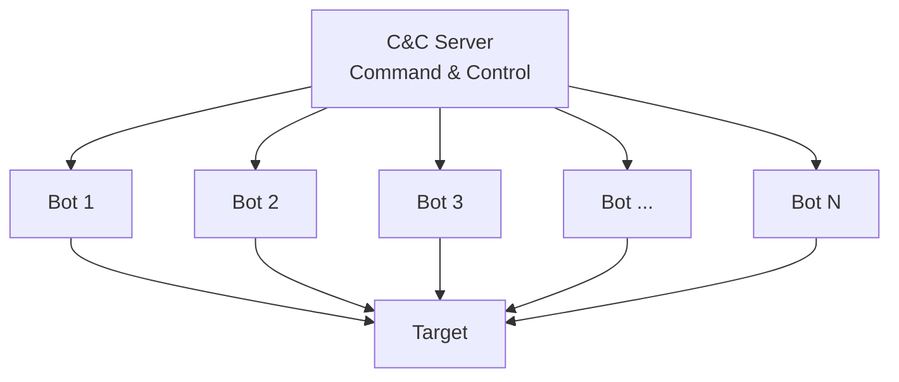

**Định nghĩa:**
- **Bot/Zombie**: Máy bị xâm phạm, điều khiển từ xa
- **Botnet**: Mạng lưới các bots

#### Sử dụng Botnets

```
1. IP Address & Bandwidth Stealing
   - Spam email (Storm botnet)
   - Click fraud
   - DDoS attacks ($20/hour, $100/24h)
   
2. Credential Theft
   - Banking passwords
   - Corporate passwords
   - Gaming accounts
   
3. Cryptocurrency Mining
   - Coinmining malware
```

**Ví dụ**: Mirai Botnet (2016)
- Nhắm vào thiết bị IoT (routers, cameras)
- DDoS attack quy mô lớn

### 4.2 Information Theft

#### Banking Trojans

**Silent Banker Trojan** - Man-in-the-Browser (MITB):

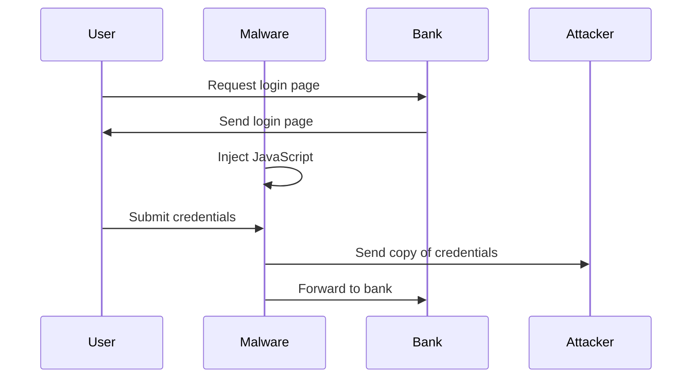

**Cơ chế tương tự**: Zeus botnet và nhiều banking malware khác

#### Mobile Spyware

**FinSpy Spyware**:
```
Platforms: iOS, Android, Windows
Capabilities:
  - Contacts collection
  - Call history
  - Geolocation
  - Text messages
  - Encrypted chat app messages
  
Installation:
  - Android (pre-2017): SMS/Email links
  - iOS & Android (post-2017): Physical access required
```

### 4.3 Ransomware

#### Khái niệm

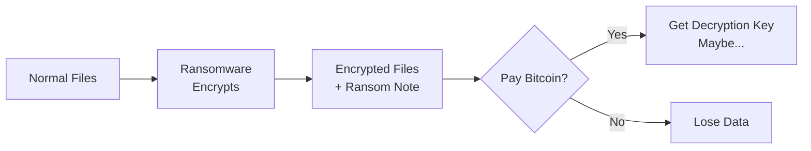

**Đặc điểm:**
- Mã hóa files của người dùng
- Đòi tiền chuộc (thường Bitcoin)
- Không đảm bảo sẽ nhận được key sau khi trả tiền

#### WannaCry (2017)

```
Ngày: 12/5/2017
Lỗ hổng: EternalBlue (SMB port 445)
Timeline:
  - 14/4/2017: ShadowBrokers công bố Eternalblue
  - 12/5/2017: WannaCry phát hiện (3 tuần để weaponize)
Ảnh hưởng: Hàng trăm nghìn máy tính toàn cầu
```

**Lesson learned**: Patch management cực kỳ quan trọng!

### 4.4 System Corruption

**Data Destruction Virus:**
- Xóa toàn bộ dữ liệu trên hệ thống nhiễm
- Ví dụ: Chernobyl virus (1998)

**Logic Bombs:**
- Kích hoạt khi đạt điều kiện nhất định
- Thường do insider cài đặt

### 4.5 Server-Side Attacks

#### Data Breach

**Ví dụ**: Equifax (7/2017)
```
Lỗ hổng: Apache Struts RCE
Ảnh hưởng: ~143 triệu hồ sơ khách hàng
Dữ liệu bị đánh cắp:
  - Credit card numbers
  - Social Security numbers
  - Addresses, DOB
```

#### Cách mất dữ liệu khách hàng

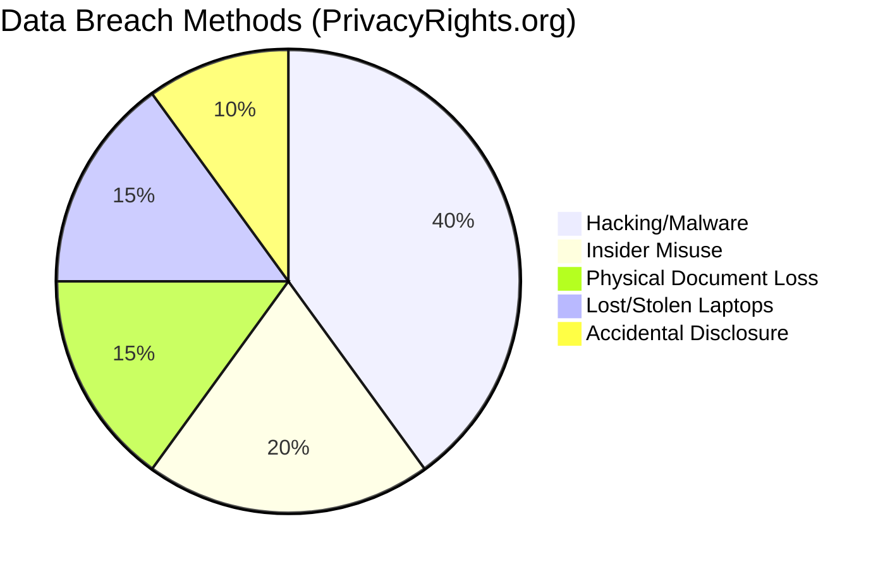

---

## 5. Đối phó với Malware

### 5.1 Lỗ hổng bảo mật

#### Nguồn gốc

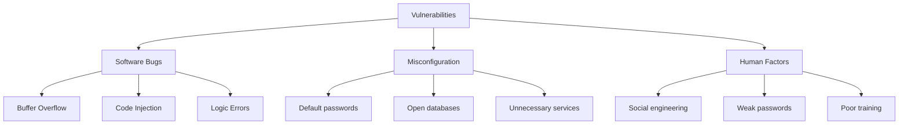

**Buffer Overflow** - Vẫn là vấn đề lớn:
- Sử dụng trong Morris Worm (1988)
- Vẫn trong Top 25 CWE (2020)

**Misconfiguration** - "Huge problem!"

### 5.2 Spread Modeling

#### Epidemic Model

```
Variables:
  N = số máy dễ bị tấn công
  I_t = số máy bị nhiễm tại thời điểm t
  S_t = số máy còn dễ bị tấn công tại t
  β = infection rate

Relations:
  I_(t+1) = I_t + β * I_t * S_t
  S_(t+1) = N - I_(t+1)
```

**Thực tế**: Model khớp rất tốt với dữ liệu thực tế (Code Red worm)

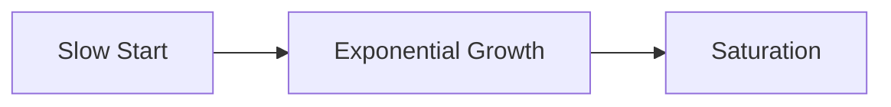

### 5.3 Detection Techniques

#### 1. Signature-Based Detection

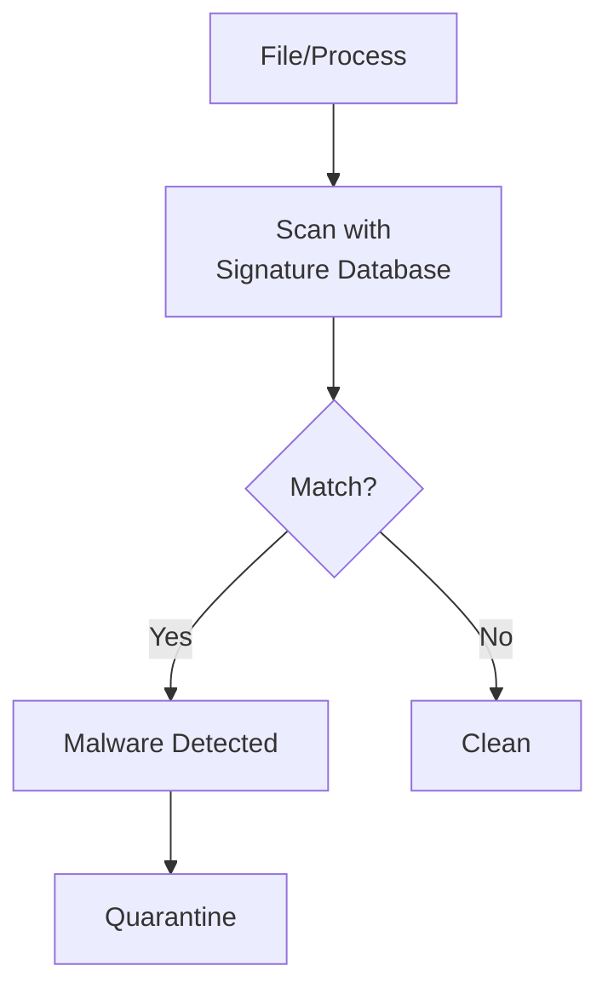

**Đặc điểm:**
- ✓ Đáng tin cậy, false positive thấp
- ✓ Nhanh
- ✗ Phải biết malware trước (miss zero-days)
- ✗ Dễ bypass bằng modification

**Yêu cầu**: Cập nhật signature database thường xuyên!

#### 2. Anomaly Detection

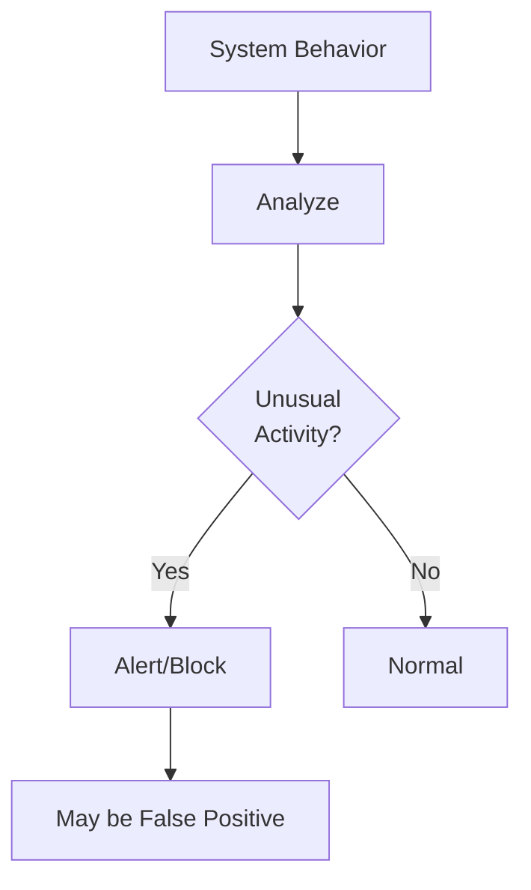

**Indicators:**
- Đọc/ghi nhiều files
- Hook vào event handlers
- Unusual network connections
- High CPU/memory usage

**Đặc điểm:**
- ✓ Phát hiện cả malware chưa biết
- ✓ Phát hiện zero-days
- ✗ False positive cao
- ✗ Phức tạp hơn

### 5.4 Evasion Techniques

#### Cuộc đua vũ trang

```
Defenders: New detection techniques
    ↕
Attackers: New evasion techniques
    ↕
Who will win?
```

#### Polymorphic Viruses

```
Core functionality giữ nguyên
Presentation thay đổi mỗi lần
  - Mã hóa với key khác nhau
  - Decryptor có thể bị nhận diện
```

#### Metamorphic Viruses

```
Toàn bộ code thay đổi
Transformations:
  - Shuffle registers
  - Add useless code (NOP sleds)
  - Use equivalent operations
  - Reorder instructions
  
→ Rất khó phát hiện!
```

### 5.5 Countermeasures

#### Defense in Depth

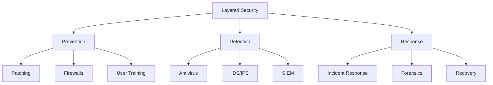

#### Best Practices

**Phòng ngừa:**
1. Keep systems patched
2. Use antivirus software (updated!)
3. Enable firewalls
4. Principle of least privilege
5. User education/training
6. Network segmentation
7. Application whitelisting

**Phát hiện:**
1. Antivirus scans (scheduled + real-time)
2. IDS/IPS monitoring
3. Log analysis
4. Behavioral monitoring
5. Network traffic analysis

**Ứng phó:**
1. Incident response plan
2. Isolate infected systems
3. Forensic analysis
4. Malware removal
5. System restoration
6. Post-incident review

---

## Tóm tắt

### Key Takeaways

1. **Malware Landscape**:
   - >350,000 malware mới mỗi ngày
   - Ngày càng tinh vi (APT, ransomware)
   - Mục tiêu đa dạng (PC, mobile, IoT)

2. **Propagation Methods**:
   - Virus: Cần user action
   - Worm: Automatic, exploit vulnerabilities
   - Trojan: Social engineering

3. **Payloads**:
   - Data destruction
   - Information theft
   - Ransomware
   - Botnets
   - System corruption

4. **Defense Strategy**:
   - Prevention > Detection > Response
   - Layered security (Defense in Depth)
   - User education quan trọng
   - Keep systems updated

### Malware Timeline

```
1986: Brain (first PC virus)
1988: Morris Worm (first Internet worm)
1999: Melissa (macro virus)
2001: Code Red (IIS worm)
2003: Slammer (fastest worm)
2010: Stuxnet (APT targeting SCADA)
2017: WannaCry (global ransomware)
2020: COVID-19 themed malware surge
```

---

## Bài tập

### Homework

Tìm hiểu về một malware/cyberattack nổi tiếng trong lịch sử và viết báo cáo ngắn:

**Nội dung cần có:**
1. Thời gian xảy ra
2. Loại malware
3. Cơ chế hoạt động
4. Lỗ hổng bị khai thác
5. Tác động/thiệt hại
6. Bài học kinh nghiệm
7. Tài liệu tham khảo

**Nguồn tham khảo**:
- [Wikipedia - List of Security Hacking Incidents](https://en.wikipedia.org/wiki/List_of_security_hacking_incidents)
- [Kaspersky Blog](https://www.kaspersky.com/blog/)
- [Wired Security](https://www.wired.com/category/security/)

---

## Đề xuất đồ án cuối kỳ

### Security Topics

1. **Network Security**:
   - Intrusion Detection System (IDS)
   - Intrusion Prevention System (IPS)
   - Firewall technologies
   - Network Security Monitoring

2. **Advanced Topics**:
   - Honeypots và Deception Technology
   - SIEM (Security Information and Event Management)
   - DoS/DDoS attack và detection
   - Advanced Persistent Threat analysis

3. **Emerging Technologies**:
   - Container Security (Docker/K8s)
   - Cloud Security
   - IoT Security
   - SDN Security

4. **Applied Security**:
   - Web Application Security
   - Wireless Security
   - Security of Routing Protocols (BGP)
   - Zero-Trust Network Architecture

5. **Research Areas**:
   - Machine Learning for attack detection
   - Adversarial Machine Learning
   - Privacy-preserving technologies
   - Blockchain Security

---

## Tài liệu tham khảo

1. CS Book - Chapter 6: Malicious Software
2. NIST SP 800-83 - Guide to Malware Incident Prevention and Handling
3. [AV-TEST Malware Statistics](https://www.av-test.org/en/statistics/malware/)
4. [Kaspersky Security Bulletin](https://www.kaspersky.com/resource-center/threats/)
5. [MITRE ATT&CK Framework](https://attack.mitre.org/)
6. CEHv10 - Module 07: Malware Threats
7. Moore et al. (2002). "Code-Red: A case study on the spread and victims of an Internet worm"
8. Zou et al. (2005). "The monitoring and early detection of Internet worms"