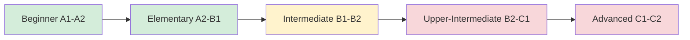

# 🇬🇧 English Learning

Welcome to English learning section! Master English through comprehensive lessons.

## 📚 Learning Sections

### [1. Grammar](grammar.md)
Core grammar rules and structures

### [2. Vocabulary](vocabulary.md)
Essential words and phrases organized by topics

### [3. IELTS Preparation](ielts.md)
IELTS exam preparation materials

### [4. Business English](business.md)
Professional communication skills

---

## 📊 Your Progress

| Section | Lessons | Completed | Progress |
|---------|---------|-----------|----------|
| Grammar | 35 | 28 | ⭐⭐⭐⭐☆ 80% |
| Vocabulary | 50 | 32 | ⭐⭐⭐☆☆ 64% |
| IELTS | 25 | 15 | ⭐⭐⭐☆☆ 60% |
| Business | 15 | 8 | ⭐⭐⭐☆☆ 53% |

---

## 🎯 Quick Tips

!!! tip "Daily Practice"
    - Read English news for 15 minutes daily
    - Watch English content with subtitles
    - Practice speaking with language exchange partners
    - Write a journal in English

!!! example "Useful Resources"
    - **Reading**: BBC News, The Guardian
    - **Listening**: BBC Podcasts, TED Talks
    - **Speaking**: HelloTalk, Tandem apps
    - **Writing**: Grammarly, DeepL

---

## 📖 Recent Lessons

1. **Present Perfect vs Past Simple** - Understanding the differences
2. **Phrasal Verbs for Daily Life** - 50 common expressions
3. **IELTS Writing Task 2** - Essay structure and templates
4. **Business Email Etiquette** - Professional communication

---

## 🎬 Learning Path

---

**Current Level**: Intermediate (B2) | **Target**: Advanced (C1)
