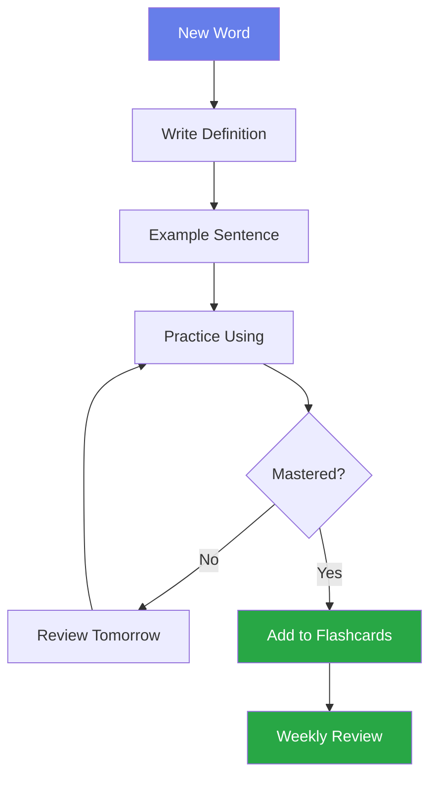

# 💬 English Vocabulary

Building a strong vocabulary foundation through organized topics.

---

## 🏠 Daily Life

### Home & Family

| English | Pronunciation | Vietnamese | Example |
|---------|--------------|------------|---------|
| **apartment** | /əˈpɑːrt.mənt/ | căn hộ | I live in a small **apartment**. |
| **neighbor** | /ˈneɪ.bɚ/ | hàng xóm | My **neighbor** is very friendly. |
| **furniture** | /ˈfɝː.nɪ.tʃɚ/ | đồ nội thất | We bought new **furniture** for the living room. |
| **laundry** | /ˈlɑːn.dri/ | giặt giũ | I need to do the **laundry** today. |
| **chores** | /tʃɔːrz/ | việc nhà | Kids should help with household **chores**. |

!!! example "Practice Sentence"
    "Every weekend, I help my parents with **chores** like doing the **laundry** and cleaning the **furniture** in our **apartment**."

---

## 💼 Work & Career

### Office Vocabulary

| English | Pronunciation | Vietnamese | Example |
|---------|--------------|------------|---------|
| **deadline** | /ˈded.laɪn/ | hạn chót | The **deadline** for this project is Friday. |
| **colleague** | /ˈkɑː.liːɡ/ | đồng nghiệp | My **colleagues** are very supportive. |
| **promotion** | /prəˈmoʊ.ʃən/ | thăng chức | She got a **promotion** last month. |
| **resign** | /rɪˈzaɪn/ | từ chức | He decided to **resign** from his position. |
| **shift** | /ʃɪft/ | ca làm việc | I work the night **shift** this week. |

### Common Phrasal Verbs

=== "Work-related"
    - **carry out** = thực hiện (a task, project)
    - **fill in** = thay thế tạm thời (for someone)
    - **hand in** = nộp (homework, report)
    - **take on** = đảm nhận (responsibility)
    - **step down** = từ chức (from position)

=== "Examples"
    ```
    ✓ I need to carry out market research.
    ✓ Can you fill in for me tomorrow?
    ✓ Please hand in the report by 5 PM.
    ✓ She took on a new project.
    ✓ The CEO stepped down last year.
    ```

---

## 🎓 Academic English

### Research & Study

| Term | Meaning | Usage |
|------|---------|-------|
| **analyze** | examine in detail | We need to **analyze** the data. |
| **hypothesis** | proposed explanation | The **hypothesis** was proven correct. |
| **methodology** | system of methods | The research **methodology** is sound. |
| **cite** | reference a source | Always **cite** your sources properly. |
| **plagiarism** | copying others' work | **Plagiarism** is strictly prohibited. |

---

## 🌟 Advanced Vocabulary

### Sophisticated Alternatives

| Basic Word | Advanced Alternative | Example |
|------------|---------------------|---------|
| important | **crucial, vital, paramount** | This is a **crucial** decision. |
| good | **exceptional, outstanding, exemplary** | Her work is **exceptional**. |
| bad | **detrimental, adverse, unfavorable** | The impact was **detrimental**. |
| show | **demonstrate, illustrate, exhibit** | The data **demonstrates** a trend. |
| think | **consider, contemplate, deliberate** | I need to **contemplate** this offer. |

---

## 🎯 Idioms & Expressions

### Common English Idioms

!!! quote "Business Idioms"
    - **"Think outside the box"** = Suy nghĩ sáng tạo
    - **"Get the ball rolling"** = Bắt đầu công việc
    - **"On the same page"** = Cùng quan điểm
    - **"Touch base"** = Liên lạc ngắn gọn
    - **"Cut corners"** = Làm việc qua loa

!!! quote "Daily Life Idioms"
    - **"Piece of cake"** = Rất dễ
    - **"Break the ice"** = Phá vỡ sự im lặng
    - **"Hit the books"** = Học chăm chỉ
    - **"Under the weather"** = Không khỏe
    - **"Cost an arm and a leg"** = Rất đắt

---

## 📊 Learning Strategy



---

## ✍️ Practice Exercise

### Fill in the Blanks

Complete the sentences with words from the vocabulary list:

1. The __________ for the assignment is next Monday.
2. We need to __________ the results before making conclusions.
3. My __________ helped me finish the project on time.
4. She received a __________ after working hard for two years.
5. This decision is __________ for the company's future.

??? success "Answers"
    1. deadline
    2. analyze
    3. colleague(s)
    4. promotion
    5. crucial

---

## 📚 Spaced Repetition Schedule

| Day | Action | Words to Review |
|-----|--------|----------------|
| **Day 1** | Learn new words | 10 new words |
| **Day 2** | Review Day 1 | 10 words |
| **Day 3** | Learn + Review | 10 new + 10 old |
| **Day 7** | Weekly review | All 30 words |
| **Day 30** | Monthly review | All words learned |

---

## 🎯 Goals

- [ ] Learn 10 new words daily
- [ ] Use 5 new words in sentences
- [ ] Review with flashcards (15 mins)
- [ ] Practice with language exchange partner
- [ ] Weekly vocabulary quiz

---

**Total Words Learned**: 2,500+ | **Target**: 5,000 words (C1 level)
