# 📊 Mermaid Diagrams & Math in MkDocs

Complete guide to using Mermaid diagrams and mathematical formulas in MkDocs Material.

---

## 🎨 Mermaid Diagrams

### 1. Flowchart / Graph

Biểu đồ luồng để mô tả quy trình, thuật toán.

=== "Vertical (TB)"
    ```mermaid
    graph TB
        A[Start] --> B{Is it raining?}
        B -->|Yes| C[Take umbrella]
        B -->|No| D[No umbrella needed]
        C --> E[Go outside]
        D --> E
        E --> F[End]
        
        style A fill:#28a745,color:#fff
        style F fill:#dc3545,color:#fff
        style B fill:#ffc107,color:#000
    ```

=== "Horizontal (LR)"
    ```mermaid
    graph LR
        A[Input] --> B[Process 1]
        B --> C[Process 2]
        C --> D[Process 3]
        D --> E[Output]
        
        style A fill:#667eea,color:#fff
        style E fill:#764ba2,color:#fff
    ```

=== "Syntax"
    ````markdown
    ```mermaid
    graph TB
        A[Square] --> B(Round edges)
        B --> C{Diamond}
        C -->|Label 1| D[Result 1]
        C -->|Label 2| E[Result 2]
        
        style A fill:#color,color:#textcolor
    ```
    ````

**Node Shapes:**
- `[Text]` - Square
- `(Text)` - Rounded
- `{Text}` - Diamond
- `((Text))` - Circle
- `>Text]` - Asymmetric
- `[[Text]]` - Subroutine

**Arrow Types:**
- `-->` - Solid arrow
- `-.->` - Dotted arrow
- `==>` - Thick arrow
- `--text-->` - Arrow with label

---

### 2. Sequence Diagram

Biểu đồ tuần tự cho tương tác giữa các đối tượng.

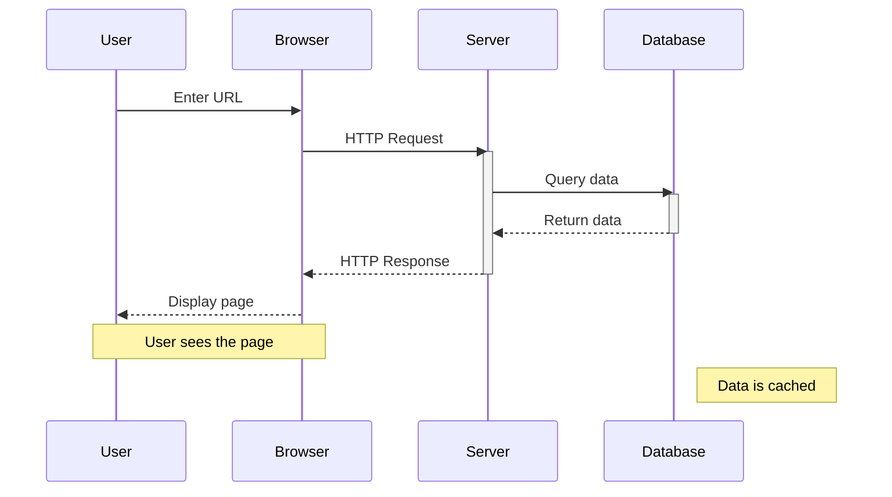

=== "Advanced Features"
    ```mermaid
    sequenceDiagram
        autonumber
        Alice->>+John: Hello John, how are you?
        Alice->>+John: John, can you hear me?
        John-->>-Alice: Hi Alice, I can hear you!
        John-->>-Alice: I feel great!
        
        rect rgb(191, 223, 255)
        note right of Alice: Alice thinks
        Alice->>John: What about you?
        John->>Alice: Doing well!
        end
        
        loop Every minute
            John-->Alice: Great!
        end
        
        alt is sick
            John->>Alice: Not so good :(
        else is well
            John->>Alice: Feeling fresh like a daisy
        end
    ```

**Key Syntax:**
- `->>` - Solid line
- `-->>` - Dotted line
- `->>+` - Activate
- `-->>-` - Deactivate
- `autonumber` - Auto-number messages
- `loop...end` - Loop block
- `alt...else...end` - Alternative paths

---

### 3. Class Diagram

Biểu đồ lớp cho OOP design.

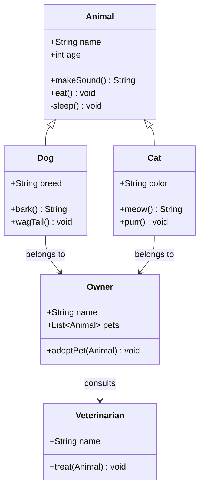

**Visibility:**
- `+` Public
- `-` Private
- `#` Protected
- `~` Package/Internal

**Relationships:**
- `<|--` Inheritance
- `*--` Composition
- `o--` Aggregation
- `-->` Association
- `..>` Dependency
- `..|>` Realization

---

### 4. State Diagram

Biểu đồ trạng thái cho vòng đời đối tượng.

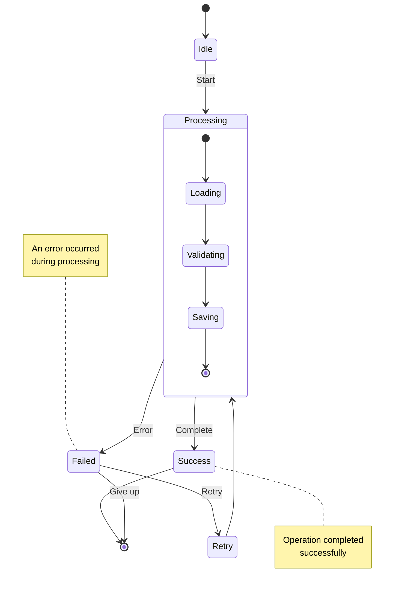

=== "User Authentication Flow"
    ```mermaid
    stateDiagram-v2
        [*] --> LoggedOut
        
        LoggedOut --> LoggingIn: Enter credentials
        LoggingIn --> LoggedIn: Valid credentials
        LoggingIn --> LoggedOut: Invalid credentials
        
        LoggedIn --> ViewingProfile: View profile
        LoggedIn --> EditingProfile: Edit profile
        LoggedIn --> LoggedOut: Logout
        
        ViewingProfile --> LoggedIn: Back
        EditingProfile --> LoggedIn: Save changes
        
        LoggedIn --> [*]: Session expired
    ```

---

### 5. Entity Relationship Diagram (ERD)

Biểu đồ thực thể quan hệ cho database design.

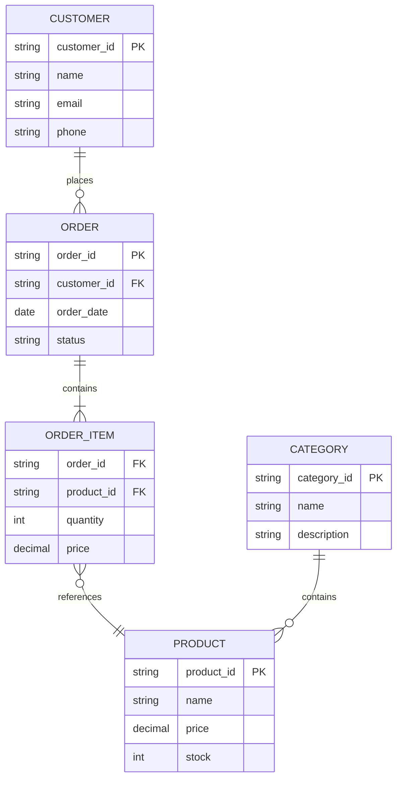

**Cardinality:**
- `||--||` One to one
- `||--o{` One to many
- `}o--o{` Many to many
- `||--|{` One to exactly many

---

### 6. Gantt Chart

Biểu đồ Gantt cho project timeline.

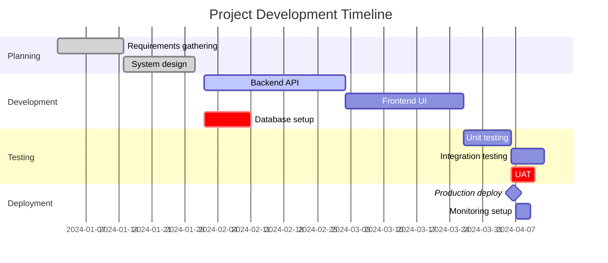

**Keywords:**
- `:done` - Completed
- `:active` - In progress
- `:crit` - Critical task
- `:milestone` - Milestone marker

---

### 7. Pie Chart

Biểu đồ tròn cho phân bổ phần trăm.

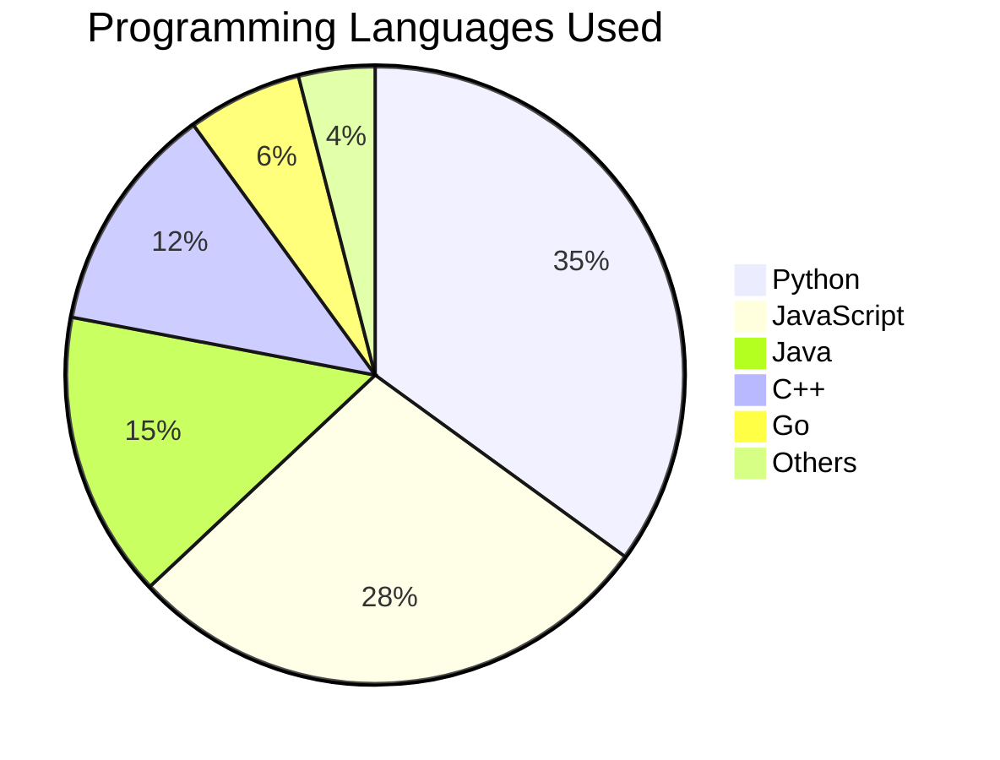

=== "Project Time Distribution"
    ```mermaid
    pie title Time Spent on Project Phases
        "Development" : 45
        "Testing" : 20
        "Planning" : 15
        "Deployment" : 10
        "Maintenance" : 10
    ```

---

### 8. Git Graph

Biểu đồ Git branches và commits.

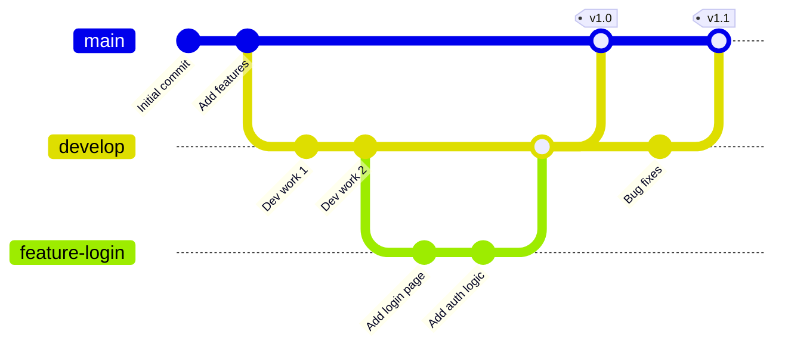

---

### 9. User Journey

Biểu đồ hành trình người dùng.

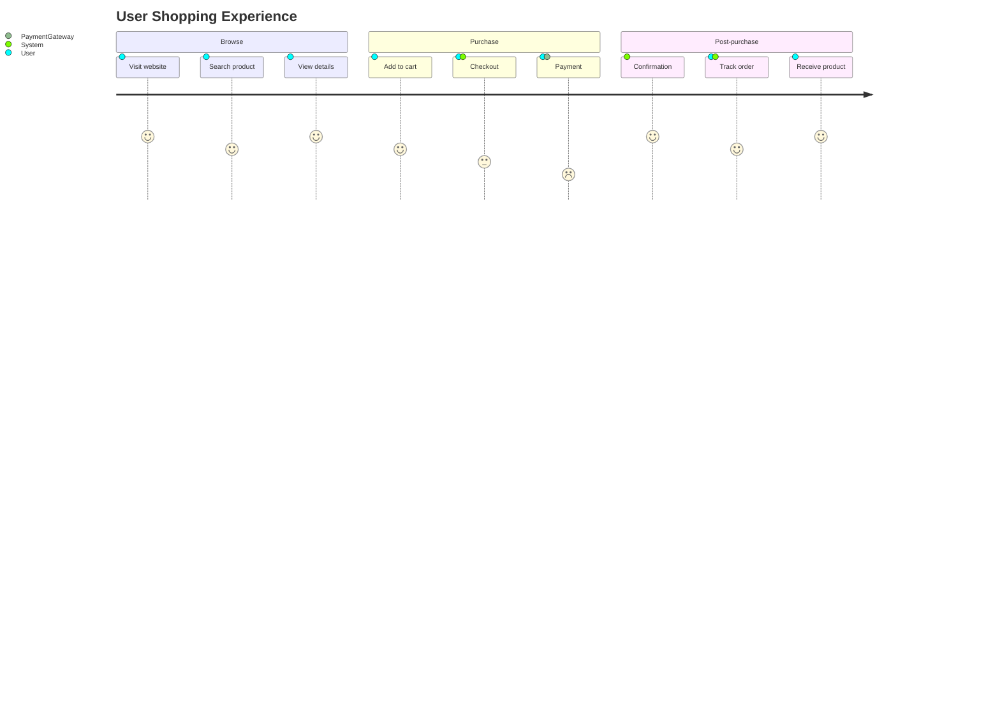

---

### 10. Timeline

Biểu đồ timeline cho sự kiện theo thời gian.

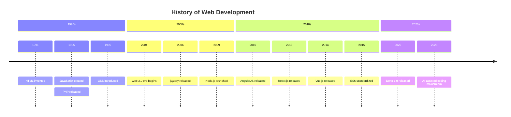

---

## 🧮 Mathematical Formulas (KaTeX)

MkDocs Material sử dụng KaTeX để render công thức toán học.

### Inline Math

Sử dụng `$...$` cho công thức inline:

The formula $E = mc^2$ is Einstein's mass-energy equivalence.

The quadratic formula is $x = \frac{-b \pm \sqrt{b^2 - 4ac}}{2a}$.

### Display Math

Sử dụng `$$...$$` cho công thức block:

$$
\int_{a}^{b} f(x) dx = F(b) - F(a)
$$

$$
\sum_{i=1}^{n} i = \frac{n(n+1)}{2}
$$

### Common Mathematical Symbols

=== "Greek Letters"
    | Symbol | Code | Symbol | Code |
    |--------|------|--------|------|
    | $\alpha$ | `\alpha` | $\beta$ | `\beta` |
    | $\gamma$ | `\gamma` | $\delta$ | `\delta` |
    | $\theta$ | `\theta` | $\lambda$ | `\lambda` |
    | $\mu$ | `\mu` | $\pi$ | `\pi` |
    | $\sigma$ | `\sigma` | $\omega$ | `\omega` |

=== "Operators"
    | Symbol | Code | Symbol | Code |
    |--------|------|--------|------|
    | $\times$ | `\times` | $\div$ | `\div` |
    | $\pm$ | `\pm` | $\mp$ | `\mp` |
    | $\leq$ | `\leq` | $\geq$ | `\geq` |
    | $\neq$ | `\neq` | $\approx$ | `\approx` |
    | $\sum$ | `\sum` | $\prod$ | `\prod` |
    | $\int$ | `\int` | $\infty$ | `\infty` |

=== "Arrows & Sets"
    | Symbol | Code | Symbol | Code |
    |--------|------|--------|------|
    | $\rightarrow$ | `\rightarrow` | $\Rightarrow$ | `\Rightarrow` |
    | $\leftarrow$ | `\leftarrow` | $\Leftarrow$ | `\Leftarrow` |
    | $\in$ | `\in` | $\notin$ | `\notin` |
    | $\subset$ | `\subset` | $\subseteq$ | `\subseteq` |
    | $\cup$ | `\cup` | $\cap$ | `\cap` |
    | $\emptyset$ | `\emptyset` | $\forall$ | `\forall` |

### Advanced Examples

#### Calculus

**Derivative:**
$$
\frac{d}{dx}(x^n) = nx^{n-1}
$$

**Integration by parts:**
$$
\int u \, dv = uv - \int v \, du
$$

**Taylor Series:**
$$
f(x) = f(a) + f'(a)(x-a) + \frac{f''(a)}{2!}(x-a)^2 + \frac{f'''(a)}{3!}(x-a)^3 + \cdots
$$

#### Linear Algebra

**Matrix:**
$$
A = \begin{bmatrix}
a_{11} & a_{12} & a_{13} \\
a_{21} & a_{22} & a_{23} \\
a_{31} & a_{32} & a_{33}
\end{bmatrix}
$$

**Determinant:**
$$
\det(A) = \begin{vmatrix}
a & b \\
c & d
\end{vmatrix} = ad - bc
$$

**Eigenvalue equation:**
$$
Av = \lambda v
$$

#### Statistics

**Mean:**
$$
\bar{x} = \frac{1}{n}\sum_{i=1}^{n} x_i
$$

**Variance:**
$$
\sigma^2 = \frac{1}{n}\sum_{i=1}^{n}(x_i - \bar{x})^2
$$

**Normal Distribution:**
$$
f(x) = \frac{1}{\sigma\sqrt{2\pi}} e^{-\frac{1}{2}\left(\frac{x-\mu}{\sigma}\right)^2}
$$

#### Algorithm Complexity

**Big O Notation:**
- $O(1)$ - Constant time
- $O(\log n)$ - Logarithmic time
- $O(n)$ - Linear time
- $O(n \log n)$ - Linearithmic time
- $O(n^2)$ - Quadratic time
- $O(2^n)$ - Exponential time

**Master Theorem:**
$$
T(n) = aT\left(\frac{n}{b}\right) + f(n)
$$

#### Probability

**Bayes' Theorem:**
$$
P(A|B) = \frac{P(B|A) \cdot P(A)}{P(B)}
$$

**Expected Value:**
$$
E[X] = \sum_{i=1}^{n} x_i \cdot P(x_i)
$$

---

## 🎨 Styling Mermaid Diagrams

### Using `style` keyword

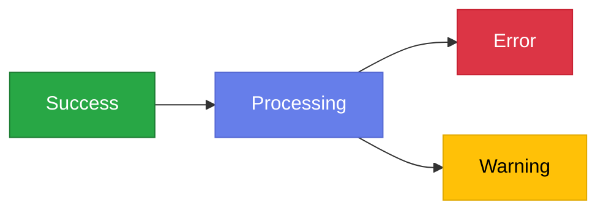

### Using `classDef`

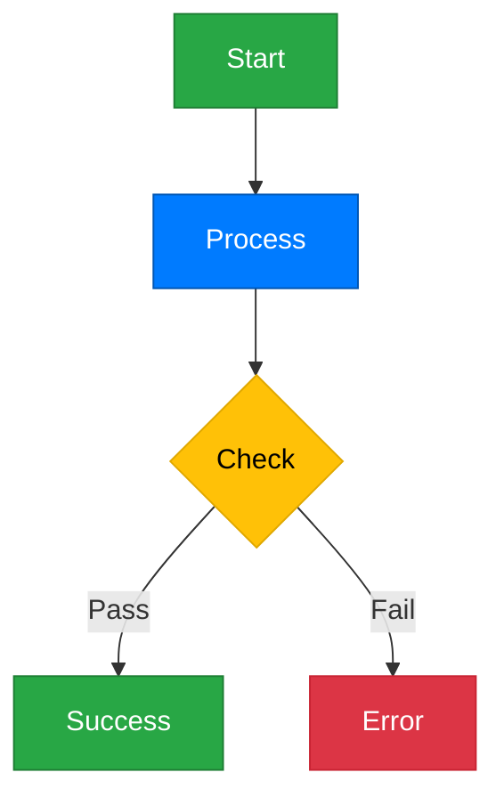

---

## 📝 Complete Example: System Architecture

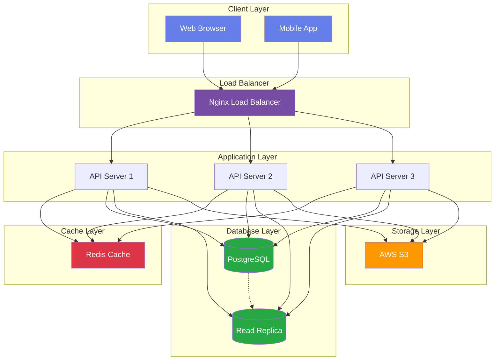

---

## 🎯 Best Practices

!!! tip "Mermaid Tips"
    1. Keep diagrams simple and focused
    2. Use subgraphs to organize complex diagrams
    3. Apply consistent styling across similar diagrams
    4. Add notes for important information
    5. Test diagrams in live editor first: [Mermaid Live Editor](https://mermaid.live/)

!!! tip "Math Tips"
    1. Use `\text{}` for text inside math: $\text{speed} = \frac{\text{distance}}{\text{time}}$
    2. Use `\,` for small space, `\quad` for medium, `\qquad` for large
    3. Align equations with `align` environment
    4. Number equations for reference

---

## 📚 Resources

- [Mermaid Official Docs](https://mermaid.js.org/)
- [Mermaid Live Editor](https://mermaid.live/)
- [KaTeX Supported Functions](https://katex.org/docs/supported.html)
- [LaTeX Math Symbols](https://www.overleaf.com/learn/latex/List_of_Greek_letters_and_math_symbols)

---

**Happy diagramming! 🎨**
