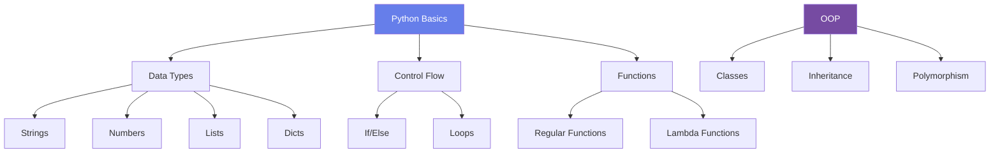

# 🐍 Python Programming

Complete guide to mastering Python from basics to advanced.

---

## 📚 Learning Sections

### [1. Basics](basics.md)
Variables, Data Types, Control Flow

### [2. Functions & Modules](functions.md)
Writing reusable code

### [3. OOP](oop.md)
Object-Oriented Programming concepts

### [4. Data Structures](data-structures.md)
Lists, Dictionaries, Sets, Tuples

### [5. Advanced Topics](advanced.md)
Decorators, Generators, Context Managers

---

## 🚀 Quick Start

### Hello World

```python title="hello.py"
# Your first Python program
print("Hello, World!")

# Variables
name = "Dat"
age = 25
print(f"My name is {name} and I'm {age} years old.")
```

### Data Types

=== "Strings"
    ```python
    # String operations
    text = "Python Programming"
    
    print(text.upper())        # PYTHON PROGRAMMING
    print(text.lower())        # python programming
    print(text.split())        # ['Python', 'Programming']
    print(len(text))           # 18
    
    # String formatting
    name = "Dat"
    age = 25
    print(f"{name} is {age} years old")  # f-string (recommended)
    print("{} is {} years old".format(name, age))  # .format()
    ```

=== "Numbers"
    ```python
    # Integer operations
    x = 10
    y = 3
    
    print(x + y)   # 13
    print(x - y)   # 7
    print(x * y)   # 30
    print(x / y)   # 3.333...
    print(x // y)  # 3 (floor division)
    print(x % y)   # 1 (modulo)
    print(x ** y)  # 1000 (power)
    
    # Float operations
    pi = 3.14159
    print(round(pi, 2))  # 3.14
    ```

=== "Lists"
    ```python
    # List operations
    fruits = ["apple", "banana", "cherry"]
    
    fruits.append("orange")      # Add to end
    fruits.insert(0, "mango")    # Insert at index
    fruits.remove("banana")      # Remove by value
    fruits.pop()                 # Remove last item
    
    # List comprehension
    numbers = [1, 2, 3, 4, 5]
    squares = [x**2 for x in numbers]
    # Result: [1, 4, 9, 16, 25]
    
    # Filter with list comprehension
    evens = [x for x in numbers if x % 2 == 0]
    # Result: [2, 4]
    ```

=== "Dictionaries"
    ```python
    # Dictionary operations
    person = {
        "name": "Dat",
        "age": 25,
        "city": "Hanoi"
    }
    
    # Access values
    print(person["name"])        # Dat
    print(person.get("age"))     # 25
    
    # Add/modify
    person["email"] = "dat@example.com"
    person["age"] = 26
    
    # Iterate
    for key, value in person.items():
        print(f"{key}: {value}")
    ```

---

## 🎯 Control Flow

### Conditions

```python
# If-elif-else
score = 85

if score >= 90:
    grade = "A"
elif score >= 80:
    grade = "B"
elif score >= 70:
    grade = "C"
else:
    grade = "F"

print(f"Your grade is: {grade}")

# Ternary operator
status = "Pass" if score >= 50 else "Fail"
```

### Loops

```python
# For loop
fruits = ["apple", "banana", "cherry"]
for fruit in fruits:
    print(fruit)

# For loop with index
for i, fruit in enumerate(fruits):
    print(f"{i}: {fruit}")

# While loop
count = 0
while count < 5:
    print(count)
    count += 1

# Loop control
for i in range(10):
    if i == 3:
        continue  # Skip this iteration
    if i == 7:
        break     # Exit loop
    print(i)
```

---

## 🔧 Functions

### Basic Functions

```python
def greet(name):
    """Greet a person by name"""
    return f"Hello, {name}!"

# Call function
message = greet("Dat")
print(message)  # Hello, Dat!

# Default parameters
def greet(name, greeting="Hello"):
    return f"{greeting}, {name}!"

print(greet("Dat"))              # Hello, Dat!
print(greet("Dat", "Hi"))        # Hi, Dat!

# Multiple return values
def calculate(a, b):
    return a + b, a - b, a * b, a / b

add, sub, mul, div = calculate(10, 5)
```

### Lambda Functions

```python
# Lambda (anonymous function)
square = lambda x: x ** 2
print(square(5))  # 25

# Lambda with map
numbers = [1, 2, 3, 4, 5]
squared = list(map(lambda x: x**2, numbers))
# Result: [1, 4, 9, 16, 25]

# Lambda with filter
evens = list(filter(lambda x: x % 2 == 0, numbers))
# Result: [2, 4]

# Lambda with sorted
students = [
    {"name": "Alice", "score": 85},
    {"name": "Bob", "score": 92},
    {"name": "Charlie", "score": 78}
]
sorted_students = sorted(students, key=lambda x: x["score"], reverse=True)
```

---

## 🏗️ Object-Oriented Programming

### Classes and Objects

```python
class Person:
    """A simple Person class"""
    
    # Class variable
    species = "Homo sapiens"
    
    # Constructor
    def __init__(self, name, age):
        self.name = name      # Instance variable
        self.age = age
    
    # Instance method
    def greet(self):
        return f"Hi, I'm {self.name} and I'm {self.age} years old."
    
    # String representation
    def __str__(self):
        return f"Person(name={self.name}, age={self.age})"
    
    # Class method
    @classmethod
    def from_birth_year(cls, name, birth_year):
        age = 2024 - birth_year
        return cls(name, age)
    
    # Static method
    @staticmethod
    def is_adult(age):
        return age >= 18

# Create objects
person1 = Person("Dat", 25)
person2 = Person.from_birth_year("Alice", 1998)

print(person1.greet())           # Hi, I'm Dat and I'm 25 years old.
print(Person.is_adult(20))       # True
print(person1)                   # Person(name=Dat, age=25)
```

### Inheritance

```python
class Student(Person):
    """Student class inheriting from Person"""
    
    def __init__(self, name, age, student_id):
        super().__init__(name, age)  # Call parent constructor
        self.student_id = student_id
        self.courses = []
    
    def enroll(self, course):
        self.courses.append(course)
        return f"Enrolled in {course}"
    
    def greet(self):
        # Override parent method
        return f"Hi, I'm {self.name}, student ID: {self.student_id}"

# Usage
student = Student("Bob", 20, "S12345")
student.enroll("Python Programming")
student.enroll("Data Structures")
print(student.greet())
print(f"Courses: {', '.join(student.courses)}")
```

---

## 📊 Data Visualization



---

## 💡 Best Practices

!!! tip "Code Style (PEP 8)"
    ```python
    # Good
    def calculate_total(price, tax_rate):
        """Calculate total price including tax."""
        return price * (1 + tax_rate)
    
    # Bad
    def calcTotal(p,t):
        return p*(1+t)
    ```

!!! warning "Common Mistakes"
    ```python
    # ❌ Mutable default argument
    def add_item(item, items=[]):  # DON'T
        items.append(item)
        return items
    
    # ✅ Correct way
    def add_item(item, items=None):
        if items is None:
            items = []
        items.append(item)
        return items
    ```

!!! example "List Comprehension vs Loop"
    ```python
    # Traditional loop
    squares = []
    for x in range(10):
        squares.append(x**2)
    
    # List comprehension (Pythonic)
    squares = [x**2 for x in range(10)]
    ```

---

## 🎯 Practice Projects

1. **Calculator** - Basic arithmetic operations
2. **To-Do List** - CRUD operations with file storage
3. **Web Scraper** - Extract data from websites
4. **Data Analyzer** - Work with CSV/Excel files
5. **REST API** - Build with FastAPI/Flask

---

## 📚 Resources

- [Official Python Docs](https://docs.python.org/)
- [Real Python](https://realpython.com/)
- [Python Package Index (PyPI)](https://pypi.org/)
- [PEP 8 Style Guide](https://pep8.org/)

---

**Skill Level**: 85% | **Projects Completed**: 28/45
